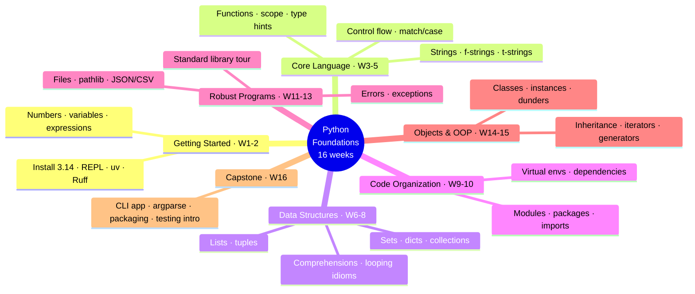

# Python Mastery — Part 1: Foundations · Trainer Session Plan

## From Absolute Basics to Confident, Idiomatic Python — the Facilitator's Delivery Guide

**The Python Mastery Series · Program 01 of 4 | Rathinam Trainers & Consultants Private Limited**

> This is the **trainer-facing delivery manual** for **Part 1 — Foundations**. It is the document
> Rajan reads to *run* the course week by week: what to teach, what to demo live, and what to set as
> homework, for all sixteen sessions. It is built from, and bounded by, the authoritative scope in
> [`../010_brochure/brochure.md`](../010_brochure/brochure.md), grounded against the official
> **Python 3.14** documentation (3.14.6, current stable). Parts 2–4 are scoped separately in
> [`../training_roadmap.md`](../training_roadmap.md); nothing from those parts is pulled in here.

---

### Audience & delivery at a glance

| | |
|---|---|
| **Course** | Python Mastery — Part 1: Foundations (Program 01 of 4) |
| **Delivered by** | **Rajan**, live, trainer-led (explains concepts + runs every live demo on screen) |
| **Platform** | **Live online on Microsoft Teams**, every session **recorded** |
| **Shape** | **16 sessions × 2 hours live = 32 live hours**, **one session per week** (a **16-week** schedule, Week 1 → Week 16) |
| **Hands-on** | **Done by students after each session**, asynchronously, from the **recording + the lab guide** — there is **no in-session hands-on**; live time is teach + demo + Q&A |
| **Lab guides** | The per-session **lab spec** in this plan is expanded into the full student lab guide by the separate **`training_03`** agent — this plan defines the spec, not the finished guide |
| **Cohort level** | **Absolute beginners** to programming, plus developers from other languages new to Python (assumed prior knowledge: basic computer literacy only) |
| **Python version** | **Python 3.14.x** (CPython standard build) |
| **Tooling (free, web-verified 2026-06)** | **uv** (Astral) for projects/venvs/dependencies · **Ruff** (Astral) for lint/format · **VS Code** + Python/Pylance recommended |
| **Schedule anchor** | Relative weeks (Week 1–16); no fixed calendar start date set — anchor to real dates when a batch start is confirmed |
| **Assessment** | Weekly post-session labs (checkpoints) + a **capstone CLI application** (default theme: a **task/notes manager**) → **Certificate of completion** |

---

## Visual table of contents — the curriculum arc

<!-- export-png: session-plan-mindmap.png -->



<details>
<summary>ASCII fallback</summary>

```
Python Foundations (16 weeks)
├── Getting Started · W1-2 ...... install 3.14 · REPL · uv · Ruff | numbers · variables · expressions
├── Core Language · W3-5 ........ strings/f-strings/t-strings | control flow & match/case | functions · scope · type hints
├── Data Structures · W6-8 ...... lists & tuples | sets · dicts · collections | comprehensions · looping idioms
├── Code Organization · W9-10 ... modules · packages · imports | virtual envs · dependencies
├── Robust Programs · W11-13 .... errors & exceptions | files · pathlib · JSON/CSV | standard library tour
├── Objects & OOP · W14-15 ...... classes · instances · dunders | inheritance · iterators · generators
└── Capstone · W16 ............. CLI app · argparse · packaging as a module · testing intro
```

</details>

The arc is deliberately scaffolded. The first two weeks remove every environmental obstacle and give
students a working Python 3.14 they can run, so that from Week 3 on every concept lands in a tool they
already trust. Weeks 3–5 build the *expressive core* of the language — text, decisions, and the unit of
reuse (functions). Weeks 6–8 give them the *data containers* that real programs move around, and the
comprehension idioms that make Python feel like Python. Weeks 9–10 teach them to *organize and isolate*
code so projects stop being single files. Weeks 11–13 make programs *robust* — they fail gracefully,
persist data, and reach for the standard library instead of reinventing it. Weeks 14–15 introduce
*objects*, the last big mental model, and Week 16 consolidates everything into a shipped CLI application.
Each week explicitly assumes the labs of the weeks before it, so the homework compounds into the capstone.

```mermaid
flowchart LR
    subgraph GS["Getting Started"]
      W1[W1 Setup & REPL] --> W2[W2 Numbers]
    end
    subgraph CL["Core Language"]
      W3[W3 Strings] --> W4[W4 Control flow] --> W5[W5 Functions]
    end
    subgraph DS["Data Structures"]
      W6[W6 Lists/tuples] --> W7[W7 Sets/dicts] --> W8[W8 Comprehensions]
    end
    subgraph CO["Code Organization"]
      W9[W9 Modules] --> W10[W10 venv/uv]
    end
    subgraph RP["Robust Programs"]
      W11[W11 Exceptions] --> W12[W12 Files/IO] --> W13[W13 Stdlib tour]
    end
    subgraph OO["Objects & OOP"]
      W14[W14 Classes] --> W15[W15 Inheritance/generators]
    end
    W16[W16 Capstone CLI]
    W2 --> W3
    W5 --> W6
    W8 --> W9
    W10 --> W11
    W13 --> W14
    W15 --> W16
    classDef gs fill:#dbeafe,stroke:#2563eb,color:#000;
    classDef cl fill:#fef9c3,stroke:#ca8a04,color:#000;
    classDef ds fill:#dcfce7,stroke:#16a34a,color:#000;
    classDef co fill:#fae8ff,stroke:#a21caf,color:#000;
    classDef rp fill:#ffe4e6,stroke:#e11d48,color:#000;
    classDef oo fill:#ffedd5,stroke:#ea580c,color:#000;
    classDef cap fill:#bbf7d0,stroke:#15803d,color:#000;
    class W1,W2 gs;
    class W3,W4,W5 cl;
    class W6,W7,W8 ds;
    class W9,W10 co;
    class W11,W12,W13 rp;
    class W14,W15 oo;
    class W16 cap;
```



<details>
<summary>ASCII fallback</summary>

```
Getting Started:  W1 Setup/REPL -> W2 Numbers
        |
Core Language:    W3 Strings -> W4 Control flow -> W5 Functions
        |
Data Structures:  W6 Lists/tuples -> W7 Sets/dicts -> W8 Comprehensions
        |
Code Org:         W9 Modules -> W10 venv/uv
        |
Robust Programs:  W11 Exceptions -> W12 Files/IO -> W13 Stdlib tour
        |
Objects & OOP:    W14 Classes -> W15 Inheritance/generators
        |
Capstone:         W16 CLI app (argparse + packaging + testing intro)
```

</details>

---

## Course overview

### Learning outcomes (traced to the brochure)

By the end of Part 1 a student can do everything the brochure's section 2 promises. Restated as the
outcomes this plan is engineered to deliver, the graduate can: **write and run** Python 3.14 from the
REPL, scripts, and a `uv`-managed project, formatting and linting with Ruff (W1, W9–W10); **use every
core data type** — `int`/`float`/`complex`/`bool`/`None` and `str` including f-strings and an intro to
t-strings — and reason about mutability (W2–W3); **control program flow** with `if`/`elif`/`else`,
`for`/`while`, `break`/`continue`/loop-`else`, and structural pattern matching (W4); **define functions**
with the full argument grammar, scope (LEGB), `global`/`nonlocal`, lambdas, and basic type hints (W5);
**build and manipulate** lists, tuples, sets, and dictionaries and write comprehensions for all of them
(W6–W8); **organize code** into modules and packages and isolate dependencies in virtual environments
(W9–W10); **handle errors** with the full `try` grammar, raising, chaining, and custom exceptions,
including the 3.14 bracketless `except` syntax (W11); **read and write files and text** with `pathlib`
and clean output formatting, and serialize JSON/CSV (W12); **reach into the standard library** for
everyday tasks (W13); **write classes** with attributes, methods, `__init__`, `__str__`/`__repr__`, and
**use iterators and generators** (W14–W15); and **deliver a capstone** — a complete, well-structured
command-line application (W16). Every brochure module M1–M16 is accounted for across the sixteen
sessions, with nothing dropped and nothing invented beyond the brochure plus the web-verified current
state of Python 3.14 and its tooling.

### The delivery model and why it works

Every session runs **live on Microsoft Teams and is recorded**, because the recording *is* part of the
courseware: students do their hands-on work afterwards, replaying the live demo while they repeat it
themselves from the lab guide. Rajan **teaches the concepts and runs the demos live** — the two hours are
**teach + demo + Q&A, never in-session labs**. This is a deliberate pedagogy: in each session a concept
is first **explained**, then **shown working** in a live demo the student watches Rajan type, and then
**practiced** by the student after class in a lab that mirrors that demo. The loop is *concept → live demo
→ post-session lab → checkpoint*, and it repeats every week. Because the lab always rebuilds (and then
extends) what the demo just showed, a student who got lost in the live session can scrub back to the exact
moment in the recording and follow along. The **checkpoint** — usually the lab submission, occasionally a
short quiz or milestone — tells Rajan asynchronously whether the cohort is keeping up before the next
session builds on it. The full student-facing lab guides are written by the **`training_03`** agent from
the per-session lab specs in this plan; Rajan's job from this document is to teach, demo, and assign.

### Prerequisites

None beyond basic computer literacy — installing software, navigating a file system, using a text editor.
**No prior programming experience is assumed.** Developers arriving from Java/C#/JavaScript/Go are welcomed
and will move faster, but the plan is paced for a true beginner; the demos repeatedly contrast Python's
data model with what other-language developers expect, so the experienced cohort gets value without leaving
beginners behind.

### Materials & tools the whole course needs

The trainer needs **Microsoft Teams** (with recording enabled and started at the top of every session),
a **screen-share demo environment** running **Python 3.14.x**, **uv** and **Ruff** (both from Astral),
and **VS Code** with the Python/Pylance extension. Every tool is free and open-source; no paid service is
required for Part 1. A reusable **demo project** (the running task/notes manager that becomes the capstone)
should live in a folder Rajan re-opens each week, plus a small **sample-data folder** (a few `.txt`,
`.csv`, and `.json` files) introduced from Week 12. Students need any laptop able to run Python 3.14 and
are walked through installing the same toolchain in Week 1.

---

## The 16-week schedule (spine reference)

One row per session. Cells are tight named summaries; the per-session blocks below carry the full detail.
The trainer Cmd-Fs this table.

| Week | S# | Title | Concepts (named) | Live demos (named) | Homework (post-session lab) | Checkpoint |
|:---:|:---:|---|---|---|---|---|
| 1 | 1 | Getting Started & the Python Model | What Python is; install 3.14; the improved REPL (syntax highlight, import autocomplete); script vs `python -m`; interpret/bytecode mental model; `uv init`; Ruff format/check | **D1** REPL tour & first script; **D2** `uv init` project + Ruff format on save | **Lab 1** Set up toolchain, run a 3.14 REPL + a script, scaffold a `uv` project, format it with Ruff | Lab 1 submitted: working `uv` project screenshot + script output |
| 2 | 2 | Numbers, Variables & Expressions | `int`/`float`/`complex`/`bool`; arithmetic, `/` vs `//` vs `%`, `**`, precedence; variables & assignment; `None`; floating-point limits; `math` first touch | **D3** REPL calculator & precedence; **D4** float surprises + `round`/`math.isclose` | **Lab 2** Build a `tip/units` calculator script; handle float rounding correctly | Lab 2 submitted: calculator passes given inputs |
| 3 | 3 | Strings & Text | `str` indexing/slicing; key methods; immutability; f-strings & format spec; **t-strings (PEP 750) intro**; `bytes` vs `str`, encodings basics | **D5** slicing & method chaining; **D6** f-string formatting + t-string vs f-string | **Lab 3** Text-report formatter using f-strings + a t-string sketch | Lab 3 submitted: formatted report matches spec |
| 4 | 4 | Control Flow & Pattern Matching | `if`/`elif`/`else`; truthiness; `for`/`while`/`range`; `break`/`continue`/`pass`; loop-`else`; **`match`/`case`** (literal, capture, sequence, mapping, guard) | **D7** loops & `range` patterns; **D8** `match`/`case` command dispatcher | **Lab 4** Number-guessing game + a `match`-based menu | Lab 4 submitted: game + menu behave per spec |
| 5 | 5 | Functions, Scope & Type Hints | `def`/`return`; positional/keyword/default/`*args`/`**kwargs`/keyword-only/positional-only; docstrings; LEGB scope; `global`/`nonlocal`; lambdas; **basic type hints** | **D9** argument-grammar tour; **D10** scope/LEGB + type hints in VS Code | **Lab 5** Refactor Lab 2/4 into typed, documented functions | Lab 5 submitted: functions typed + docstringed |
| 6 | 6 | Lists & Tuples | List ops & methods; `del`; mutability in depth; tuples; packing/unpacking; nested sequences; sequence comparison; sorting basics | **D11** list mutation & aliasing pitfalls; **D12** tuple unpacking & swap | **Lab 6** In-memory task list (add/remove/sort) using lists & tuples | Lab 6 submitted: task ops correct |
| 7 | 7 | Sets & Dictionaries | Sets & set algebra; dicts, methods, iteration; dict vs list vs set choice; `collections` first look (`Counter`, `defaultdict`, `namedtuple`) | **D13** set algebra dedupe; **D14** dict-of-tasks + `Counter`/`defaultdict` | **Lab 7** Re-model tasks as dicts keyed by id; tag-frequency with `Counter` | Lab 7 submitted: dict model + counts |
| 8 | 8 | Comprehensions & Looping Idioms | List/set/dict comprehensions; nested & conditional comprehensions; `enumerate`/`zip`/`reversed`/`sorted` (with `key`); conditional expressions; idiom vs loop | **D15** rewrite loops as comprehensions; **D16** `enumerate`/`zip`/`sorted(key=...)` | **Lab 8** Replace Lab 6/7 loops with comprehensions; sort tasks by key | Lab 8 submitted: comprehension refactor |
| 9 | 9 | Modules & Packages | Writing/importing modules; `import` forms; `__name__ == "__main__"`; module search path; packages & `__init__.py`; `dir()`; standard modules | **D17** split script into modules; **D18** build a package + `python -m` | **Lab 9** Split the task app into a multi-module package | Lab 9 submitted: package runs via `-m` |
| 10 | 10 | Virtual Environments & Dependencies | Why isolation; `venv` model; installing packages; `uv` project + `uv.lock`; `uv add`/`run`/`sync`; reproducible envs; `.python-version` | **D19** `venv` vs `uv` env; **D20** `uv add rich`, lockfile, `uv sync` reproduce | **Lab 10** Convert Lab 9 into a locked `uv` project with one dependency | Lab 10 submitted: `uv.lock` + working run |
| 11 | 11 | Errors & Exceptions | Syntax vs runtime errors; `try`/`except`/`else`/`finally`; raising/re-raising; **chaining (`raise ... from`)**; custom exceptions; clean-up; **3.14 bracketless multi-`except`**; `except*` first look | **D21** the full `try` grammar; **D22** custom exception + chaining + 3.14 syntax | **Lab 11** Add robust validation + custom exceptions to the task app | Lab 11 submitted: invalid input handled cleanly |
| 12 | 12 | Files & I/O | Text & binary read/write; `with`/context managers (usage); `pathlib`; output formatting; **JSON** load/dump; **CSV** read/write | **D23** `pathlib` + `with` round-trip; **D24** save/load tasks as JSON & export CSV | **Lab 12** Persist the task app to a JSON file; export CSV | Lab 12 submitted: tasks persist across runs |
| 13 | 13 | Standard Library Tour | `os`/`sys`; `datetime`; `random`; `math`/`statistics`; `re` (intro); `argparse` (intro); `logging` (intro); deeper `collections` | **D25** `datetime`/`random`/`statistics`; **D26** `argparse` CLI + `logging` + `re` find | **Lab 13** Add timestamps, an `argparse` flag, and logging to the task app | Lab 13 submitted: CLI flag + log output |
| 14 | 14 | Classes & OOP Basics | Objects & names; namespaces revisited; defining classes; instances/attributes/methods; `__init__`; class vs instance attributes; `__str__`/`__repr__`; private-by-convention | **D27** `Task` class with `__init__`/methods; **D28** `__str__`/`__repr__` + class vs instance attrs | **Lab 14** Re-model the task as a `Task` class with a `TaskList` manager | Lab 14 submitted: OO task model works |
| 15 | 15 | Inheritance, Iterators & Generators | Inheritance; overriding; `super()`; `isinstance`; the iterator protocol (`__iter__`/`__next__`); generators & generator expressions; `yield` | **D29** subclass `Task` + `super()`; **D30** make `TaskList` iterable + a generator filter | **Lab 15** Add a `PriorityTask` subclass; make the list iterable via a generator | Lab 15 submitted: subclass + iteration |
| 16 | 16 | Consolidation & Capstone CLI | Project structure recap; full CLI with `argparse`; package as runnable module; **testing intro** (`assert`, smoke tests); packaging/run; Q&A | **D31** assemble the capstone end-to-end; **D32** smoke-test + run as installed CLI | **Capstone** Finish & submit the complete task/notes-manager CLI | Capstone accepted → certificate |

Every session's live segments below sum to exactly **120 minutes**. The detailed blocks are the source of
truth; this table is the index.

---

## The 16 sessions in detail

Each block follows the same shape: objectives, an *assumes / sets up* thread, the named concepts in
teaching order, a timed 120-minute breakdown, the named live demos (scenario → steps → end state), the
post-session lab spec, materials, and the checkpoint. The **recording must be started before the first
spoken minute** of every session — students rebuild the demos from it.

---

### Session 1 — Week 1 · Getting Started & the Python Model

**Module:** M1. **Learning objectives.** After this session and its lab, a student can install Python
3.14, open and use the improved interactive REPL, run a `.py` file two ways (directly and with
`python -m`), explain in one sentence what "the interpreter runs bytecode" means, scaffold a project with
`uv init`, and format and lint it with Ruff.

**Assumes / sets up.** Assumes only basic computer literacy — this is the floor of the course. It sets up
*everything*: the REPL and the `uv` project created here are the surfaces every later session demos in,
and the demo project scaffolded today becomes the running task app that grows into the Week 16 capstone.

**Concepts to cover (in teaching order).** What Python is and where 3.14 fits (CPython, the standard
build); installing Python 3.14 on Windows/macOS/Linux; launching the **interactive interpreter** and the
**improved 3.14 REPL** — syntax highlighting on by default, **import auto-completion** (`import co`+Tab),
multiline editing, `help()`/`exit()`; the difference between **typing in the REPL** and **running a
script**; running a file as `python hello.py` versus `python -m`; a plain-language **interpreter /
bytecode mental model** (source → bytecode → the interpreter loop) without going near internals;
**modern tooling** — `uv` as the project/venv/dependency manager and `uv init` to scaffold, then **Ruff**
for `ruff format` and `ruff check`.

| Segment | Min | What happens |
|---|:--:|---|
| Welcome, course map, how the week works (live + recording + lab) | 10 | Orient the cohort; start recording first |
| Concept: what Python is, the 3.14 release, the mental model | 20 | Source→bytecode→interpreter, told simply |
| **Demo D1** — REPL tour + first script | 25 | Live |
| Concept: the modern toolchain (`uv`, Ruff) and why | 15 | Why isolation/formatting matter even on day one |
| **Demo D2** — `uv init` project + Ruff format/check | 25 | Live |
| Q&A + install troubleshooting | 15 | Common install pitfalls per OS |
| Wrap + walk through Lab 1 brief | 10 | Hand off to homework |
| **Total** | **120** | |

**Live demos.**
- **D1 — REPL tour & first script.** *Scenario:* meet Python by talking to it. *Steps shown:* launch
  `python3.14`, show the highlighted prompt; evaluate `2 + 2`, a string, `print(...)`; demonstrate
  `import ma`+Tab autocompletion resolving to `math`; call `help(len)`; then create `hello.py`
  (`print("Hello, Python 3.14")`), run it with `python hello.py`, and re-run it with `python -m hello`,
  narrating the difference. *End state:* students see the same output two ways and understand the REPL is
  for exploring, scripts are for keeping.
- **D2 — `uv init` project + Ruff.** *Scenario:* turn a loose script into a real project. *Steps shown:*
  `uv init taskapp`, tour the generated `pyproject.toml`, `main.py`, `README`, `.python-version`; run it
  with `uv run main.py`; deliberately paste badly-formatted code, run `ruff format` to fix it and
  `ruff check` to flag a lint issue, then fix it. *End state:* a clean, formatted `taskapp` project that
  runs via `uv run` — the seed of the capstone.

**Homework — Lab 1 spec (post-session).** *Objective:* stand up the exact toolchain and prove it works.
*What they build/practice:* install Python 3.14, uv, Ruff, and VS Code; use the REPL to evaluate three
expressions; write and run a `hello.py` both ways; scaffold their own `uv init taskapp`; format it with
Ruff. *Scope/steps:* mirror D1 then D2 from the recording. *Expected outcome:* a screenshot of the REPL
session and `python -m` output, plus a formatted `uv` project that runs. *Prereqs:* a laptop they can
install software on. *Recording link:* D1 for REPL/script, D2 for the project + Ruff.

**Materials & resources.** Slides M1; the demo machine with Python 3.14 / uv / Ruff / VS Code; per-OS
install notes; an empty folder to create `taskapp` in. **Start the recording before D1.**

**Checkpoint.** Lab 1 submission: screenshot of a working REPL + script run and a Ruff-formatted `uv`
project. This confirms the whole cohort has a working environment before Week 2 relies on it.

---

### Session 2 — Week 2 · Numbers, Variables & Expressions

**Module:** M2. **Learning objectives.** After this session and its lab, a student can use Python's
numeric types correctly, predict the result of mixed arithmetic and operator precedence, distinguish
`/`, `//`, and `%`, assign and rebind variables, use `None` meaningfully, and explain (and defend against)
floating-point imprecision.

**Assumes / sets up.** Assumes the working REPL and `uv` project from Week 1. Sets up the value layer that
strings (W3), control flow conditions (W4), and every later computation depend on; the calculator built
here is refactored into typed functions in Week 5.

**Concepts to cover (in teaching order).** The numeric types `int`, `float`, `complex`, and `bool` (and
that `bool` is an `int`); arithmetic operators, **true division `/` vs floor division `//` vs modulo `%`**,
expon. `**`, and **operator precedence**; **variables and assignment** (names bind to objects), augmented
assignment, multiple assignment; **`None`** as the absence of a value; **floating-point limitations** —
why `0.1 + 0.2 != 0.3`, and the fixes `round()`, formatting, and `math.isclose`; a first touch of `math`
(`sqrt`, `floor`, `pi`) and numeric input via `input()` + `int()`/`float()`.

| Segment | Min | What happens |
|---|:--:|---|
| Recap of Week 1 + start recording | 8 | REPL/`uv` recap, today's goal |
| Concept: numeric types, operators, precedence | 22 | int/float/complex/bool, `/` `//` `%` `**` |
| **Demo D3** — REPL calculator & precedence | 25 | Live |
| Concept: variables, assignment, `None`, input/casting | 17 | Names bind to objects; `None`; `input()` |
| **Demo D4** — floating-point surprises & fixes | 25 | Live |
| Q&A + common arithmetic gotchas | 13 | Integer vs float division, casting errors |
| Wrap + Lab 2 brief | 10 | Hand off |
| **Total** | **120** | |

**Live demos.**
- **D3 — REPL calculator & precedence.** *Scenario:* use Python as a calculator and watch precedence.
  *Steps:* evaluate `7 / 2`, `7 // 2`, `7 % 2`, `2 ** 10`; show `(2 + 3) * 4` vs `2 + 3 * 4`; mix
  `int`/`float` and show the result type; use augmented assignment (`x = 5; x += 3`) and multiple
  assignment (`a, b = 1, 2`). *End state:* students can predict each operator's result and see how
  precedence and parentheses change answers.
- **D4 — floating-point surprises & fixes.** *Scenario:* the famous `0.1 + 0.2`. *Steps:* show
  `0.1 + 0.2` printing `0.30000000000000004`; explain binary fractions in one plain paragraph; fix it
  with `round(0.1 + 0.2, 2)` and `math.isclose(0.1 + 0.2, 0.3)`; then read two numbers with `input()`,
  cast with `float()`, and compute a tip. *End state:* students understand floats are approximate and know
  the three standard defenses.

**Homework — Lab 2 spec.** *Objective:* write a small arithmetic program that handles real numbers safely.
*What they build:* a `calculator.py` that reads two numbers and prints sum, difference, floor-division,
remainder, and a percentage, all rounded sensibly. *Scope:* mirror D3 for the operations and D4 for the
rounding; use `input()` + casting. *Expected outcome:* given the spec's sample inputs, the script prints
correctly rounded results with no float noise. *Prereqs:* Lab 1 toolchain. *Recording link:* D3, D4.

**Materials & resources.** Slides M2; the REPL; the `taskapp` project to drop the script beside.
**Start recording before D3.**

**Checkpoint.** Lab 2 submission: the calculator produces correct, cleanly-rounded output for the
provided inputs.

---

### Session 3 — Week 3 · Strings & Text

**Module:** M3. **Learning objectives.** After this session and its lab, a student can index and slice
strings, use the common string methods, explain string immutability, build formatted output with
f-strings and the format mini-language, recognize what a t-string is and how it differs from an f-string,
and explain at a basic level the difference between `str` and `bytes` and why encodings exist.

**Assumes / sets up.** Assumes numbers/variables/`None` (W2). Sets up the text handling every later lab
relies on for output, the f-strings used throughout, and the encoding awareness needed for files (W12).

**Concepts to cover (in teaching order).** `str` literals (quotes, triple-quotes, escapes, raw strings);
**indexing and slicing** (`s[0]`, `s[-1]`, `s[1:4]`, `s[::-1]`, step); the high-value **methods**
(`.strip`, `.lower`/`.upper`/`.title`, `.split`/`.join`, `.replace`, `.find`/`.index`, `.startswith`/
`.endswith`, `.format`); **immutability** (methods return new strings); **f-strings** including
expressions, `=` debugging, and the **format spec mini-language** (width, alignment, `,` grouping,
`.2f`, padding); an **intro to t-strings (PEP 750)** — that a t-string evaluates to a
`string.templatelib.Template` rather than a `str`, the `t"..."` syntax, and the kind of safe-interpolation
use case it exists for (contrast with f-strings, no deep API); and a basics-level look at **`bytes` vs
`str`** and `.encode()`/`.decode()` with UTF-8.

| Segment | Min | What happens |
|---|:--:|---|
| Recap W2 + start recording | 8 | Numbers recap, today's goal |
| Concept: str literals, indexing, slicing, methods, immutability | 25 | Core string mechanics |
| **Demo D5** — slicing & method chaining | 22 | Live |
| Concept: f-strings & the format mini-language; t-string intro | 22 | Formatting + PEP 750 contrast |
| **Demo D6** — f-string formatting + t-string vs f-string | 23 | Live |
| Concept + Q&A: `bytes` vs `str`, encodings basics | 10 | Why encodings exist |
| Wrap + Lab 3 brief | 10 | Hand off |
| **Total** | **120** | |

**Live demos.**
- **D5 — slicing & method chaining.** *Scenario:* clean and reshape messy text. *Steps:* take
  `"  Buy Milk, Eggs, Bread  "`; `.strip()`, `.lower()`, `.split(",")`; index and slice a word
  (`word[0]`, `word[-1]`, `word[:3]`, `word[::-1]`); rebuild a clean string with `", ".join(...)`; show
  that the original is unchanged (immutability). *End state:* students see strings transformed by chaining
  and understand methods return new strings.
- **D6 — f-string formatting + t-string contrast.** *Scenario:* format a tidy report line. *Steps:* build
  `f"{name:<10}{qty:>4}{price:>8.2f}"`, show `,` grouping and `{value=}` debugging; then write the same
  interpolation as a `t"..."` t-string, `type()` it to reveal it's a `Template` not a `str`, and explain
  in one sentence the safe-interpolation use case it's for. *End state:* students produce aligned,
  formatted output and can state how a t-string differs from an f-string.

**Homework — Lab 3 spec.** *Objective:* format structured text cleanly. *What they build:* a
`report.py` that takes a few (name, quantity, price) rows and prints an aligned table using f-strings with
the format mini-language, plus a short comment sketching how one line would look as a t-string and why
type differs. *Scope:* mirror D5 (cleaning/slicing) and D6 (formatting). *Expected outcome:* output
columns line up and numbers show two decimals with thousands grouping. *Prereqs:* Labs 1–2. *Recording
link:* D5, D6.

**Materials & resources.** Slides M3; REPL; a few sample lines of text. **Start recording before D5.**

**Checkpoint.** Lab 3 submission: the formatted report matches the specified alignment and number format.

---

### Session 4 — Week 4 · Control Flow & Pattern Matching

**Module:** M4. **Learning objectives.** After this session and its lab, a student can branch with
`if`/`elif`/`else`, reason about truthiness, write `for` and `while` loops with `range()`, control loops
with `break`/`continue`/`pass` and the loop-`else` clause, and dispatch on shape and value with
`match`/`case`.

**Assumes / sets up.** Assumes numbers (W2) and strings (W3) to form conditions and loop bodies. Sets up
the decision and iteration logic that functions (W5), data-structure traversal (W6–W8), and the menu loops
in the capstone all use.

**Concepts to cover (in teaching order).** `if`/`elif`/`else` and nesting; **truthiness** (which values
are falsy: `0`, `""`, `[]`, `{}`, `None`); comparison and boolean operators (`and`/`or`/`not`, chained
comparisons); **`for` loops** over sequences and with `range()` (start/stop/step); **`while` loops** and
sentinel conditions; **`break`, `continue`, `pass`**; the **`else` clause on loops** (runs when no
`break`); and **structural pattern matching `match`/`case`** — literal patterns, capture patterns, the
wildcard `_`, **sequence patterns** (`[x, y]`, `*rest`), **mapping patterns** (`{"cmd": ...}`), `|`
or-patterns, and **guards** (`case ... if ...`).

| Segment | Min | What happens |
|---|:--:|---|
| Recap W3 + start recording | 8 | Strings recap, today's goal |
| Concept: `if`/`elif`/`else`, truthiness, boolean logic | 18 | Branching + falsy values |
| Concept: `for`/`while`/`range`, break/continue/pass, loop-else | 17 | Iteration & loop control |
| **Demo D7** — loops & `range` patterns | 22 | Live |
| Concept: `match`/`case` — all pattern kinds + guards | 22 | Structural pattern matching |
| **Demo D8** — `match`/`case` command dispatcher | 23 | Live |
| Q&A + wrap + Lab 4 brief | 10 | Hand off |
| **Total** | **120** | |

**Live demos.**
- **D7 — loops & `range` patterns.** *Scenario:* iterate every common way. *Steps:* `for i in range(5)`;
  `for ch in "abc"`; a `while` countdown with a sentinel; use `continue` to skip evens and `break` to stop
  early; show a `for ... else` that prints "not found" only when the loop didn't `break`. *End state:*
  students see each loop construct and exactly when loop-`else` fires.
- **D8 — `match`/`case` command dispatcher.** *Scenario:* parse a typed command into actions. *Steps:*
  `match command.split():` with `case ["add", task]:`, `case ["done", id] if id.isdigit():`,
  `case ["list"] | ["ls"]:`, `case {"cmd": c}:` for a dict input, and `case _:` for unknown; run several
  inputs live. *End state:* students see literal, capture, sequence, or-, mapping patterns and a guard all
  routing one input — the dispatcher pattern the capstone reuses.

**Homework — Lab 4 spec.** *Objective:* practice branching, loops, and pattern matching. *What they
build:* (a) a number-guessing game using a `while` loop, `break`, and a loop-`else`, and (b) a small
`menu.py` that reads a command line and routes it with `match`/`case` to printed actions. *Scope:* mirror
D7 for the game, D8 for the menu. *Expected outcome:* the game ends correctly on a correct guess or
exhaustion; the menu dispatches at least four command shapes plus an unknown fallback. *Prereqs:*
Labs 1–3. *Recording link:* D7, D8.

**Materials & resources.** Slides M4; REPL; sample command strings. **Start recording before D7.**

**Checkpoint.** Lab 4 submission: game and `match`-based menu behave per spec, including the loop-`else`
and the wildcard fallback.

---

### Session 5 — Week 5 · Functions, Scope & Type Hints

**Module:** M5. **Learning objectives.** After this session and its lab, a student can define functions
with the full argument grammar, return values, write docstrings, reason about scope using LEGB, use
`global`/`nonlocal` deliberately, write small lambdas, and annotate functions with basic type hints.

**Assumes / sets up.** Assumes expressions (W2), strings (W3), and control flow (W4) — functions wrap that
logic into reusable units. This is the pivot of the course: from here on every lab is expressed as
functions, and the type-hint habit started here is the foundation Part 2's full typing system builds on.

**Concepts to cover (in teaching order).** Defining functions with `def`, calling, and `return` (and that
a bare `return`/falling off the end yields `None`); the **argument grammar** — positional, **keyword**,
**default** values (and the mutable-default trap), **`*args`**, **`**kwargs`**, **keyword-only**
parameters (after `*`), and **positional-only** parameters (before `/`); **docstrings** and `help()`;
**scope and LEGB** (Local, Enclosing, Global, Built-in) with a nested-function example; **`global`** and
**`nonlocal`** and when (rarely) to use them; **lambdas** as small anonymous functions (foreshadowing
`sorted(key=...)`); and an **intro to type hints** — annotating parameters and returns
(`def add(a: int, b: int) -> int:`), `list[str]`/`dict[str, int]`, `| None`, and that hints are not
enforced at runtime but power the editor and Part 2's type checkers.

| Segment | Min | What happens |
|---|:--:|---|
| Recap W4 + start recording | 8 | Control-flow recap, today's goal |
| Concept: defining/calling functions, return, docstrings | 16 | Basics + `None` return |
| **Demo D9** — the argument-grammar tour | 26 | Live |
| Concept: scope & LEGB, `global`/`nonlocal`, lambdas | 20 | Scope rules |
| Concept: basic type hints | 12 | Annotations + editor benefit |
| **Demo D10** — scope/LEGB + type hints in VS Code | 26 | Live |
| Wrap + Lab 5 brief | 12 | Hand off |
| **Total** | **120** | |

**Live demos.**
- **D9 — the argument-grammar tour.** *Scenario:* one function, every parameter kind. *Steps:* start with
  `def greet(name, greeting="Hi")`; add `*args` and `**kwargs` and print what they capture; add a
  keyword-only param after `*`; show a positional-only param before `/`; then demonstrate the
  mutable-default trap (`def f(x, acc=[])`) and the `acc=None` fix. *End state:* students can read and
  write any function signature and know why mutable defaults are dangerous.
- **D10 — scope/LEGB + type hints in VS Code.** *Scenario:* see where names live and let the editor help.
  *Steps:* a `counter()` with an enclosing variable changed via `nonlocal`; show a `global` toggle; show a
  name resolving L→E→G→B; then add type hints to a function and watch Pylance flag a wrong-typed call and
  autocomplete on a typed parameter; show hints are not enforced at runtime. *End state:* students see
  scope resolution and the concrete payoff of type hints in the editor.

**Homework — Lab 5 spec.** *Objective:* turn earlier scripts into clean, typed functions. *What they
build:* refactor Lab 2's calculator and Lab 4's menu logic into well-named functions with docstrings,
default and keyword-only parameters where sensible, and full type hints. *Scope:* mirror D9 for signatures
and D10 for hints. *Expected outcome:* each function has a docstring and annotations, behavior is
unchanged, and `ruff check` is clean. *Prereqs:* Labs 1–4. *Recording link:* D9, D10.

**Materials & resources.** Slides M5; VS Code with Pylance (to show hint feedback); the prior labs to
refactor. **Start recording before D9.**

**Checkpoint.** Lab 5 submission: functions are typed and documented, and prior behavior is preserved.

---

### Session 6 — Week 6 · Lists & Tuples

**Module:** M6. **Learning objectives.** After this session and its lab, a student can create and mutate
lists with the common methods, delete elements safely, reason about mutability and aliasing, build and
unpack tuples, work with nested sequences, and compare and sort sequences.

**Assumes / sets up.** Assumes functions (W5) and control flow (W4) to traverse and transform sequences.
Sets up the first real data model for the task app (a list of tasks), which is re-modeled with dicts in
W7, refactored with comprehensions in W8, and finally with classes in W14.

**Concepts to cover (in teaching order).** Creating lists and the core **methods** (`append`, `extend`,
`insert`, `remove`, `pop`, `index`, `count`, `sort`, `reverse`, `copy`); indexing, slicing, and slice
assignment; **`del`**; **mutability and aliasing** (two names, one list) and the shallow-copy fix
(`list(...)`, `[:]`); **tuples** as immutable sequences, why and when to use them; **packing and
unpacking** (`a, b, c = t`, star-unpacking `first, *rest = ...`, the swap idiom); **nested sequences**
(a list of tuples); and **sequence comparison** plus `sorted()` vs `.sort()`.

| Segment | Min | What happens |
|---|:--:|---|
| Recap W5 + start recording | 8 | Functions recap, today's goal |
| Concept: list creation, methods, slicing, `del` | 22 | Core list operations |
| **Demo D11** — list mutation & aliasing pitfalls | 25 | Live |
| Concept: tuples, packing/unpacking, nesting, comparison | 22 | Tuples + unpacking |
| **Demo D12** — tuple unpacking & swap | 23 | Live |
| Q&A + sort/sorted gotchas | 10 | `.sort()` mutates, `sorted()` copies |
| Wrap + Lab 6 brief | 10 | Hand off |
| **Total** | **120** | |

**Live demos.**
- **D11 — list mutation & aliasing pitfalls.** *Scenario:* manage a growing to-do list. *Steps:* build a
  list, `append`/`insert`/`remove`/`pop`; slice-assign a range; show the aliasing bug — `b = a; b.append(...)`
  mutates `a` too — then fix with `b = a.copy()`; show `.sort()` mutating in place vs `sorted()` returning
  a new list. *End state:* students see lists mutate, understand aliasing, and know the copy fix.
- **D12 — tuple unpacking & swap.** *Scenario:* model a task as `(id, title, done)`. *Steps:* create
  tuples, show immutability (assignment fails); unpack `tid, title, done = task`; do `a, b = b, a`; use
  `first, *rest = numbers`; iterate a list of task tuples and unpack in the `for`. *End state:* students
  use tuples for fixed records and unpack fluently.

**Homework — Lab 6 spec.** *Objective:* hold tasks in memory with lists and tuples. *What they build:* a
`tasks.py` that keeps a list of `(id, title, done)` tuples and offers add, remove (by id), mark-done, and
list-sorted-by-title operations as functions. *Scope:* mirror D11 for list ops and D12 for unpacking.
*Expected outcome:* operations behave correctly and sorting returns a sorted view without corrupting the
stored order unintentionally. *Prereqs:* Labs 1–5. *Recording link:* D11, D12.

**Materials & resources.** Slides M6; REPL; the `taskapp` project. **Start recording before D11.**

**Checkpoint.** Lab 6 submission: task operations are correct and aliasing/sort behavior is handled.

---

### Session 7 — Week 7 · Sets & Dictionaries

**Module:** M7. **Learning objectives.** After this session and its lab, a student can use sets and set
algebra, build and iterate dictionaries with their methods, choose between list/set/dict for a problem,
and reach for `Counter`, `defaultdict`, and `namedtuple` from `collections`.

**Assumes / sets up.** Assumes lists/tuples (W6). Sets up the keyed data model the task app uses from here
on (tasks-by-id), and the `collections` first look that Part 2 deepens; dicts are also the in-memory shape
that becomes JSON in W12.

**Concepts to cover (in teaching order).** **Sets** — literals, `add`/`discard`, membership, and **set
algebra** (`|` union, `&` intersection, `-` difference, `^` symmetric difference) and the dedupe idiom;
**dictionaries** — literals, key/value access, `get` with defaults, `setdefault`, `update`, `pop`,
membership, and **iteration** (`.keys()`, `.values()`, `.items()`); dict and set **comprehensions**
previewed (full treatment W8); **choosing the right container** — list vs set vs dict by access pattern;
and a **`collections` first look** — `Counter` for frequencies, `defaultdict` for grouped accumulation,
and `namedtuple` for lightweight records.

| Segment | Min | What happens |
|---|:--:|---|
| Recap W6 + start recording | 8 | Lists/tuples recap, today's goal |
| Concept: sets & set algebra; when to use a set | 18 | Membership + dedupe |
| **Demo D13** — set algebra dedupe | 22 | Live |
| Concept: dicts — methods, iteration, choosing a container | 22 | Keyed data |
| **Demo D14** — dict-of-tasks + `Counter`/`defaultdict` | 28 | Live |
| Q&A + container-choice discussion | 12 | list vs set vs dict |
| Wrap + Lab 7 brief | 10 | Hand off |
| **Total** | **120** | |

**Live demos.**
- **D13 — set algebra dedupe.** *Scenario:* compare two tag lists. *Steps:* build two sets of tags; show
  `|`, `&`, `-`, `^`; dedupe a list with `set(...)`; test membership speed conceptually (`in` on a set vs
  a list). *End state:* students use sets for uniqueness and comparison.
- **D14 — dict-of-tasks + `Counter`/`defaultdict`.** *Scenario:* key tasks by id and summarize tags.
  *Steps:* build `tasks = {1: {"title": ..., "tags": [...]}, ...}`; access with `get`, iterate `.items()`,
  add/remove keys; then `Counter(all_tags)` to rank tags and a `defaultdict(list)` to group task ids by
  tag; show a `namedtuple` task record. *End state:* students have a keyed task model and know three
  `collections` tools.

**Homework — Lab 7 spec.** *Objective:* move to a keyed model and summarize. *What they build:* re-model
Lab 6's tasks as a dict keyed by id (each value a dict with title/done/tags), keep the same operations,
and add a tag-frequency report using `Counter` and a group-by-tag using `defaultdict`. *Scope:* mirror
D13 (set dedupe of tags) and D14 (dict model + collections). *Expected outcome:* lookups by id are
direct, and the tag report and grouping are correct. *Prereqs:* Labs 1–6. *Recording link:* D13, D14.

**Materials & resources.** Slides M7; REPL; the task data from Lab 6. **Start recording before D13.**

**Checkpoint.** Lab 7 submission: dict-keyed model works and the `Counter`/`defaultdict` summaries are
correct.

---

### Session 8 — Week 8 · Comprehensions & Looping Idioms

**Module:** M8. **Learning objectives.** After this session and its lab, a student can write list, set,
and dict comprehensions (including nested and conditional ones), use `enumerate`, `zip`, `reversed`, and
`sorted(key=...)`, use conditional expressions, and decide when a comprehension is clearer than a loop.

**Assumes / sets up.** Assumes lists/tuples (W6), sets/dicts (W7), functions and lambdas (W5). Sets up the
idiomatic style used in every later lab and consolidates the data-structure block before the course turns
to organization (W9).

**Concepts to cover (in teaching order).** **List comprehensions** (`[f(x) for x in xs]`), with a filter
(`if`) and with a **conditional expression** (`a if cond else b`); **set** and **dict comprehensions**;
**nested comprehensions** (and when to stop and use a loop); the **looping helpers** — `enumerate` for
index+value, `zip` to walk in parallel, `reversed`, and `sorted` with a **`key` function** (lambda or
named); generator-expression preview (full treatment W15); and the judgment call of **idiom vs explicit
loop** for readability.

| Segment | Min | What happens |
|---|:--:|---|
| Recap W7 + start recording | 8 | Sets/dicts recap, today's goal |
| Concept: list/set/dict comprehensions, conditions, nesting | 24 | All comprehension forms |
| **Demo D15** — rewrite loops as comprehensions | 25 | Live |
| Concept: `enumerate`/`zip`/`reversed`/`sorted(key=...)`; idiom vs loop | 20 | Looping helpers |
| **Demo D16** — `enumerate`/`zip`/`sorted(key=...)` | 23 | Live |
| Q&A + readability discussion | 10 | When NOT to comprehension |
| Wrap + Lab 8 brief | 10 | Hand off |
| **Total** | **120** | |

**Live demos.**
- **D15 — rewrite loops as comprehensions.** *Scenario:* shrink verbose loops. *Steps:* take a `for`-loop
  that builds a filtered list and rewrite it as a list comprehension with `if`; add a conditional
  expression to transform items; build a dict comprehension `{id: title for ...}` and a set comprehension
  of tags; then show a nested comprehension and contrast it with the readable loop version. *End state:*
  students convert loops to comprehensions and know when not to.
- **D16 — `enumerate`/`zip`/`sorted(key=...)`.** *Scenario:* present tasks nicely. *Steps:* number tasks
  with `enumerate(tasks, start=1)`; `zip` titles with due-dates; `sorted(tasks, key=lambda t: t["title"])`
  and then by a second key; `reversed` a list. *End state:* students use the idiomatic iteration helpers,
  especially sort-by-key.

**Homework — Lab 8 spec.** *Objective:* make the task app idiomatic. *What they build:* refactor Lab 6/7
loops into comprehensions where they read better, number the displayed list with `enumerate`, and offer
sort-by-title and sort-by-done using `sorted(key=...)`. *Scope:* mirror D15 and D16. *Expected outcome:*
same behavior, fewer/clearer lines, correct sorted output; `ruff check` clean. *Prereqs:* Labs 1–7.
*Recording link:* D15, D16.

**Materials & resources.** Slides M8; REPL; the Lab 7 task model. **Start recording before D15.**

**Checkpoint.** Lab 8 submission: comprehension refactor preserves behavior and the keyed sorts are
correct.

---

### Session 9 — Week 9 · Modules & Packages

**Module:** M9. **Learning objectives.** After this session and its lab, a student can split code across
modules, use the `import` forms correctly, write the `if __name__ == "__main__"` guard, explain the module
search path, build a package with `__init__.py`, introspect with `dir()`, and import from the standard
library.

**Assumes / sets up.** Assumes functions (W5) and a working multi-function task app (W6–W8). Sets up the
project structure that virtual environments (W10) isolate, that the capstone (W16) ships, and that all
robust-programs work (W11–W13) lives inside.

**Concepts to cover (in teaching order).** What a **module** is (a `.py` file) and **importing** it —
`import m`, `from m import name`, `import m as alias`, and why `from m import *` is discouraged; the
**`if __name__ == "__main__":`** guard and the difference between importing and running a file; the
**module search path** (`sys.path`, the current dir, site-packages) at a practical level; **packages** —
a directory with `__init__.py`, sub-modules, and intra-package imports; **`dir()`** and `help()` to
introspect a module; and importing **standard modules** to show it all works the same way.

| Segment | Min | What happens |
|---|:--:|---|
| Recap W8 + start recording | 8 | Idioms recap, today's goal |
| Concept: modules, import forms, `__name__`/`__main__` | 22 | Import mechanics |
| **Demo D17** — split a script into modules | 26 | Live |
| Concept: the search path, packages & `__init__.py`, `dir()` | 22 | Packages |
| **Demo D18** — build a package + run with `python -m` | 24 | Live |
| Q&A + import-error troubleshooting | 8 | ModuleNotFound, circular imports preview |
| Wrap + Lab 9 brief | 10 | Hand off |
| **Total** | **120** | |

**Live demos.**
- **D17 — split a script into modules.** *Scenario:* the task app is one big file; break it up. *Steps:*
  move the data operations into `core.py` and formatting into `display.py`; import them into `main.py`;
  add the `if __name__ == "__main__":` guard to `main.py`; show that importing `core` does not run
  `main`'s code. *End state:* a three-module app whose entry point is guarded.
- **D18 — build a package + `python -m`.** *Scenario:* make it a real package. *Steps:* create a
  `taskapp/` package directory with `__init__.py`, move modules in, add a `__main__.py`; run it with
  `python -m taskapp`; use `dir(taskapp)` and `help` to introspect; show `sys.path` and how the package
  is found. *End state:* a runnable package invoked with `-m`.

**Homework — Lab 9 spec.** *Objective:* turn the single-file app into a package. *What they build:* split
their task app into at least three modules inside a `taskapp/` package with `__init__.py` and a
`__main__.py`, guarded entry point, and clean intra-package imports. *Scope:* mirror D17 then D18.
*Expected outcome:* `python -m taskapp` runs the app; importing a sub-module does not trigger the menu.
*Prereqs:* Labs 1–8. *Recording link:* D17, D18.

**Materials & resources.** Slides M9; the Lab 8 app; a file tree to refactor. **Start recording before
D17.**

**Checkpoint.** Lab 9 submission: the app runs as a package via `python -m taskapp` with a guarded
entry point.

---

### Session 10 — Week 10 · Virtual Environments & Dependencies

**Module:** M10. **Learning objectives.** After this session and its lab, a student can explain why
environment isolation matters, create and use a `venv`, install packages, run the full `uv` project
workflow with a lockfile, and reproduce an environment from the lock.

**Assumes / sets up.** Assumes the packaged app (W9). Sets up reproducible projects for everything that
follows — third-party use, the standard-library tour's optional extras, and the capstone, which ships as
a locked `uv` project.

**Concepts to cover (in teaching order).** **Why isolation** — global installs collide; each project wants
its own dependencies; the **`venv`** model (`python -m venv`, activate, `pip install`, `deactivate`) shown
once so students understand what `uv` automates; the **`uv` project workflow** — `uv init` (already seen),
**`uv add <pkg>`** (creates/updates the venv and `pyproject.toml`), **`uv run`**, **`uv lock`**, and
**`uv sync`**; the **`uv.lock`** lockfile and why it is committed (exact, cross-platform, reproducible);
the **`.python-version`** pin; and the reproducibility loop — delete the env, `uv sync`, run again.

| Segment | Min | What happens |
|---|:--:|---|
| Recap W9 + start recording | 8 | Packages recap, today's goal |
| Concept: why isolation; the `venv` model | 18 | The problem isolation solves |
| **Demo D19** — `venv` vs `uv` environment | 24 | Live |
| Concept: `uv` project workflow, `uv.lock`, `.python-version` | 22 | Lockfile + reproducibility |
| **Demo D20** — `uv add`, lockfile, `uv sync` reproduce | 26 | Live |
| Q&A + environment troubleshooting | 12 | Activation, wrong-interpreter pitfalls |
| Wrap + Lab 10 brief | 10 | Hand off |
| **Total** | **120** | |

**Live demos.**
- **D19 — `venv` vs `uv` environment.** *Scenario:* see what `uv` automates. *Steps:* create a plain
  `python -m venv .venv`, activate it, `pip install rich`, show the isolated install, deactivate; then show
  `uv` doing the equivalent without manual activation via `uv run`. *End state:* students understand the
  classic venv and why `uv` is smoother.
- **D20 — `uv add`, lockfile, `uv sync` reproduce.** *Scenario:* add a real dependency reproducibly.
  *Steps:* in the `taskapp` project, `uv add rich`; show `pyproject.toml` and the new `uv.lock`; use
  `rich` to colorize the task list in `main`; run with `uv run`; then delete `.venv`, run `uv sync`, and
  show it rebuilds and still runs. *End state:* a locked project with one dependency that reproduces from
  the lockfile.

**Homework — Lab 10 spec.** *Objective:* make the packaged app a reproducible `uv` project with a
dependency. *What they build:* convert Lab 9 into a `uv` project, `uv add` one dependency (e.g. `rich`),
use it minimally, commit `pyproject.toml` + `uv.lock`, and prove reproducibility by deleting the env and
running `uv sync`. *Scope:* mirror D19 then D20. *Expected outcome:* `uv run` works, `uv.lock` exists, and
`uv sync` rebuilds a working env. *Prereqs:* Labs 1–9. *Recording link:* D19, D20.

**Materials & resources.** Slides M10; the Lab 9 package; network access to install one package.
**Start recording before D19.**

**Checkpoint.** Lab 10 submission: a locked `uv` project with one dependency that reproduces via
`uv sync`.

---

### Session 11 — Week 11 · Errors & Exceptions

**Module:** M11. **Learning objectives.** After this session and its lab, a student can tell a syntax
error from a runtime exception, handle errors with the full `try`/`except`/`else`/`finally` grammar, raise
and re-raise exceptions, chain causes with `raise ... from`, define and use custom exception classes,
write clean-up that always runs, use the new **Python 3.14 bracketless multi-`except`** syntax, and
recognize what `except*` exception groups are for.

**Assumes / sets up.** Assumes functions (W5), the packaged task app (W9), and the reproducible project
(W10) — exceptions are now added *inside* a real package. Sets up the robustness the file/I-O work (W12),
the CLI (W13), and the capstone (W16) all depend on: programs that fail loudly in development and
gracefully for the user.

**Concepts to cover (in teaching order).** The difference between a **`SyntaxError`** (the code can't be
parsed) and a **runtime exception** (the code runs and then fails), read through a traceback top-to-bottom;
the **`try`/`except`** block and catching specific exception types (`ValueError`, `KeyError`,
`FileNotFoundError`) rather than bare `except`; capturing the instance with **`as e`** and reading its
message; the **`else`** clause (runs only if no exception) and the **`finally`** clause (always runs,
for clean-up); **`raise`** to signal an error and **re-raising** a caught one; **exception chaining** with
**`raise NewError(...) from err`** (and implicit chaining), and how the "During handling of the above
exception" message reads; **user-defined exceptions** subclassing `Exception` (a small `TaskError`
hierarchy); the **Python 3.14 bracketless multi-`except`** syntax — `except ValueError, TypeError:` with
no parentheses (PEP 758), and that the parentheses are still required when using `as e`; and a **first
look at `except*` and exception groups** — what an `ExceptionGroup` is and that `except*` handles several
at once (conceptual, no deep API; Part 3 goes deeper into concurrency where groups matter).

| Segment | Min | What happens |
|---|:--:|---|
| Recap W10 + start recording | 8 | Reproducible-project recap, today's goal |
| Concept: syntax vs runtime errors; reading a traceback | 12 | How to read failures |
| Concept: `try`/`except`/`else`/`finally`; catching specific types | 18 | The full grammar |
| **Demo D21** — the full `try` grammar | 25 | Live |
| Concept: raising, re-raising, chaining; custom exceptions; 3.14 syntax; `except*` intro | 22 | Raising + 3.14 + groups |
| **Demo D22** — custom exception + chaining + 3.14 bracketless syntax | 25 | Live |
| Q&A + wrap + Lab 11 brief | 10 | Hand off |
| **Total** | **120** | |

**Live demos.**
- **D21 — the full `try` grammar.** *Scenario:* read a number from the user without crashing. *Steps:*
  wrap `int(input())` in `try`/`except ValueError`, print a friendly message; add an `else` that uses the
  value only on success and a `finally` that prints "done" every time; trigger a `KeyError` looking up a
  missing task id and catch it specifically; show what an *uncaught* exception's traceback looks like so
  students can read one. *End state:* students see all four clauses fire in the right order and catch
  specific exception types rather than swallowing everything.
- **D22 — custom exception + chaining + 3.14 bracketless syntax.** *Scenario:* validate a task before
  adding it. *Steps:* define `class TaskError(Exception)` and `class EmptyTitleError(TaskError)`; in an
  `add_task` function `raise EmptyTitleError(...)` on blank input; catch a low-level `ValueError` and
  `raise TaskError("bad task") from err` to chain it, showing the chained traceback; then demonstrate the
  **3.14 bracketless** form `except ValueError, KeyError:` (no parens) and contrast with the parenthesized
  `except (ValueError, KeyError) as e:` still needed for `as`; close with a one-line `except*` /
  `ExceptionGroup` sketch and say where Part 3 picks it up. *End state:* students have a small exception
  hierarchy, understand chaining, and can write the new bracketless syntax correctly.

**Homework — Lab 11 spec.** *Objective:* make the task app reject bad input cleanly instead of crashing.
*What they build:* add a `TaskError` hierarchy and validation to the packaged task app — empty titles,
unknown ids, and bad numeric input all raise or are caught with friendly messages; use `try`/`else`/
`finally` around the menu action; chain at least one low-level error with `raise ... from`; use the 3.14
bracketless `except` for one multi-type handler. *Scope:* mirror D21 for the grammar and D22 for custom
exceptions and chaining. *Expected outcome:* feeding invalid input never produces an uncaught traceback;
valid input still works; the program reports *why* something failed. *Prereqs:* Labs 1–10.
*Recording link:* D21 for the grammar, D22 for custom/chained exceptions and the 3.14 syntax.

**Materials & resources.** Slides M11; the Lab 10 `uv` project; a few deliberately-bad inputs to demo.
Note for the trainer: the bracketless `except` syntax requires the interpreter be **Python 3.14+** — the
demo machine already is. **Start recording before D21.**

**Checkpoint.** Lab 11 submission: invalid input is handled cleanly (no uncaught tracebacks), a custom
exception is raised and caught, and one chained exception is shown.

---

### Session 12 — Week 12 · Files & I/O

**Module:** M12. **Learning objectives.** After this session and its lab, a student can read and write
text (and, at a basic level, binary) files, use `with` / context managers to manage file handles, build
and manipulate paths with `pathlib`, format output cleanly to a file, and serialize data to and from
**JSON** and **CSV**.

**Assumes / sets up.** Assumes the robust, packaged app with exception handling (W9–W11) — files fail in
predictable ways (`FileNotFoundError`, `PermissionError`) that last week's handling now covers. Sets up
**persistence**, the feature that turns the in-memory task app into something useful, and the JSON shape
the capstone (W16) saves and loads.

**Concepts to cover (in teaching order).** **Opening files** with `open(path, mode, encoding="utf-8")`
and the **modes** (`r`, `w`, `a`, `r+`, and `b` for binary); **the `with` statement / context managers**
as the right way to open files (the handle closes automatically even on error) — usage only, *authoring*
context managers is Part 2; **reading** (`.read()`, `.readline()`, iterating a file line-by-line) and
**writing** (`.write()`, `.writelines()`, `print(..., file=f)`); **`pathlib.Path`** — constructing paths,
the `/` operator, `.exists()`, `.is_file()`, `.read_text()`/`.write_text()`, `.glob()`, `.mkdir()`, and a
mention of the **3.14 additions** (`Path.copy()`/`.move()`, the cached `.info`) as nice-to-knows; **clean
output formatting** to a file using the f-string skills from W3; **JSON** with `json.dump`/`json.load` and
`json.dumps`/`json.loads` (and that JSON keys are strings); and **CSV** with `csv.reader`/`csv.writer` (and
`DictReader`/`DictWriter`) including the `newline=""` gotcha.

| Segment | Min | What happens |
|---|:--:|---|
| Recap W11 + start recording | 8 | Exceptions recap, today's goal |
| Concept: `open`, modes, `with`/context managers, read/write | 20 | File handling basics |
| **Demo D23** — `pathlib` + `with` round-trip | 25 | Live |
| Concept: `pathlib` deeper; JSON load/dump; CSV read/write | 22 | Paths + serialization |
| **Demo D24** — save/load tasks as JSON & export CSV | 25 | Live |
| Q&A + encoding/path pitfalls | 10 | UTF-8, relative vs absolute paths |
| Wrap + Lab 12 brief | 10 | Hand off |
| **Total** | **120** | |

**Live demos.**
- **D23 — `pathlib` + `with` round-trip.** *Scenario:* write text to a file and read it back safely.
  *Steps:* build a path with `Path("data") / "notes.txt"`, `mkdir(parents=True, exist_ok=True)` the parent;
  open with `with path.open("w", encoding="utf-8") as f:` and write several lines (and `print(..., file=f)`);
  then read it back by iterating the file and with `path.read_text()`; show `.exists()` / `.is_file()` and
  what happens (a caught `FileNotFoundError`) when reading a missing path. *End state:* students see the
  `with`-managed round-trip and that the handle closes automatically.
- **D24 — save/load tasks as JSON & export CSV.** *Scenario:* persist the task app between runs. *Steps:*
  take the in-memory task dict, `json.dump` it to `tasks.json` (with `indent=2`), then `json.load` it back
  and show the data survives a restart; note that integer ids become strings as JSON keys and how to handle
  that; then export the same tasks to `tasks.csv` with `csv.DictWriter` (header + rows), opening with
  `newline=""`, and read it back with `DictReader`. *End state:* a task app that saves to JSON, reloads on
  start, and can export a CSV — the persistence the capstone ships.

**Homework — Lab 12 spec.** *Objective:* make the task app remember its data across runs. *What they
build:* add load-on-start / save-on-change to the packaged task app using `pathlib` + `json` (a
`tasks.json` in a data folder), wrapped in `with` and guarded by the W11 exception handling; add a
"export to CSV" action using `csv`. *Scope:* mirror D23 for path/file handling and D24 for JSON and CSV.
*Expected outcome:* tasks added in one run are present in the next; a CSV export opens correctly in a
spreadsheet; missing/corrupt files are handled gracefully. *Prereqs:* Labs 1–11. *Recording link:* D23 for
files/paths, D24 for JSON and CSV.

**Materials & resources.** Slides M12; the Lab 11 project; a **sample-data folder** with a couple of
`.txt`, `.json`, and `.csv` files to read in the demo. **Start recording before D23.**

**Checkpoint.** Lab 12 submission: tasks persist to JSON across runs and a valid CSV export is produced;
file errors are handled.

---

### Session 13 — Week 13 · Standard Library Tour

**Module:** M13. **Learning objectives.** After this session and its lab, a student can reach into the
standard library for everyday work: inspect the environment with `os`/`sys`, work with dates and times via
`datetime`, generate randomness with `random`, compute with `math`/`statistics`, do a first match with
`re`, build a real command-line interface with `argparse`, and emit structured diagnostics with `logging`.

**Assumes / sets up.** Assumes modules/imports (W9), the reproducible project (W10), exceptions (W11), and
files (W12). Sets up the `argparse` CLI and `logging` that the capstone (W16) is built around, and gives
students the "don't reinvent it — it's probably in the standard library" instinct.

**Concepts to cover (in teaching order).** **`os`/`sys`** — `os.environ`, `os.getcwd`, `os.path` vs
`pathlib`, `sys.argv`, `sys.exit`, `sys.platform`; **`datetime`** — `date`/`datetime`/`timedelta`, `now`,
formatting with `strftime`, parsing with `strptime`; **`random`** — `random`, `randint`, `choice`,
`shuffle`, `sample`, and a note on `random.seed` for reproducibility; **`math` / `statistics`** —
`sqrt`/`ceil`/`floor`/`pi` and `mean`/`median`/`stdev`; an **intro to `re`** — `search`/`match`/`findall`,
a simple pattern, groups (full `re` is Part 2); an **intro to `argparse`** — `ArgumentParser`, positional
vs optional arguments, `--flags`, `type=`, `choices=`, sub-commands, and the auto-generated `--help`
(noting the 3.14 niceties: colorized help and `suggest_on_error`); an **intro to `logging`** —
`logging.getLogger`, levels (`debug`/`info`/`warning`/`error`), `basicConfig`, and why `logging` beats
`print` for diagnostics; and a deeper return to **`collections`** (`Counter`/`defaultdict`/`deque`).

| Segment | Min | What happens |
|---|:--:|---|
| Recap W12 + start recording | 8 | Persistence recap, today's goal |
| Concept: `os`/`sys`, `datetime`, `random`, `math`/`statistics` | 20 | Everyday modules |
| **Demo D25** — `datetime` / `random` / `statistics` | 24 | Live |
| Concept: `re` intro; `argparse`; `logging`; deeper `collections` | 24 | CLI + diagnostics |
| **Demo D26** — `argparse` CLI + `logging` + `re` find | 26 | Live |
| Q&A + "which module do I reach for?" discussion | 8 | Picking the right tool |
| Wrap + Lab 13 brief | 10 | Hand off |
| **Total** | **120** | |

**Live demos.**
- **D25 — `datetime` / `random` / `statistics`.** *Scenario:* stamp and summarize task data. *Steps:* add a
  `created` timestamp to a task with `datetime.now()` and format it with `strftime`; compute the age of a
  task with a `timedelta`; use `random.choice`/`random.sample` to pick a "random task to do today"; compute
  `statistics.mean`/`median` over a list of numbers (e.g., minutes spent); seed `random` to show
  reproducibility. *End state:* students use dates, randomness, and basic stats from the standard library.
- **D26 — `argparse` CLI + `logging` + `re` find.** *Scenario:* give the task app a real command line.
  *Steps:* build an `ArgumentParser` with sub-commands (`add`, `list`, `done`), a positional title, and
  `--priority` with `choices`; run `python -m taskapp add "Buy milk" --priority high` and show the parsed
  `args`; show the auto `--help` (and the 3.14 colorized help / a mistyped-command suggestion); add
  `logging.basicConfig(level=...)` and replace a couple of `print`s with `logger.info`/`logger.warning`;
  finish with a quick `re.findall` to extract `#tags` from a title. *End state:* the task app now has an
  argparse CLI, logs at levels, and can extract tags with a regex — the shape the capstone formalizes.

**Homework — Lab 13 spec.** *Objective:* give the task app a proper CLI and diagnostics. *What they build:*
add an `argparse` interface to the packaged app (at least `add`, `list`, `done` sub-commands with one
optional flag), a `created` timestamp via `datetime`, and `logging` (info on actions, warning on bad
input) replacing ad-hoc prints; optionally extract `#tags` from a title with a simple `re` pattern.
*Scope:* mirror D25 for `datetime`/`random`/`statistics` and D26 for `argparse`/`logging`/`re`. *Expected
outcome:* the app is driven from the command line (`python -m taskapp ...`), shows `--help`, timestamps
tasks, and writes log lines at the right levels. *Prereqs:* Labs 1–12. *Recording link:* D25 for
date/random/stats, D26 for the CLI, logging, and regex.

**Materials & resources.** Slides M13; the Lab 12 project; a terminal sized so argparse output is
readable on the recording. Note: the colorized `argparse` help and `suggest_on_error` are **Python 3.14**
features — point them out as current. **Start recording before D25.**

**Checkpoint.** Lab 13 submission: the app runs from an `argparse` CLI with sub-commands and `--help`,
timestamps tasks, and emits leveled log output.

---

### Session 14 — Week 14 · Classes & OOP Basics

**Module:** M14. **Learning objectives.** After this session and its lab, a student can explain objects
and names, define a class, create instances, write methods and the `__init__` initializer, distinguish
class attributes from instance attributes, implement `__str__` and `__repr__`, and follow the
private-by-convention naming style.

**Assumes / sets up.** Assumes everything procedural so far — functions (W5), the data structures
(W6–W8), and the full working CLI task app (W9–W13). This is the last big mental model: it re-expresses
the dict-of-tasks model as objects. Sets up inheritance and the iterator/generator protocols (W15) and the
object-oriented core the capstone (W16) ships.

**Concepts to cover (in teaching order).** A short bridge from **objects and names** — everything in
Python is already an object; classes let *you* define new kinds; **namespaces and scope revisited** in the
class context; **defining a class** with `class Task:`; the **`__init__`** initializer and `self`;
**instance attributes** set in `__init__` vs **class attributes** shared across instances (and the mutable
class-attribute trap); **methods** that operate on `self`; **`__str__`** (human-readable) vs **`__repr__`**
(unambiguous, debugging) and when each is called; **private-by-convention** with a leading underscore
(`_internal`) and a word on name-mangling `__dunder`; and a short contrast for the experienced cohort
between a `Task` class and the dict/`namedtuple` models from earlier weeks (when a class earns its keep).

| Segment | Min | What happens |
|---|:--:|---|
| Recap W13 + start recording | 8 | CLI/stdlib recap, today's goal |
| Concept: objects & names; defining a class; `__init__`/`self`; methods | 22 | The class basics |
| **Demo D27** — a `Task` class with `__init__` and methods | 26 | Live |
| Concept: class vs instance attributes; `__str__`/`__repr__`; privacy | 20 | Attributes + dunders |
| **Demo D28** — `__str__`/`__repr__` + class vs instance attributes | 24 | Live |
| Q&A + "dict vs class" discussion | 10 | When a class earns its keep |
| Wrap + Lab 14 brief | 10 | Hand off |
| **Total** | **120** | |

**Live demos.**
- **D27 — a `Task` class with `__init__` and methods.** *Scenario:* re-model a task as an object. *Steps:*
  define `class Task:` with `__init__(self, id, title, done=False)` setting instance attributes; add methods
  `mark_done(self)` and `is_overdue(self, ...)`; create two `Task` instances and call methods on them; show
  that each instance has its own attribute values. *End state:* students create instances and call methods,
  seeing how `self` carries per-instance state — the dict model from W7 reborn as an object.
- **D28 — `__str__`/`__repr__` + class vs instance attributes.** *Scenario:* make tasks print nicely and
  show shared vs per-instance state. *Steps:* add `__repr__` (e.g. `Task(id=1, title='Buy milk',
  done=False)`) and `__str__` (a friendly one-liner), show which one `print()` vs the REPL uses; add a
  class attribute (e.g. a shared `default_priority` or an auto-incrementing id counter) and contrast it
  with instance attributes; demonstrate the mutable-class-attribute trap (a shared list) and the fix.
  *End state:* students implement both dunder string methods correctly and understand class- vs
  instance-level data.

**Homework — Lab 14 spec.** *Objective:* re-model the task app with objects. *What they build:* replace
the dict-of-tasks model with a `Task` class (instance attributes, `mark_done`, `__str__`, `__repr__`) and
a `TaskList` manager class that holds `Task` objects and exposes add/remove/list/done; keep the W13
argparse CLI and W12 JSON persistence working against the new model. *Scope:* mirror D27 for the class and
methods, D28 for the dunders and class vs instance attributes. *Expected outcome:* the app behaves as
before but is now object-oriented; `print(task)` and `repr(task)` produce the intended output; persistence
still round-trips. *Prereqs:* Labs 1–13. *Recording link:* D27 for the class, D28 for dunders/attributes.

**Materials & resources.** Slides M14; the Lab 13 project; the REPL to inspect instances and `repr`.
**Start recording before D27.**

**Checkpoint.** Lab 14 submission: an object-oriented task model (`Task` + `TaskList`) with working
`__str__`/`__repr__` that preserves prior behavior and persistence.

---

### Session 15 — Week 15 · Inheritance, Iterators & Generators

**Module:** M15. **Learning objectives.** After this session and its lab, a student can derive a subclass
and override methods, call the parent with `super()`, check types with `isinstance`, implement the iterator
protocol (`__iter__`/`__next__`), write generator functions with `yield`, and use generator expressions.

**Assumes / sets up.** Assumes the class-based model from W14 (`Task`/`TaskList`). This is the final new
concept block: it adds inheritance and the iteration protocols that make objects feel native. Sets up the
capstone (W16), where a small class hierarchy and an iterable task collection are assembled into the
shipped CLI; the iterator/generator intro here is the foundation Part 2 deepens (`yield from`, pipelines).

**Concepts to cover (in teaching order).** **Inheritance** — defining `class PriorityTask(Task):` to reuse
and extend; **method overriding** and calling the base implementation with **`super().__init__(...)`** and
`super().method()`; **`isinstance`** / `issubclass` and why duck typing often makes them unnecessary;
the **iterator protocol** — what makes an object iterable (`__iter__` returning an iterator with
`__next__`, and `StopIteration`), and that `for` works on any iterable; **generators** — a function with
**`yield`** that produces values lazily, why they are memory-efficient, and generator state; **generator
expressions** — `(x for x in xs if ...)` and when they beat a list comprehension; and tying it together by
making `TaskList` iterable and adding a generator that filters tasks lazily.

| Segment | Min | What happens |
|---|:--:|---|
| Recap W14 + start recording | 8 | Classes recap, today's goal |
| Concept: inheritance, overriding, `super()`, `isinstance` | 20 | Reusing and extending classes |
| **Demo D29** — subclass `Task` with `super()` | 24 | Live |
| Concept: iterator protocol; generators & `yield`; generator expressions | 24 | Iteration & laziness |
| **Demo D30** — make `TaskList` iterable + a generator filter | 26 | Live |
| Q&A + "when to inherit vs compose" discussion | 8 | Inheritance judgment |
| Wrap + Lab 15 brief | 10 | Hand off |
| **Total** | **120** | |

**Live demos.**
- **D29 — subclass `Task` with `super()`.** *Scenario:* a task that also carries a priority. *Steps:*
  define `class PriorityTask(Task):` whose `__init__` calls `super().__init__(...)` then adds a `priority`
  attribute; override `__str__` to include the priority (calling `super().__str__()` or extending it);
  create a mix of `Task` and `PriorityTask` objects in one list and show `isinstance(t, Task)` is true for
  both; iterate and print them polymorphically. *End state:* students see inheritance, `super()`, and an
  overridden method working across a mixed collection.
- **D30 — make `TaskList` iterable + a generator filter.** *Scenario:* loop over a `TaskList` directly and
  filter lazily. *Steps:* add `__iter__` to `TaskList` so `for task in task_list:` works (yielding its
  tasks); then write a generator function `pending(tasks)` that `yield`s only not-done tasks, and show it
  is lazy (prints as it goes, holds no full list); rewrite the same filter as a generator expression
  `(t for t in task_list if not t.done)`; contrast memory use with building a list. *End state:* students
  make their own type iterable and write both a generator function and a generator expression.

**Homework — Lab 15 spec.** *Objective:* add a class hierarchy and native iteration to the task app.
*What they build:* add a `PriorityTask(Task)` subclass (using `super()` and an overridden `__str__`),
make `TaskList` iterable via `__iter__`, and add at least one generator (function or expression) that
filters tasks lazily (e.g. pending, or high-priority); keep the CLI and persistence working. *Scope:*
mirror D29 for the subclass and D30 for iteration/generators. *Expected outcome:* `for t in task_list:`
works, a `PriorityTask` displays its priority, and the generator filter returns the right tasks without
materializing a full list. *Prereqs:* Labs 1–14. *Recording link:* D29 for inheritance, D30 for
iteration and generators.

**Materials & resources.** Slides M15; the Lab 14 object model; the REPL to step a generator with
`next()` and watch laziness. **Start recording before D29.**

**Checkpoint.** Lab 15 submission: a working subclass with `super()`, an iterable `TaskList`, and a
correct lazy generator filter.

---

### Session 16 — Week 16 · Consolidation & Capstone CLI

**Module:** M16. **Learning objectives.** After this session and its lab, a student can assemble
everything from the course into a single, well-structured command-line application: a clean package layout,
an `argparse` CLI, JSON persistence, an object model with a small hierarchy, robust exception handling,
and a first taste of testing — then run it as an installed module and submit it as the capstone.

**Assumes / sets up.** Assumes **every prior week** — this session has no new module-sized concept; it is
where M1–M15 converge. The capstone is the running task/notes-manager that has grown lab by lab since Week
1, now finished, tested at a smoke level, and packaged. It sets up nothing further in Part 1; it is the
on-ramp to Part 2 (where decorators, context-manager authoring, `pytest`, and the full typing system
extend exactly this project).

**Concepts to cover (in teaching order).** **Project-structure recap** — the package layout (`taskapp/`
with `__init__.py`, `__main__.py`, `core.py`, `models.py`, `cli.py`, `storage.py`) and how the pieces from
each week map to files; **assembling the full CLI** with `argparse` sub-commands wired to the object model
and JSON storage; **packaging it as a runnable module** so it starts with `python -m taskapp` (and a note
on how a `[project.scripts]` entry point would make it a real command, foreshadowing Part 3 packaging); an
**intro to testing** — the `assert` statement, writing a couple of **smoke tests** that exercise the main
flow (add → persist → reload → list), and *why* tests matter (Part 2 teaches `pytest` properly); a quick
**Ruff format/check** pass over the whole project; and a **course recap + Q&A** drawing the arc from the
Week 1 REPL to the finished app, plus a preview of Part 2.

| Segment | Min | What happens |
|---|:--:|---|
| Recap of the whole arc + start recording | 10 | Week 1 → now; what the capstone must contain |
| Concept: final project structure; wiring CLI + model + storage | 18 | How the files fit together |
| **Demo D31** — assemble the capstone end-to-end | 30 | Live |
| Concept: testing intro (`assert`, smoke tests); packaging/run | 16 | Confidence before shipping |
| **Demo D32** — smoke-test + run as an installed CLI | 22 | Live |
| Course recap, capstone requirements walkthrough, Part 2 preview, Q&A | 24 | Close the course |
| **Total** | **120** | |

**Live demos.**
- **D31 — assemble the capstone end-to-end.** *Scenario:* bring fifteen weeks into one app. *Steps:*
  open the grown `taskapp` package; walk the final layout (`models.py` holds `Task`/`PriorityTask`/
  `TaskList` from W14–W15; `storage.py` holds the JSON load/save from W12; `cli.py` holds the argparse
  from W13; `core.py` ties operations together with the W11 exception handling; `__main__.py` is the
  guarded entry point from W9); run a full session live — `python -m taskapp add "Write report"
  --priority high`, `list`, `done 1`, restart and `list` to prove persistence. *End state:* a single
  coherent CLI app demonstrating every module, running from the package entry point with data surviving
  restarts.
- **D32 — smoke-test + run as an installed CLI.** *Scenario:* gain confidence and ship. *Steps:* write a
  tiny `tests.py` (or a `if __name__ == "__main__"` self-check) using `assert` to verify add → save →
  load → the task is present, and that an empty title raises `TaskError`; run it and show it passing, then
  break something to show it failing; run `ruff format` / `ruff check` over the project; finally show how
  a `[project.scripts]` entry in `pyproject.toml` plus `uv run task ...` (or `uv sync` + the entry point)
  turns `python -m taskapp` into a named command — flagged as the bridge to Part 3 packaging. *End state:*
  the capstone is smoke-tested, clean, and runnable as a command — submission-ready.

**Homework — Capstone spec (final deliverable).** *Objective:* finish and submit the complete task/notes
manager CLI. *What they build:* a single `uv` project / package that integrates **all** prior labs — the
`argparse` CLI (W13), the `Task`/`PriorityTask`/`TaskList` object model with `__str__`/`__repr__` and a
generator filter (W14–W15), JSON persistence with CSV export (W12), robust `TaskError` handling (W11),
clean modular structure run via `python -m` (W9–W10), and at least two `assert`-based smoke tests; the
whole project must pass `ruff check`. *Scope:* assemble from Labs 9–15 following D31, then add tests and
the polish from D32. *Expected outcome:* a working, persistent, object-oriented, exception-safe CLI task
manager that runs with `python -m taskapp`, survives restarts, exports CSV, and passes its smoke tests and
Ruff. *Prereqs:* all prior labs. *Recording link:* D31 for assembly, D32 for testing and packaging.

**Materials & resources.** Slides M16; the cumulative `taskapp` project; the capstone rubric/checklist
(the bullet list of required features above); Ruff. **Start recording before D31** — students assemble
their own capstone from this recording.

**Checkpoint / assessment.** The **capstone is the summative assessment**: it is accepted when it runs via
`python -m taskapp`, persists across runs, handles bad input with custom exceptions, uses the object model
and a generator, passes its smoke tests, and is Ruff-clean. Acceptance of the capstone, together with the
fifteen weekly lab checkpoints, awards the **Certificate of completion**. Students leave with all lab code,
the capstone scaffold, and the recordings.

---

## Limitations / what this plan deliberately excludes

This plan covers **Part 1 — Foundations** only, and nothing beyond what the Part 1 brochure scopes. Three
boundaries are worth stating so the trainer sets expectations honestly:

First, **depth is deliberately capped at "confident, idiomatic core Python."** Several topics are
*introduced* here and *completed* in later parts, and the plan says so each time it touches one — type
hints are an intro (full static typing, generics, `Protocol`, and `mypy`/`pyright` are **Part 2**);
context managers are taught as *users* only (authoring them, `contextlib`, and `@contextmanager` are
**Part 2**); iterators and generators stop at the protocol and `yield` (`yield from`, pipelines, and
advanced generators are **Part 2**); `re` and `collections` get a first look (full `re` and deep
`collections` are **Part 2**); exception groups / `except*` are a one-slide mention (they matter for
concurrency in **Part 3**); and packaging stops at a runnable module (entry points, wheels, and publishing
to PyPI are **Part 3**). Decorators, dataclasses/enums, descriptors, metaclasses, ABCs, the full data
model, the memory model, concurrency, `asyncio`, CPython internals, the JIT, and C extensions are **not**
in Part 1 at all — they are partitioned across Parts 2–4 in `training_roadmap.md`.

Second, the **hands-on is asynchronous by design.** The two live hours are teach + demo + Q&A with **no
in-session labs**; students build everything afterwards from the recording plus the `training_03` lab
guide. A cohort that needs synchronous practice would require a different (longer) delivery contract than
this one. The lab *specs* here are briefs, not finished guides — the full student-facing guides are
authored separately by `training_03`.

Third, the **schedule is in relative weeks (Week 1–16), not calendar dates.** No fixed batch start date is
anchored; when a batch is confirmed, the trainer maps Week 1 → Week 16 onto real dates. Adjacent
ecosystems (web frameworks, data science, AI/ML) are out of scope for the entire program, not just Part 1.

---

## Sources

Grounded against the authoritative scope in [`../010_brochure/brochure.md`](../010_brochure/brochure.md)
and the official **Python 3.14** documentation, with tool and version facts **web-verified 2026-06-22**
(Python 3.14.6 confirmed as the current stable release, dated 2026-06-10):

- [The Python Tutorial (3.14)](https://docs.python.org/3/tutorial/index.html) — the spine of M1–M16.
- [The Python Language Reference (3.14)](https://docs.python.org/3/reference/index.html) — execution model, scope, import system intro.
- [The Python Standard Library (3.14)](https://docs.python.org/3/library/index.html) — `math`, `collections`, `pathlib`, `json`, `csv`, `os`, `sys`, `datetime`, `random`, `statistics`, `re`, `argparse`, `logging`, `string.templatelib`.
- [What's New in Python 3.14](https://docs.python.org/3/whatsnew/3.14.html) — improved REPL, t-strings, bracketless `except`, argparse/pathlib improvements.
- [Python 3.14.6 release](https://www.python.org/downloads/release/python-3146/) and [Python Insider: 3.14.6 / 3.13.14 announcement (2026-06)](https://blog.python.org/2026/06/python-3146-31314.html) — current stable version confirmation.
- [Status of Python versions](https://devguide.python.org/versions/) — release/support status.
- [PEP 750 — Template Strings (t-strings)](https://peps.python.org/pep-0750/) and [`string.templatelib`](https://docs.python.org/3/library/string.templatelib.html) — t-string semantics and the `Template` type (W3).
- [PEP 758 — Allow `except`/`except*` without parentheses](https://peps.python.org/pep-0758/) — the 3.14 bracketless multi-exception syntax (W11).
- [`argparse` (3.14)](https://docs.python.org/3/library/argparse.html) — sub-commands, `choices`, colorized help, `suggest_on_error` (W13).
- [`pathlib` (3.14)](https://docs.python.org/3/library/pathlib.html) — paths, `read_text`/`write_text`, and the 3.14 `copy`/`move`/`info` additions (W12).
- [uv documentation (Astral)](https://docs.astral.sh/uv/) — `init`/`add`/`run`/`lock`/`sync` and `uv.lock` (W1, W10).
- [Ruff documentation (Astral)](https://docs.astral.sh/ruff/) — `ruff format` / `ruff check` (W1 onward).

---

*Rathinam Trainers & Consultants Private Limited — trainer-facing delivery guide for Python Mastery
Part 1: Foundations. Built from the Part 1 brochure; Parts 2–4 are scoped in `../training_roadmap.md`.*
