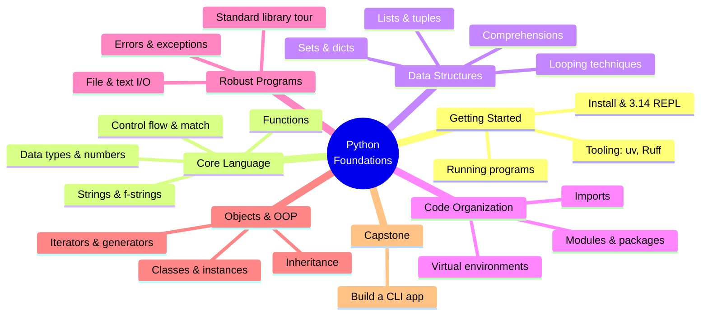
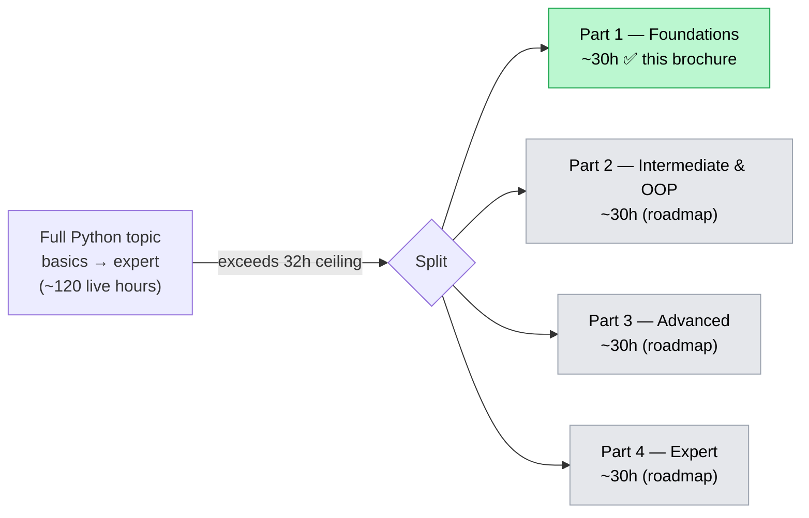

# Python Mastery — Part 1: Foundations

## From Absolute Basics to Confident, Idiomatic Python

**The Python Mastery Series · Program 01 of 4 | Rathinam Trainers & Consultants Private Limited**

> This is **Part 1 of a 4-part Python Mastery program** that covers Python end-to-end, from
> "never written a line" through expert-level CPython internals and C extensions. The full
> arc, the split, and how every documented Python topic is covered across the four parts is
> laid out in [`training_roadmap.md`](../../training_roadmap.md). This brochure is the complete,
> standalone scope for **Part 1 — Foundations**, grounded in the official Python 3.14 documentation.

---

## Course at a Glance

| | |
|---|---|
| **Program** | Python Mastery — Part 1: Foundations |
| **Shape** | **16 sessions × 2 hours live = 32 live hours**, one session per week (16 weeks) |
| **Delivery** | Live online on Microsoft Teams, **recorded**; trainer-led teach + demo + Q&A |
| **Hands-on** | Done by students **after** each session, from the recording + lab guides |
| **Python version** | **Python 3.14** (3.14.6, current stable — verified 2026-06-11) |
| **Audience** | Absolute beginners to programming, and developers from other languages new to Python |
| **Prerequisites** | None beyond basic computer literacy (install software, use a file system, type) |
| **Outcome** | Write correct, idiomatic, well-structured Python programs using the core language and standard library |
| **Takeaways** | Certificate of completion · a hands-on **capstone CLI application** · all lab code + recordings |

---

## Visual Table of Contents

<!-- export-png: brochure-mindmap.png -->



<details>
<summary>ASCII fallback</summary>

```
Python Foundations
├── Getting Started ....... install & 3.14 REPL · running programs · tooling (uv, Ruff)
├── Core Language ......... data types & numbers · strings & f-strings · control flow & match · functions
├── Data Structures ....... lists & tuples · sets & dicts · comprehensions · looping techniques
├── Code Organization ..... modules & packages · imports · virtual environments
├── Robust Programs ....... errors & exceptions · file & text I/O · standard library tour
├── Objects & OOP ......... classes & instances · inheritance · iterators & generators
└── Capstone .............. build a command-line application
```

</details>

---

## 1. Who This Course Is For

| Profile | Why this course |
|---------|-----------------|
| **Complete beginners** | Start from zero — no prior programming assumed; build a real working foundation |
| **Developers from other languages** | Map what you know (Java/C#/JS/Go) onto Python's data model and idioms, fast |
| **Data/QA/ops professionals** | Get the solid scripting foundation everything else (data, automation, AI) builds on |
| **Students preparing for AI/ML or backend tracks** | This is the prerequisite Part for every advanced Python and applied track |

**Assumed prior knowledge:** Basic computer literacy only — installing software, navigating a file system, using a text editor. **No prior programming experience is required.**

---

## 2. What You'll Be Able to Do

On finishing Part 1, you will be able to:

- **Write and run** Python 3.14 programs from the REPL, scripts, and a managed project, using `uv` and Ruff.
- **Use every core data type** — numbers, strings (including f-strings and an intro to t-strings), booleans, `None` — and reason about mutability.
- **Control program flow** with `if`/`elif`/`else`, `for`/`while`, `break`/`continue`/`else`-on-loops, and **structural pattern matching** (`match`/`case`).
- **Build and manipulate data structures** — lists, tuples, sets, dictionaries — and write **comprehensions** for all of them.
- **Define functions** with positional, keyword, default, `*args`/`**kwargs`, and keyword-only parameters; understand scope (LEGB), `global`/`nonlocal`, and basic type hints.
- **Organize code** into modules and packages; manage dependencies in **virtual environments**.
- **Handle errors** with `try`/`except`/`else`/`finally`, raise and chain exceptions, and define custom exceptions.
- **Read and write files** and text, including `pathlib`, and format output cleanly.
- **Use the standard library** for everyday tasks (`math`, `random`, `datetime`, `collections`, `json`, `os`, `sys`, and more).
- **Write classes** — attributes, methods, `__init__`, inheritance, and `__dunder__` basics — and use **iterators and generators**.
- **Deliver a capstone**: a complete, well-structured command-line application.

---

## 3. Module & Topic Coverage Map

This is the spine of the brochure. Every aspect below is drawn from the official Python 3.14
documentation; the **Source** column traces each module back to where it comes from. (Full
source list in [`000_topic_source/SOURCES.md`](../../000_topic_source/SOURCES.md).)

| Module | Aspects covered | Source |
|--------|-----------------|--------|
| **M1 — Getting Started & the Python Model** | What Python is; installing 3.14; the interactive interpreter & improved REPL; running scripts vs `-m`; bytecode/interpretation mental model; modern tooling (`uv` projects & venvs, Ruff lint/format) | Tutorial 1–2; What's New 3.14 (REPL) |
| **M2 — Numbers, Variables & Expressions** | `int`, `float`, `complex`, `bool`; arithmetic, division/floor/modulo, operator precedence; variables & assignment; `None`; floating-point limitations | Tutorial 3, 15; Lib `numbers`, `math` |
| **M3 — Strings & Text** | `str`, indexing/slicing, methods; immutability; f-strings; **intro to t-strings (PEP 750)**; `bytes` vs `str`, encodings basics | Tutorial 3, 7; Lib `string`; What's New 3.14 (t-strings) |
| **M4 — Control Flow** | `if`/`elif`/`else`; truthiness; `for`, `while`, `range()`; `break`/`continue`/`pass`; `else` on loops; **`match`/`case` structural pattern matching** | Tutorial 4 |
| **M5 — Functions** | Defining functions; arguments (positional, keyword, default, `*args`, `**kwargs`, keyword-only, positional-only); return values; docstrings; scope & LEGB, `global`/`nonlocal`; lambdas; **intro to type hints** | Tutorial 4; Reference (execution model) |
| **M6 — Lists & Tuples** | List operations & methods; `del`; tuples & sequence packing/unpacking; nested sequences; sequence comparison | Tutorial 5 |
| **M7 — Sets & Dictionaries** | Sets & set operations; dictionaries, methods, iteration; when to use which; `collections` first look (`Counter`, `defaultdict`, `namedtuple`) | Tutorial 5; Lib `collections` |
| **M8 — Comprehensions & Looping** | List/set/dict comprehensions; nested comprehensions; `enumerate`, `zip`, `reversed`, `sorted`; looping idioms; conditional expressions | Tutorial 5 |
| **M9 — Modules & Packages** | Writing & importing modules; `__name__`/`__main__`; the module search path; packages & `__init__.py`; the `dir()` function; standard modules | Tutorial 6; Reference (import system, intro) |
| **M10 — Virtual Environments & Dependencies** | Why isolation; `venv`; installing packages; `uv` project & lockfile workflow; reproducible environments | Tutorial 12; Packaging Guide (intro) |
| **M11 — Errors & Exceptions** | Syntax vs runtime errors; `try`/`except`/`else`/`finally`; raising & re-raising; exception chaining; user-defined exceptions; clean-up actions; **multi-exception `except` without parens (3.14)**; **exception notes & `except*` first look** | Tutorial 8; What's New 3.14 |
| **M12 — Files & I/O** | Reading/writing text & binary files; `with` / context managers (usage); `pathlib`; fancier output formatting; CSV/JSON basics | Tutorial 7; Lib `pathlib`, `json`, `csv` |
| **M13 — Standard Library Tour** | `os`/`sys`, `datetime`, `random`, `math`/`statistics`, `re` (intro), `argparse`/`logging` (intro), `collections` deeper | Tutorial 10–11; Lib (brief tour) |
| **M14 — Classes & OOP Basics** | Objects & names; namespaces & scope revisited; defining classes; instances, attributes, methods; `__init__`; class vs instance attributes; `__str__`/`__repr__`; private-by-convention | Tutorial 9 |
| **M15 — Inheritance & Iterators/Generators** | Inheritance; method overriding; `super()`; `isinstance`; iterators & the iterator protocol; generators & generator expressions; `yield` | Tutorial 9 |
| **M16 — Consolidation & Capstone** | Putting it together: project structure, a CLI app with `argparse`, packaging it as a runnable module, testing intro (`assert`, smoke), Q&A | Tutorial 6, 12; recap |

> **Full-coverage note.** Part 1 covers the **Tutorial** end-to-end plus the foundational
> slices of the Language Reference and Standard Library. Deeper Reference, the full typing
> system, advanced OOP, concurrency/async, packaging/distribution, testing at depth, the C
> API, and CPython internals are **explicitly carried by Parts 2–4** — named and partitioned
> in [`training_roadmap.md`](../../training_roadmap.md). Nothing in the documentation is dropped;
> it is covered across the four parts.

---

## 4. Fit-Check / Capacity Ledger

The course shape for each part of this program is the family standard: **16 sessions × 2 hours
= 32 live hours**. Usable teaching time is less than 32h once weekly recap, Q&A, and a
consolidation/capstone session are subtracted — the practical fill is **~28–30h**. The table
below budgets **live teach + demo** time per module (hands-on happens after sessions, so it is
not counted here).

| Module | Estimated live teach + demo (h) |
|--------|:---:|
| M1 — Getting Started & the Python Model | 1.5 |
| M2 — Numbers, Variables & Expressions | 1.5 |
| M3 — Strings & Text | 2.0 |
| M4 — Control Flow | 2.0 |
| M5 — Functions | 2.5 |
| M6 — Lists & Tuples | 1.5 |
| M7 — Sets & Dictionaries | 1.5 |
| M8 — Comprehensions & Looping | 2.0 |
| M9 — Modules & Packages | 1.5 |
| M10 — Virtual Environments & Dependencies | 1.5 |
| M11 — Errors & Exceptions | 2.0 |
| M12 — Files & I/O | 2.0 |
| M13 — Standard Library Tour | 2.0 |
| M14 — Classes & OOP Basics | 2.5 |
| M15 — Inheritance & Iterators/Generators | 2.5 |
| M16 — Consolidation & Capstone | 1.5 |
| **Recap / Q&A / buffer (distributed)** | **~1.5** |
| **TOTAL** | **~30.0 h** |

**Decision: Part 1 fits in one 16×2h (32h) course.** The ~30h budget sits inside the 32h
ceiling with sensible buffer. Because the *whole* topic (basics → expert) is far larger than
32h, the program is **split into 4 parts**; this brochure scopes the foundational Part 1, and
[`training_roadmap.md`](../../training_roadmap.md) scopes Parts 2–4 so the entire Python
documentation surface is covered across the program.



<details>
<summary>ASCII fallback</summary>

```
Full Python topic (basics -> expert, ~120 live hours)
        |  exceeds 32h ceiling -> SPLIT into 4 parts
        +--> Part 1  Foundations            ~30h   [THIS BROCHURE]
        +--> Part 2  Intermediate & OOP      ~30h   (see roadmap)
        +--> Part 3  Advanced                ~30h   (see roadmap)
        +--> Part 4  Expert                  ~30h   (see roadmap)
```

</details>

---

## 5. High-Level 16-Session Outline

A light module-to-weeks mapping showing the scope flows and fits. (The detailed session plan
is produced separately by the session planner — this is only the shape.)

| Week | Session focus | Modules |
|:---:|---------------|---------|
| 1 | Getting started: install 3.14, REPL, first program, `uv` & Ruff | M1 |
| 2 | Numbers, variables, expressions, floating-point reality | M2 |
| 3 | Strings & text; f-strings; a look at t-strings | M3 |
| 4 | Control flow + `match`/`case` | M4 |
| 5 | Functions, arguments, scope, type-hint intro | M5 |
| 6 | Lists & tuples | M6 |
| 7 | Sets & dictionaries; `collections` first look | M7 |
| 8 | Comprehensions & looping idioms | M8 |
| 9 | Modules & packages | M9 |
| 10 | Virtual environments & dependency management | M10 |
| 11 | Errors & exceptions (incl. 3.14 syntax) | M11 |
| 12 | Files & I/O; `pathlib`; JSON/CSV | M12 |
| 13 | Standard library tour | M13 |
| 14 | Classes & OOP basics | M14 |
| 15 | Inheritance; iterators & generators | M15 |
| 16 | Consolidation + capstone CLI app + Q&A | M16 |

---

## 6. Prerequisites, Tools & Environment

- **Prerequisites:** None beyond basic computer literacy. No prior programming required.
- **Machine:** Any laptop (Windows, macOS, or Linux) able to install Python 3.14.
- **Tools (current, web-verified 2026-06):**
  - **Python 3.14.x** (CPython, standard build).
  - **uv** (Astral) — project, virtual-environment, and dependency management.
  - **Ruff** (Astral) — linting & formatting.
  - An editor — **VS Code** (with Python/Pylance) recommended; any editor works.
- **Cost:** All tools are free and open-source. No paid services are required for Part 1.

---

## 7. Assessment & Certification

- **Weekly labs** — hands-on exercises completed after each session from the recording + lab guides.
- **Capstone deliverable** — a complete command-line application (e.g., a task/notes manager or
  text-processing tool) built with the core language, standard library, OOP, and exception handling.
- **Certificate of completion** awarded on finishing the labs and capstone.
- **Takeaways:** all lab code, the capstone scaffold, and session recordings.

---

## 8. Limitations / What's Out of Scope (carried by later parts)

Part 1 deliberately stops at *confident, idiomatic core Python*. The following are **named and
carried by later parts** (see [`training_roadmap.md`](../../training_roadmap.md)) — not dropped:

- **Part 2 — Intermediate & OOP:** decorators, context managers (authoring), advanced iterators/generators & `yield from`, dataclasses, enums, `functools`/`itertools`, deep standard library, full `re`, the complete static **typing** system, logging/config, unit testing with `pytest`, modular project design.
- **Part 3 — Advanced:** the Python data model & dunder protocols in depth, descriptors, metaclasses, abstract base classes, memory model & garbage collection, **concurrency** (threading, multiprocessing, `concurrent.futures`, free-threaded/no-GIL), **`asyncio`** and async/await, packaging & distribution to PyPI, performance basics.
- **Part 4 — Expert:** CPython internals & bytecode, the experimental JIT, profiling & optimization, **C extensions** (C API, `ctypes`, `cffi`, Cython, pybind11), embedding, advanced async patterns, design patterns, and production-grade tooling/CI.

Out of scope for the **whole program** (adjacent ecosystems, taught in their own tracks): web
frameworks (Django/FastAPI), data science (NumPy/pandas), and AI/ML libraries. These build *on*
Python and are separate Rathinam tracks.

---

## 9. Sources

All grounded against the **official Python 3.14 documentation**, verified **2026-06-11**:

- [The Python Tutorial (3.14)](https://docs.python.org/3/tutorial/index.html)
- [The Python Language Reference (3.14)](https://docs.python.org/3/reference/index.html)
- [The Python Standard Library (3.14)](https://docs.python.org/3/library/index.html)
- [What's New in Python 3.14](https://docs.python.org/3/whatsnew/3.14.html)
- [PEP 750 — Template Strings (t-strings)](https://peps.python.org/pep-0750/)
- [PEP 779 — Free-threaded CPython (supported)](https://peps.python.org/pep-0779/)
- [Status of Python versions](https://devguide.python.org/versions/)
- [uv documentation (Astral)](https://docs.astral.sh/uv/)
- [Ruff documentation (Astral)](https://docs.astral.sh/ruff/)

---

*Rathinam Trainers & Consultants Private Limited — we train engineers, not just tool users.
For batch schedules and corporate enquiries: www.rathinamtrainers.com · rajan@rathinamtrainers.com.*
