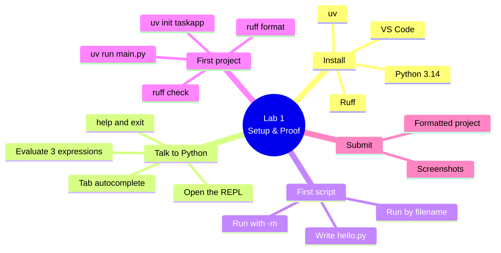

# Lab 1 — Set Up & Prove Your Python Toolchain

**Python Mastery — Part 1: Foundations · Week 1 · Student Lab Guide**

> **Audience:** You are a student in Week 1 of Python Mastery, Part 1. No prior programming
> experience is assumed.
> **Goal:** Stand up the exact toolchain this course uses — **Python 3.14**, **uv**, **Ruff**, and
> **VS Code** — and prove it works by talking to the REPL, running a script two ways, and scaffolding
> and formatting your first project (`taskapp`, the seed of your capstone). You do this on your own,
> after the live session, using the recording plus this guide.
> **Time:** about 45–75 minutes, depending on your operating system and download speed.

---

## Table of contents

<!-- export-png: session-01-lab-mindmap.png -->



<details>
<summary>ASCII fallback</summary>

```
Lab 1 — Setup & Proof
├── Install ............ Python 3.14 · uv · Ruff · VS Code
├── Talk to Python ..... open REPL · 3 expressions · Tab autocomplete · help / exit
├── First script ....... write hello.py · run by filename · run with -m
├── First project ...... uv init taskapp · uv run main.py · ruff format · ruff check
└── Submit ............. screenshots · formatted project
```

</details>

---

## 1. What you'll build and why

In the live session you watched two demos. In **Demo 1** the trainer opened Python's interactive
prompt — the **REPL** — typed a few things, and ran a tiny saved script two different ways. In
**Demo 2** the trainer used a tool called **uv** to scaffold a real project called `taskapp`, ran it,
and then used **Ruff** to format and check the code. This lab is you doing exactly those two things
yourself, at your own pace.

This is not busywork. The environment you build here is the environment every later week relies on,
and the `taskapp` project you scaffold today is the same project that grows, week by week, into the
command-line application you submit as your capstone. Getting this solid now makes everything that
follows smooth. If a step doesn't work the first time, that is completely normal — pause the
recording, re-read the step, and try again.

---

## 2. Prerequisites

Before you start, make sure you have:

- A laptop running **Windows 10/11, macOS, or Linux** on which **you are allowed to install
  software** (you'll need admin rights for some installers).
- A working **internet connection** (the tools download once).
- The **session recording** open in another window so you can follow along.

**Versions this lab targets (pinned):**

| Tool | Version this lab uses | Role |
|---|---|---|
| **Python** | **3.14.6** (any 3.14.x) | The language and interpreter you run |
| **uv** | latest (Astral) | Installs Python, scaffolds & runs your project |
| **Ruff** | latest (Astral) | Formats and lints your code |
| **VS Code** | latest | Your code editor |

You do **not** need to memorise these; you just need them installed.

---

## 3. Install the toolchain

You have two routes. **Route A (recommended)** uses **uv** to do almost everything — it can install
Python itself, so you install the fewest pieces by hand. **Route B** installs Python directly from
python.org if you prefer. Pick one route; you don't need both.

### 3.1 Install uv

uv is the one tool that bootstraps the rest. Install it first.

- **macOS / Linux** — open a terminal and run:

  ```bash
  curl -LsSf https://astral.sh/uv/install.sh | sh
  ```

- **Windows** — open **PowerShell** and run:

  ```powershell
  powershell -ExecutionPolicy ByPass -c "irm https://astral.sh/uv/install.ps1 | iex"
  ```

Close and reopen your terminal, then verify:

```bash
uv --version
```

**Checkpoint:** you see a version line such as `uv 0.x.x`.

### 3.2 Install Python 3.14

**Route A (via uv — recommended):**

```bash
uv python install 3.14
```

This downloads and sets up Python 3.14 for you. uv will use it automatically inside projects.

**Route B (from python.org):**

- Go to <https://www.python.org/downloads/> and download the **Python 3.14** installer for your OS.
- **Windows:** run the installer and, on the very first screen, **tick "Add python.exe to PATH"**
  before clicking Install. This one checkbox prevents the most common Windows problem.
- **macOS:** open the downloaded `.pkg` and click through the prompts.
- **Linux:** prefer Route A (`uv python install 3.14`), since your distro's packaged Python is often
  older than 3.14.

Verify Python is available:

```bash
# macOS / Linux
python3.14 --version
# Windows
py -3.14 --version
```

**Checkpoint:** you see `Python 3.14.6` (or another `3.14.x`).

> If you used Route A and `python3.14` is "not found" at the system prompt, that's fine — uv manages
> it. You'll run Python through `uv run` and through projects, which always find the right version.

### 3.3 Install Ruff

You don't have to install Ruff separately — you can run it on demand through uv with the `uvx`
command. Verify it works (the first run downloads it):

```bash
uvx ruff --version
```

**Checkpoint:** you see a line such as `ruff 0.x.x`.

### 3.4 Install VS Code

- Download **Visual Studio Code** from <https://code.visualstudio.com/> and install it.
- Open VS Code, go to the **Extensions** panel, and install the **Python** extension (by Microsoft);
  it brings **Pylance** with it. We'll lean on this in later weeks.

**Checkpoint:** VS Code opens and the Python extension shows as installed.

---

## 4. Talk to Python in the REPL

The REPL is an interactive prompt where you type one line and Python answers immediately. This
mirrors **Demo 1**.

### 4.1 Open the REPL

```bash
# macOS / Linux
python3.14
# Windows
py -3.14
# or, on any OS if you installed Python via uv:
uv run python
```

You'll see a banner ending in a `>>>` prompt. In a colour-capable terminal, what you type is
**syntax-highlighted** automatically — that's the new Python 3.14 REPL.

### 4.2 Evaluate three expressions

Type each line and press Enter. Try these three (or your own):

```pycon
>>> 2 + 2
4
>>> "python".upper()
'PYTHON'
>>> print("Hello from the REPL")
Hello from the REPL
```

### 4.3 Try import autocompletion

Type `import ma` and press the **Tab** key (don't type the rest):

```pycon
>>> import ma     # press Tab
```

Python should complete it to `import math`. Press Enter to run it. (If Tab doesn't complete in your
terminal, just type `import math` fully — it's a convenience, not a requirement.)

### 4.4 Ask for help, then leave

```pycon
>>> help(len)
```

A short help page appears (press `q` if a pager opens). Then exit the REPL:

```pycon
>>> exit()
```

(`Ctrl-D` on macOS/Linux, or `Ctrl-Z` then Enter on Windows, also works.)

**Checkpoint:** you evaluated at least three expressions and exited cleanly. **Take a screenshot of
this REPL session** — you'll submit it.

---

## 5. Write and run your first script

A script is saved code you run again and again. This mirrors the second half of **Demo 1**.

### 5.1 Create the file

Make a new file called `hello.py` (in VS Code: File → New File, save as `hello.py`) containing
exactly one line:

```python
print("Hello, Python 3.14")
```

Save it, and note the folder you saved it in. Open a terminal **in that same folder**.

> Tip: in VS Code, open the integrated terminal with **View → Terminal**; it opens in your project
> folder automatically.

### 5.2 Run it by filename

```bash
# macOS / Linux
python3.14 hello.py
# Windows
py -3.14 hello.py
```

Expected output:

```text
Hello, Python 3.14
```

### 5.3 Run it again as a module with `-m`

```bash
# macOS / Linux
python3.14 -m hello
# Windows
py -3.14 -m hello
```

Notice you dropped the `.py`. Expected output is **identical**:

```text
Hello, Python 3.14
```

The first form runs *this file by its path*; the `-m` form runs *the module named `hello`* found in
the current folder. Same result today — the `-m` form becomes important when we build packages in
Week 9.

**Checkpoint:** the same message printed both ways. **Take a screenshot showing both runs** — you'll
submit it.

---

## 6. Scaffold and tidy your first project

Now turn a loose idea into a real project. This mirrors **Demo 2**, and the project you create here is
the seed of your capstone — **keep it.**

### 6.1 Create the project

In a folder where you want your course work to live, run:

```bash
uv init taskapp
cd taskapp
```

uv creates a `taskapp/` folder. Look inside:

```bash
# macOS / Linux
ls -a
# Windows (PowerShell)
dir
```

You should see `.python-version`, `README.md`, `main.py`, and `pyproject.toml` (plus a `.git` folder
and `.gitignore` that uv adds — you can ignore those this week).

### 6.2 Look at the starter code and run it

Open `main.py` in VS Code. It contains a ready-made starter:

```python
def main():
    print("Hello from taskapp!")


if __name__ == "__main__":
    main()
```

Run the project with uv:

```bash
uv run main.py
```

Expected output:

```text
Hello from taskapp!
```

### 6.3 Format with Ruff

To see the formatter do real work, first **make the file messy on purpose**. Replace the contents of
`main.py` with this badly-spaced version and save:

```python
import math
def main( ):
    name='taskapp'
    print( "Hello from "+name+"!" )
if __name__=='__main__':
    main()
```

Now run the formatter:

```bash
uvx ruff format
```

Expected output:

```text
1 file reformatted
```

Re-open `main.py` — the spacing, quotes, and blank lines are now clean and consistent.

### 6.4 Check with Ruff and fix the issue

The messy version imports `math` but never uses it. Run the linter:

```bash
uvx ruff check
```

Expected — Ruff flags the unused import, something like:

```text
main.py:1:8: F401 [*] `math` imported but unused
Found 1 error.
[*] 1 fixable with the `--fix` option.
```

Let Ruff fix it automatically:

```bash
uvx ruff check --fix
```

Then run the check again to confirm a clean result:

```bash
uvx ruff check
```

Expected:

```text
All checks passed!
```

Finally, confirm the project still runs:

```bash
uv run main.py
```

Expected:

```text
Hello from taskapp!
```

**Checkpoint:** `uvx ruff check` says `All checks passed!` and `uv run main.py` prints
`Hello from taskapp!`.

---

## 7. Expected outcome / self-check

You're done with the core lab when **all** of these are true:

- [ ] `uv --version`, `uvx ruff --version`, and Python 3.14 all respond.
- [ ] You opened the REPL, evaluated at least three expressions, and exited cleanly (screenshot taken).
- [ ] `hello.py` runs and prints `Hello, Python 3.14` **both** by filename and with `-m` (screenshot taken).
- [ ] `uv init taskapp` created a project that runs with `uv run main.py`.
- [ ] `uvx ruff format` reformatted the file and `uvx ruff check` reports `All checks passed!`.

---

## 8. Where to look in the recording

If a step is unclear, scrub to the matching demo in the session recording:

| You're stuck on… | Watch | In the recording |
|---|---|---|
| Opening the REPL, autocomplete, `help`, exit | **Demo 1 (D1)** | The "REPL tour" segment |
| Writing & running `hello.py` two ways | **Demo 1 (D1)** | The "first script" segment |
| `uv init`, the project files, `uv run` | **Demo 2 (D2)** | The "uv init" segment |
| `ruff format` and `ruff check` | **Demo 2 (D2)** | The "Ruff in action" segment |
| Install problems per OS | **Q&A** | The "install help" segment near the end |

---

## 9. Stretch goals (optional)

If you finished early and want to push a little further:

1. In the REPL, try `import this` and read Python's design philosophy ("The Zen of Python").
2. In the REPL, explore: `len("hello")`, `10 / 3`, `10 // 3`, `2 ** 8`, and `"ab" * 3`. Guess each
   result before you press Enter. (We go deep on numbers next week.)
3. Add a second line to `taskapp`'s `main()` that prints a message of your own, run it, then run
   `uvx ruff format` and `uvx ruff check` again to keep it clean.
4. Open the `taskapp` folder in VS Code and read `pyproject.toml` — see if you can spot the project
   name and the Python version requirement.

---

## 10. Reference — commands used in this lab

| Command | What it does |
|---|---|
| `uv --version` | Show the installed uv version |
| `uv python install 3.14` | Install Python 3.14 via uv |
| `python3.14` / `py -3.14` / `uv run python` | Open the Python 3.14 REPL |
| `2 + 2`, `"x".upper()`, `print(...)` | Evaluate expressions in the REPL |
| `import ma` + **Tab** | Autocomplete an import name |
| `help(len)` | Show help for a built-in |
| `exit()` | Leave the REPL |
| `python3.14 hello.py` / `py -3.14 hello.py` | Run a script by filename |
| `python3.14 -m hello` / `py -3.14 -m hello` | Run the same file as a module |
| `uv init taskapp` | Scaffold a new project |
| `uv run main.py` | Run the project's script in its managed environment |
| `uvx ruff format` | Format the code |
| `uvx ruff check` | Lint the code |
| `uvx ruff check --fix` | Auto-fix safe lint issues |

---

## 11. Troubleshooting & limitations

**"`python3.14` / `python` is not recognised / command not found."** This is almost always a PATH
problem, not a broken Python. On Windows, re-run the python.org installer and tick **"Add python.exe
to PATH"**, or use the `py -3.14` launcher. On macOS/Linux, try `python3.14`, or just use
`uv run python`, which always finds the version your project pins. Close and reopen your terminal
after any install so it picks up new PATH entries.

**"`uv` / `uvx` is not recognised right after install."** Close the terminal and open a fresh one so
your shell reloads PATH. If it still fails on Windows, sign out and back in.

**Tab doesn't autocomplete the import.** Some terminals and remote (SSH) sessions don't pass Tab
through. Just type the full `import math` — autocompletion is a convenience, not a requirement, and
the rest of the lab is unaffected.

**The REPL has no colours.** Syntax highlighting needs a colour-capable (ANSI) terminal. It's purely
cosmetic — everything works without it. (Setting `PYTHON_BASIC_REPL=1` forces the old plain REPL; you
don't need that.)

**`uvx ruff` is slow the first time.** The very first `uvx ruff` call downloads Ruff once, then caches
it; later calls are instant.

**`ruff check` shows nothing to fix.** If you didn't paste the messy code from section 6.3 (which adds
an unused `import math`), there may be no issue to find — `All checks passed!` is then the correct,
expected result.

**Limitations of this lab.** This week is purely about environment and tooling — you won't write
real program logic yet; that starts in Week 2. The `taskapp` starter prints a fixed greeting on
purpose; we grow its behaviour in later weeks.

---

## 12. Submission / sign-off

Submit the following to the course channel on Microsoft Teams (this is your Week 1 checkpoint, which
confirms your environment works before Week 2 builds on it):

1. A **screenshot of your REPL session** (section 4) showing at least three evaluated expressions.
2. A **screenshot of `hello.py` running both ways** — by filename and with `-m` (section 5).
3. Proof of your **formatted `taskapp` project**: a screenshot of `uvx ruff check` showing
   `All checks passed!` and `uv run main.py` showing `Hello from taskapp!`, **and** paste the contents
   of your `taskapp/pyproject.toml`.

Once your trainer confirms these, you're signed off for Week 1. Keep your `taskapp` folder safe — you
reopen it next week.

---

## 13. Sources

All steps verified against current official documentation on **2026-06-22**:

- [What's New in Python 3.14 (REPL: highlighting & import autocompletion)](https://docs.python.org/3/whatsnew/3.14.html)
- [Python Tutorial — The Interpreter & an Informal Introduction (3.14)](https://docs.python.org/3/tutorial/index.html)
- [Python 3.14.6 release](https://www.python.org/downloads/release/python-3146/)
- [Download Python (installers, all OSes)](https://www.python.org/downloads/)
- [uv — Creating projects (`uv init`)](https://docs.astral.sh/uv/concepts/projects/init/)
- [uv — Installing Python (`uv python install`)](https://docs.astral.sh/uv/guides/install-python/)
- [Ruff — The formatter (`ruff format`)](https://docs.astral.sh/ruff/formatter/)
- [Ruff — Tutorial (`ruff check`, `uvx ruff`)](https://docs.astral.sh/ruff/tutorial/)
- [VS Code download](https://code.visualstudio.com/)
