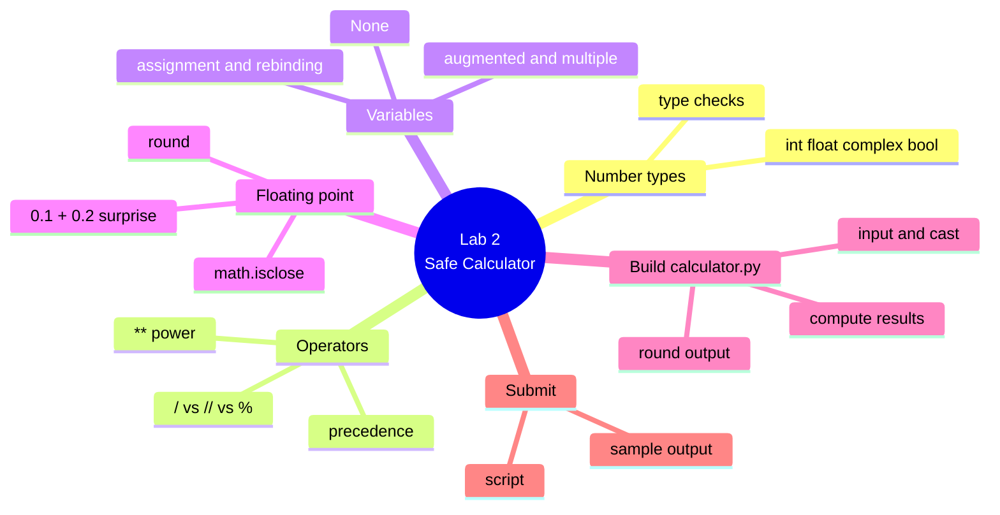

# Lab 2 — A Safe Little Calculator

**Python Mastery — Part 1: Foundations · Week 2 · Student Lab Guide**

> **Audience:** You are a student in Week 2 of Python Mastery, Part 1. You have completed Week 1 (or
> set up its toolchain): Python 3.14, uv, Ruff, and VS Code are installed and working.
> **Goal:** Write a small but real arithmetic program — `calculator.py` — that reads two numbers from
> the user, computes several results with the right operators, and prints them **cleanly rounded** so
> no floating-point noise leaks out. Along the way you'll cement the number types, the three kinds of
> division, operator precedence, variables, and the floating-point defenses from the live session.
> **Time:** about 45–75 minutes, depending on how much you explore.

---

## Table of contents

<!-- export-png: session-02-lab-mindmap.png -->



<details>
<summary>ASCII fallback</summary>

```
Lab 2 — Safe Calculator
├── Number types ..... int · float · complex · bool · type() checks
├── Operators ........ / vs // vs % · ** power · precedence
├── Variables ........ assignment & rebinding · augmented & multiple · None
├── Floating point ... 0.1 + 0.2 surprise · round · math.isclose
├── Build ............ calculator.py: input & cast · compute · round output
└── Submit ........... script · sample output
```

</details>

---

## 1. What you'll build and why

In the live session you watched two demos. In **Demo 3** the trainer used the REPL as a calculator —
running true division, floor division, modulo, and the power operator side by side, and showing how
parentheses and precedence change an answer. In **Demo 4** the trainer revealed the famous
floating-point surprise (`0.1 + 0.2` is *not* exactly `0.3`), demonstrated the three standard
defenses, and built a small tip calculator that reads numbers from the user.

This lab is you bringing those two demos together into one program. You'll write `calculator.py`: it
asks the user for two numbers, computes their sum, difference, floor-division, remainder, and a
percentage, and prints every result **rounded sensibly** so the output is clean. It's a small program,
but it exercises almost everything from Week 2, and it's the kind of safe-arithmetic habit you'll use
in every program from here on.

Put `calculator.py` **beside** your `taskapp` folder from Week 1 (in the same parent folder), or drop
it *inside* `taskapp/` if you'd like to run it with `uv run`. Either is fine this week.

---

## 2. Prerequisites

Before you start, make sure you have:

- A working **Week 1 toolchain**: Python 3.14, uv, Ruff, and VS Code, all installed and verified.
- The **session recording** open in another window so you can follow along.
- About an hour of quiet time.

**Versions this lab targets (pinned):**

| Tool | Version this lab uses | Role |
|---|---|---|
| **Python** | **3.14.6** (any 3.14.x) | The language and interpreter you run |
| **uv** | latest (Astral) | Runs Python / your project |
| **Ruff** | latest (Astral) | Formats and lints your code |
| **VS Code** | latest | Your code editor |

Quick check that your environment still works:

```bash
python3.14 --version    # or: py -3.14 --version   /   uv run python --version
uv --version
```

**Checkpoint:** Python reports `3.14.x` and uv reports a version.

---

## 3. Warm up in the REPL (mirrors Demo 3)

Before writing the script, spend a few minutes in the REPL building the same muscle memory the trainer
showed. Open it:

```bash
# macOS / Linux
python3.14
# Windows
py -3.14
# or, on any OS:
uv run python
```

### 3.1 The four number types

```pycon
>>> type(42)
<class 'int'>
>>> type(3.14)
<class 'float'>
>>> type(2 + 3j)
<class 'complex'>
>>> type(True)
<class 'bool'>
>>> True + True
2
```

Notice the last line: `bool` is a kind of `int`, so `True` behaves like `1`.

### 3.2 The three divisions and the power operator

Predict each result *before* you press Enter, then check yourself:

```pycon
>>> 7 / 2
3.5
>>> 7 // 2
3
>>> 7 % 2
1
>>> 2 ** 10
1024
>>> 4 / 2
2.0
```

The single slash (`/`) **always** gives a `float` — even `4 / 2` is `2.0`. The double slash (`//`)
floors to a whole number, and `%` gives the remainder.

### 3.3 Precedence

```pycon
>>> 2 + 3 * 4
14
>>> (2 + 3) * 4
20
>>> 2 ** 3 ** 2
512
```

Multiplication binds tighter than addition. The power operator `**` groups **right to left**, so
`2 ** 3 ** 2` is `2 ** (3 ** 2)` = `2 ** 9` = `512`.

### 3.4 Variables and `None`

```pycon
>>> x = 5
>>> x += 3
>>> x
8
>>> a, b = 1, 2
>>> a, b = b, a
>>> a, b
(2, 1)
>>> result = None
>>> result is None
True
```

**Checkpoint:** you can predict the result of each operator, and you've seen augmented assignment,
the one-line swap, and `None`. Leave the REPL with `exit()` when you're done.

---

## 4. See the floating-point surprise (mirrors Demo 4)

Still comfortable in the REPL? Open it again and reproduce the famous surprise yourself:

```pycon
>>> 0.1 + 0.2
0.30000000000000004
>>> 0.1 + 0.2 == 0.3
False
```

That long tail is not a bug — decimals are stored as binary fractions, and most don't fit exactly, so
tiny errors appear. Now apply the three defenses:

```pycon
>>> round(0.1 + 0.2, 2)
0.3
>>> import math
>>> math.isclose(0.1 + 0.2, 0.3)
True
>>> f"{0.1 + 0.2:.2f}"
'0.30'
```

Remember the golden rule: **never compare floats with `==`** — use `math.isclose`. Use `round` when
you want a clean value to keep, and formatting when you just want to display a number nicely.

**Checkpoint:** you reproduced `0.30000000000000004` and saw all three defenses give the clean result.

---

## 5. Build `calculator.py`

Now write the program. Create a new file called `calculator.py` (in VS Code: File → New File, save as
`calculator.py`) beside your `taskapp` folder.

### 5.1 Read two numbers — and cast them

The single most important habit in this lab: `input()` **always returns text**, so you must convert it
to a number with `float()` before doing any maths.

```python
a = float(input("First number: "))
b = float(input("Second number: "))
```

If you forget the `float(...)` wrapper, your arithmetic will either error or silently do the wrong
thing (text `+` text *joins*, it doesn't add).

### 5.2 Compute the results

Use the operators from Demo 3. Compute the sum, the difference, the floor-division, the remainder, and
a percentage of the first number relative to the second:

```python
total = a + b
difference = a - b
floor_div = a // b
remainder = a % b
percentage = a / b * 100
```

### 5.3 Print everything, cleanly rounded

Round every result to two decimal places so no floating-point noise reaches the user. You can round
inside an f-string's format spec, or with `round()` — either is fine. Here both styles are shown:

```python
print(f"Sum:            {round(total, 2)}")
print(f"Difference:     {round(difference, 2)}")
print(f"Floor division: {round(floor_div, 2)}")
print(f"Remainder:      {round(remainder, 2)}")
print(f"Percentage:     {percentage:.2f}%")
```

### 5.4 Run it

```bash
# macOS / Linux
python3.14 calculator.py
# Windows
py -3.14 calculator.py
# or, if you placed it inside taskapp/:
uv run calculator.py
```

### 5.5 The sample run to match

When prompted, type **`12.5`** then **`4`**. Your output must match this exactly (this is the run you
will submit):

```text
First number: 12.5
Second number: 4
Sum:            16.5
Difference:     8.5
Floor division: 3.0
Remainder:      0.5
Percentage:     312.50%
```

Then run it a second time with **`0.1`** and **`0.2`** to prove your rounding tames the float noise:

```text
First number: 0.1
Second number: 0.2
Sum:            0.3
Difference:     -0.1
Floor division: 0.0
Remainder:      0.1
Percentage:     50.00%
```

Notice the **Sum** is a clean `0.3`, not `0.30000000000000004` — because you rounded it.

### 5.6 Keep it tidy with Ruff

```bash
uvx ruff format calculator.py
uvx ruff check calculator.py
```

**Checkpoint:** `calculator.py` reproduces both sample runs above exactly, and `uvx ruff check`
reports `All checks passed!`.

---

## 6. Expected outcome / self-check

You're done with the core lab when **all** of these are true:

- [ ] In the REPL you can predict the results of `/`, `//`, `%`, `**`, and a precedence expression.
- [ ] You reproduced `0.1 + 0.2` → `0.30000000000000004` and used `round` and `math.isclose`.
- [ ] `calculator.py` reads two numbers, casting each with `float()`.
- [ ] It prints sum, difference, floor-division, remainder, and percentage, all **rounded** to 2 dp.
- [ ] The `12.5` / `4` run and the `0.1` / `0.2` run match the expected output exactly.
- [ ] `uvx ruff check calculator.py` reports `All checks passed!`.

---

## 7. Where to look in the recording

If a step is unclear, scrub to the matching demo in the session recording:

| You're stuck on… | Watch | In the recording |
|---|---|---|
| `/` vs `//` vs `%`, `**`, mixing types | **Demo 3 (D3)** | The "operators side by side" segment |
| Precedence and parentheses | **Demo 3 (D3)** | The "precedence in action" segment |
| Augmented / multiple assignment, swap | **Demo 3 (D3)** | The end of D3 |
| `0.1 + 0.2`, `round`, `math.isclose` | **Demo 4 (D4)** | The "floating-point surprise" segment |
| Reading input, casting, the tip calc | **Demo 4 (D4)** | The "tip calculator" segment |
| Arithmetic gotchas (e.g. `int("3.5")`) | **Q&A** | The "common gotchas" segment near the end |

---

## 8. Stretch goals (optional)

If you finished early and want to push a little further:

1. Add a sixth line that prints `a ** b` (the power), rounded. Try `2` and `10`, then `2` and `0.5`
   (what does a fractional power give you?).
2. Guard against division by zero: before computing `a / b` and `a // b`, check `if b == 0:` and print
   a friendly message instead of letting Python raise `ZeroDivisionError`. (We learn the proper way to
   handle errors in Week 11 — this is a gentle preview.)
3. Use `math` for one extra result: `import math` and print `math.sqrt(a)` rounded to 2 dp. Notice it
   errors for negative `a` — that's expected.
4. Show the type of one result with `type(...)` to confirm that `/` produced a `float` while `//`
   produced a value you can floor to a whole number.

---

## 9. Reference — what each piece does

| Item | What it does |
|---|---|
| `int`, `float`, `complex`, `bool` | The four numeric types; `bool` is a kind of `int` |
| `a / b` | True division — **always** a `float` |
| `a // b` | Floor division — rounds **down** to a whole number |
| `a % b` | Modulo — the remainder after division |
| `a ** b` | Power; groups **right to left** |
| `2 + 3 * 4` | Precedence: `*` before `+` → `14` |
| `x += 3` | Augmented assignment — `x = x + 3` |
| `a, b = b, a` | Multiple assignment — one-line swap |
| `None` / `is None` | The "no value" object; test with `is None` |
| `input(...)` | Reads user input — **always returns a `str`** |
| `float(s)` / `int(s)` | Cast text to a number before doing maths |
| `round(x, 2)` | Round to 2 decimal places — clean value |
| `math.isclose(a, b)` | Compare two floats safely (never use `==`) |
| `f"{x:.2f}"` | Format a number for display with 2 decimals |
| `uvx ruff format` / `uvx ruff check` | Format and lint your code |

---

## 10. Troubleshooting & limitations

**"`TypeError: can only concatenate str ... to str`" when adding.** You forgot to cast the input.
`input()` returns text; wrap it in `float(...)` (or `int(...)`) before doing arithmetic.

**"`ValueError: could not convert string to float`".** You typed something that isn't a number (a
letter, an empty line, a stray space). Re-run and type a plain number like `12.5`. Robust handling of
bad input is a Week 11 topic; for now, just type valid numbers.

**`int("3.5")` raises an error.** `int()` can't parse a string that contains a decimal point. Cast to
`float` first (`float("3.5")`), then to `int` if you truly need a whole number.

**`ZeroDivisionError: ...`** You divided by zero. If your second number is `0`, the `/`, `//`, and `%`
operations will fail. See stretch goal 2 for a gentle guard, or just avoid `0` as the second number
for the core lab.

**My sum prints `0.30000000000000004` instead of `0.3`.** You didn't round (or format) that line.
Wrap the value in `round(value, 2)` or use a `{value:.2f}` format spec.

**`-7 // 2` gives `-4`, which looks wrong.** It's correct — floor division rounds *toward negative
infinity* (downward), not toward zero. This only surprises you with negative numbers.

**`python3.14` / `py` not recognised.** Almost always a PATH issue, not broken Python. Use
`uv run python`, which always finds your pinned version, or revisit the Week 1 troubleshooting notes.

**Limitations of this lab.** This week is about numbers and safe arithmetic only — you're not yet
handling bad input gracefully (Week 11) or formatting rich text reports (Week 3). The calculator does
one calculation per run on purpose; looping menus come later.

---

## 11. Submission / sign-off

Submit the following to the course channel on Microsoft Teams (this is your Week 2 checkpoint, which
confirms you've got safe arithmetic working before Week 3 builds on it):

1. Your **`calculator.py`** file (paste the code, or attach the file).
2. A **screenshot or pasted text of two runs**: the `12.5` / `4` run and the `0.1` / `0.2` run,
   showing output that matches Section 5.5 exactly — including the clean, rounded `Sum` on the second
   run.
3. One sentence in your own words: **why** `0.1 + 0.2` does not equal `0.3`, and which defense you used
   to keep your output clean.

Once your trainer confirms these, you're signed off for Week 2. Keep `calculator.py` and your
`taskapp` folder — both come back as we build the course up week by week.

---

## 12. Sources

All steps and outputs verified against current official documentation on **2026-06-25**:

- [Built-in Types — numeric types (`int`, `float`, `complex`, `bool`) — Python 3.14.6](https://docs.python.org/3/library/stdtypes.html#numeric-types-int-float-complex)
- [15. Floating-Point Arithmetic: Issues and Limitations — Python 3.14.6](https://docs.python.org/3/tutorial/floatingpoint.html)
- [`math.isclose` — math module — Python 3.14.6](https://docs.python.org/3/library/math.html#math.isclose)
- [`round` — Built-in Functions — Python 3.14.6](https://docs.python.org/3/library/functions.html#round)
- [`input` — Built-in Functions — Python 3.14.6](https://docs.python.org/3/library/functions.html#input)
- [An Informal Introduction to Python (numbers) — Tutorial 3.14](https://docs.python.org/3/tutorial/introduction.html#numbers)
- [Ruff — The formatter & `ruff check`](https://docs.astral.sh/ruff/)
