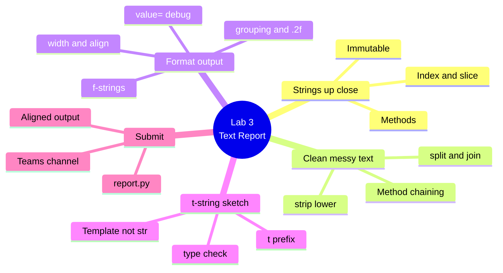

# Lab 3 — Build a Text-Report Formatter

**Python Mastery — Part 1: Foundations · Week 3 · Student Lab Guide**

> **Audience:** You are a student in Week 3 of Python Mastery, Part 1. You have completed Labs 1 and
> 2, so you already have Python 3.14, uv, and Ruff working, and a `taskapp` project. No deeper
> background is assumed.
> **Goal:** Produce clean, professional text output. You'll clean messy text with string methods and
> slicing, then print an **aligned table** with f-strings and the format mini-language, and finish by
> writing one line as a **t-string** to see how it differs from an f-string. You do this on your own,
> after the live session, using the recording plus this guide.
> **Time:** about 45–75 minutes.

---

## Table of contents

<!-- export-png: session-03-lab-mindmap.png -->



<details>
<summary>ASCII fallback</summary>

```
Lab 3 — Text Report
├── Strings up close .... index & slice · methods · immutable
├── Clean messy text .... strip/lower · split & join · method chaining
├── Format output ....... f-strings · width & align · grouping & .2f · {value=} debug
├── t-string sketch ..... t prefix · Template not str · type() check
└── Submit .............. report.py · aligned output · Teams channel
```

</details>

---

## 1. What you'll build and why

In the live session you watched two demos. In **Demo 5** the trainer took a messy line of text and
cleaned it up by chaining string methods — stripping spaces, lowercasing, splitting on commas — and
sliced individual words, then rebuilt a clean string with `join`, proving the original never changed.
In **Demo 6** the trainer built a neatly aligned report row using f-strings and the format
mini-language, and then showed that the same interpolation written as a **t-string** produces a
`Template` object instead of a finished string.

In this lab you build a small program, `report.py`, that does both: it cleans a few rows of data and
prints them as a tidy, aligned table where the columns line up and the numbers are formatted properly.
Then you add a short comment sketching one line as a t-string.

This matters because almost every program you ever write produces text output for a human to read —
reports, logs, messages, receipts. Doing it cleanly is a skill you'll use forever, and the f-string
skills you build here are used in every later lab in this course. If a step doesn't work the first
time, that's normal — pause the recording, re-read the step, and try again.

---

## 2. Prerequisites

Before you start, make sure you have:

- A working **Python 3.14** environment from Lab 1 (this lab's t-string section **requires 3.14**).
- **uv** and **Ruff** available (you used them in Labs 1–2).
- **VS Code** (or any editor) for writing `report.py`.
- The **session recording** open in another window so you can follow along.

**Versions this lab targets (pinned):**

| Tool | Version this lab uses | Why it matters here |
|---|---|---|
| **Python** | **3.14.6** (any 3.14.x) | t-strings (PEP 750) only exist in Python **3.14+** |
| **uv** | latest (Astral) | Runs your script in its managed environment |
| **Ruff** | latest (Astral) | Formats and lints `report.py` |

**Quick check that your Python is 3.14** (the t-string part will not work otherwise):

```bash
# macOS / Linux
python3.14 --version
# Windows
py -3.14 --version
# or, on any OS:
uv run python --version
```

You should see `Python 3.14.6` (or another `3.14.x`).

---

## 3. Warm up in the REPL (mirrors Demo 5)

Before writing the script, get a feel for strings interactively. Open the REPL:

```bash
# macOS / Linux
python3.14
# Windows
py -3.14
# or, on any OS:
uv run python
```

### 3.1 Index and slice

```pycon
>>> word = "Python"
>>> word[0]
'P'
>>> word[-1]
'n'
>>> word[1:4]
'yth'
>>> word[:2]
'Py'
>>> word[::-1]
'nohtyP'
```

Notice: counting starts at **0**, `-1` is the last character, the slice **stop is excluded**, and
`[::-1]` reverses the string.

### 3.2 Clean messy text by chaining methods

```pycon
>>> raw = "  Buy Milk, Eggs, Bread  "
>>> raw.strip().lower()
'buy milk, eggs, bread'
>>> items = [w.strip() for w in raw.strip().split(",")]
>>> items
['Buy Milk', 'Eggs', 'Bread']
>>> ", ".join(items)
'Buy Milk, Eggs, Bread'
```

`split(",")` breaks the text into a list on the commas; the per-item `.strip()` removes the leftover
spaces; `", ".join(...)` glues the pieces back into one string.

> If the comprehension `[w.strip() for w in ...]` feels unfamiliar, do it in two steps instead:
> `parts = raw.strip().split(",")`, then strip each piece in a plain `for` loop that appends to a new
> list. We cover comprehensions properly in Week 8 — either approach is fine here.

### 3.3 See that strings are immutable

```pycon
>>> raw
'  Buy Milk, Eggs, Bread  '
>>> raw[0] = "X"
Traceback (most recent call last):
  File "<stdin>", line 1, in <module>
TypeError: 'str' object does not support item assignment
```

`raw` is **unchanged** after all that cleaning, because every method returned a *new* string. And you
cannot change a character in place — Python raises a `TypeError`. Type `exit()` to leave the REPL when
you're done.

**Checkpoint:** you cleaned a messy string by chaining methods and confirmed the original was
unchanged.

---

## 4. Format output with f-strings (mirrors Demo 6)

Still in the REPL (or a fresh one), explore the format mini-language.

### 4.1 Basic f-strings and the debug `=` trick

```pycon
>>> name, qty = "Eggs", 12
>>> f"{name}: {qty}"
'Eggs: 12'
>>> f"{qty=}"
'qty=12'
```

An f-string starts with `f` and replaces `{ ... }` with the value of whatever's inside. Adding `=`
inside the braces prints both the expression and its value — a great debugging shortcut.

### 4.2 Width, alignment, grouping, and decimals

```pycon
>>> name, qty, price = "Eggs", 12, 3.5
>>> f"{name:<10}{qty:>4}{price:>8.2f}"
'Eggs        12    3.50'
>>> f"{1234567.5:>12,.2f}"
'1,234,567.50'
```

Read the spec after the colon:

| Spec | Meaning |
|---|---|
| `<10` | left-align, pad to width 10 |
| `>4` | right-align, width 4 |
| `^6` | centre, width 6 |
| `,` | insert thousands separators |
| `.2f` | float with exactly 2 decimal places |
| `>10,.2f` | all combined: right-aligned, width 10, grouped, 2 decimals |

Columns line up because each field has a **fixed width**, regardless of the value's length.

**Checkpoint:** you produced an aligned row and a thousands-grouped number with two decimals.

---

## 5. See a t-string (mirrors the end of Demo 6)

This part **requires Python 3.14**. In the REPL:

```pycon
>>> name = "Eggs"
>>> f"Item: {name}"
'Item: Eggs'
>>> t"Item: {name}"
Template(strings=('Item: ', ''), interpolations=(Interpolation('Eggs', 'name', None, ''),))
>>> type(t"Item: {name}")
<class 'string.templatelib.Template'>
```

The f-string immediately builds a finished **`str`**. The t-string — same text, just a `t` prefix
instead of `f` — builds a **`Template`** instead, which keeps the static text and the interpolated
values separate. That's *why* t-strings exist: a library can inspect and **safely sanitise** those
values before assembling the final text (preventing bugs like SQL injection and HTML/XSS). In Part 1
you only need to **recognise** a t-string and state how it differs from an f-string — you'll see the
finished `str` from an f-string and the `Template` from a t-string. If you'd like, peek at the parts:

```pycon
>>> tmpl = t"Item: {name}"
>>> tmpl.strings
('Item: ', '')
>>> tmpl.values
('Eggs',)
```

**Checkpoint:** `type(t"Item: {name}")` reports `string.templatelib.Template`, and you can say in one
sentence how a t-string differs from an f-string.

---

## 6. Write `report.py`

Now put it together into a script. Create a file `report.py` (keep it next to your `taskapp` folder,
or in a new `week03` folder — your choice). Type this in:

```python
"""Lab 3 — a small aligned text-report formatter."""


def clean(text: str) -> str:
    """Trim surrounding whitespace and collapse the casing of a label."""
    return text.strip().title()


def print_report(rows):
    """Print an aligned table of (name, quantity, price) rows."""
    # Header
    print(f"{'Item':<12}{'Qty':>5}{'Price':>12}")
    print("-" * 29)
    # Body
    for name, qty, price in rows:
        print(f"{clean(name):<12}{qty:>5}{price:>12,.2f}")


def main():
    rows = [
        ("  milk  ", 2, 45.5),
        ("eggs", 12, 6.0),
        ("bread", 1, 38.75),
        ("imported cheese", 1, 1234.5),
    ]
    print_report(rows)

    # --- t-string sketch (Python 3.14) ---
    # If we wrote one line with a t-string instead of an f-string, e.g.:
    #     t"{rows[0][0]:<12}"
    # it would NOT produce a finished str. Its type() would be
    # string.templatelib.Template, because a t-string keeps the static text
    # and the interpolated values separate so they can be processed safely
    # before the final string is built. An f-string, by contrast, evaluates
    # immediately to a plain str.


if __name__ == "__main__":
    main()
```

Run it:

```bash
uv run report.py
```

Expected output (columns aligned, prices to 2 decimals, big number grouped):

```text
Item          Qty       Price
-----------------------------
Milk            2       45.50
Eggs           12        6.00
Bread           1       38.75
Imported Cheese    1    1,234.50
```

> The messy `"  milk  "` row comes out as a clean, title-cased `Milk` — that's the `clean()` function
> doing the strip-and-retitle you practised in section 3. The `1234.5` price shows as `1,234.50` with
> a thousands separator and two decimals.

> One thing you may notice: `Imported Cheese` is longer than the 12-character column, so it overflows
> and pushes its `Qty` over. That's expected — a fixed width is a *minimum*, not a hard cut. Widening
> the first column to, say, `<16` fixes the alignment; try it.

**Checkpoint:** `uv run report.py` prints an aligned table with two-decimal, grouped prices, and your
file contains the t-string comment.

---

## 7. Tidy with Ruff

Format and lint your script, just like every week:

```bash
uvx ruff format
uvx ruff check
```

Expected:

```text
1 file reformatted    (or: 1 file left unchanged)
All checks passed!
```

If `ruff check` reports anything, read its message — it usually tells you exactly what to fix — and
run `uvx ruff check --fix` for the safe auto-fixes.

---

## 8. Expected outcome / self-check

You're done with the core lab when **all** of these are true:

- [ ] In the REPL you cleaned a messy string by **chaining** methods and confirmed the original was unchanged.
- [ ] You produced an **aligned** f-string row and a **thousands-grouped, 2-decimal** number.
- [ ] `type(t"...")` reported `string.templatelib.Template`, and you can state how a t-string differs from an f-string.
- [ ] `report.py` runs with `uv run report.py` and prints an **aligned table** with 2-decimal, grouped prices.
- [ ] `report.py` contains a short **t-string comment** noting the type would be `Template`, not `str`, and why.
- [ ] `uvx ruff check` reports `All checks passed!`.

---

## 9. Where to look in the recording

If a step is unclear, scrub to the matching demo in the session recording:

| You're stuck on… | Watch | In the recording |
|---|---|---|
| Indexing, slicing, `strip`/`lower`/`split`/`join`, immutability | **Demo 5 (D5)** | The "method chaining" segment |
| Cleaning messy text and rebuilding it | **Demo 5 (D5)** | The grocery-string walkthrough |
| f-strings, width/alignment, `,` grouping, `.2f`, `{value=}` | **Demo 6 (D6)** | The "aligned report row" segment |
| t-string vs f-string and the `Template` type | **Demo 6 (D6)** | The "f-string vs t-string" segment |
| Why text vs bytes / encodings exist | **Concept + Q&A** | The "bytes & encodings" segment near the end |

---

## 10. Stretch goals (optional)

If you finished early and want to push a little further:

1. Add a **total row** at the bottom that sums the prices, formatted with `,.2f` and aligned under the
   Price column. (Hint: build up a running total in the loop, or sum a list.)
2. Widen the `Item` column until even `Imported Cheese` fits without breaking the alignment, and add a
   thin separator line under the header that matches the new total width.
3. Right-align the **header labels** over their columns so `Qty` and `Price` sit exactly above their
   numbers.
4. In the REPL, explore more format specs: try `f"{0.1875:.1%}"` (a percentage), `f"{255:08b}"`
   (binary, zero-padded), and `f"{255:#x}"` (hexadecimal). Guess each before you press Enter.
5. Take a t-string and loop over its parts: `for part in t"Hi {name}": print(part)` — see how the
   static strings and the `Interpolation` objects come out in order.

---

## 11. Reference — what you used in this lab

| Item | What it does |
|---|---|
| `s[0]` / `s[-1]` | character at position 0 / the last character |
| `s[1:4]` / `s[:2]` / `s[::-1]` | slice (stop excluded) / from start / reversed |
| `s.strip()` | remove surrounding whitespace |
| `s.lower()` / `.upper()` / `.title()` | change case |
| `s.split(sep)` | split into a list on `sep` |
| `sep.join(list)` | join a list into one string with `sep` |
| `s.replace(a, b)` | replace `a` with `b` |
| `f"{value}"` | f-string: insert a value, returns a `str` |
| `f"{value=}"` | self-documenting: prints expression and value |
| `f"{x:<10}"` / `{x:>8}` / `{x:^6}` | left / right / centre, fixed width |
| `f"{n:,}"` / `f"{x:.2f}"` / `f"{x:>10,.2f}"` | grouping / 2 decimals / combined |
| `t"{value}"` | t-string: returns a `string.templatelib.Template`, not a `str` |
| `type(obj)` | reveal an object's type |
| `s.encode("utf-8")` / `b.decode("utf-8")` | str → bytes / bytes → str |
| `uv run report.py` | run the script in its managed environment |
| `uvx ruff format` / `uvx ruff check` | format / lint the code |

---

## 12. Troubleshooting & limitations

**`t"..."` gives a `SyntaxError`.** Your Python is older than 3.14 — t-strings (PEP 750) are a 3.14
feature. Check with `uv run python --version`; if it isn't `3.14.x`, run `uv python install 3.14`, or
run your script with `uv run`, which uses the version your project pins. The rest of the lab works on
any modern Python; only the t-string section needs 3.14.

**My columns don't line up.** Two common causes. First, make sure you're viewing the output in a
**monospaced** font (a terminal, not a word processor) — alignment only looks right in fixed-width
text. Second, a width is a **minimum**, not a maximum: if a value is longer than the field width it
overflows and pushes the next column. Widen the column (e.g. `<12` → `<16`) until the longest value
fits.

**`.2f` shows the wrong number of decimals or errors.** The `.2f` format works on numbers, not
strings. If your price is accidentally a string (e.g. `"3.5"` with quotes), convert it with
`float(...)` first, or store it as a number `3.5` without quotes.

**`{value=}` prints literally instead of debugging.** The `=` must be **inside** the braces, right
after the expression: `f"{qty=}"`, not `f"{qty}="`. Also make sure the string starts with `f`.

**Ruff reformats my carefully aligned spacing.** That's expected and fine — Ruff formats your *source
code*, not your program's *output*. The spaces inside your f-string format specs (the `<12`, `>8.2f`)
are untouched; only code layout changes.

**`uv run report.py` says it can't find the file.** Run the command from the folder that contains
`report.py` (use `cd` to get there first), or pass the full path.

**Limitations of this lab.** This week is about *producing* text; we don't yet read text from files —
that comes in Week 12, which is exactly where the `bytes`/encoding idea from today becomes hands-on.
The t-string here is for recognition only; you won't build a sanitising library in Part 1.

---

## 13. Submission / sign-off

Submit the following to the course channel on Microsoft Teams (this is your Week 3 checkpoint, which
confirms you can format text cleanly before Week 4 builds on it):

1. Your **`report.py`** file (paste the code, or attach the file).
2. A **screenshot of `uv run report.py`** showing your aligned table with two-decimal, grouped prices.
3. A **screenshot of `uvx ruff check`** showing `All checks passed!`.
4. One sentence, in your own words, stating **how a t-string differs from an f-string** (you can paste
   the t-string comment from your code).

Once your trainer confirms these, you're signed off for Week 3. Keep your work — your formatting skills
carry into every later lab.

---

## 14. Sources

All steps verified against current official documentation on **2026-06-25**:

- [What's New in Python 3.14 — Template strings (PEP 750) & the improved REPL](https://docs.python.org/3/whatsnew/3.14.html)
- [PEP 750 — Template Strings (t-strings)](https://peps.python.org/pep-0750/)
- [`string.templatelib` — Template strings (`Template`, `Interpolation`)](https://docs.python.org/3/library/string.templatelib.html)
- [Python Tutorial — An Informal Introduction (strings: indexing, slicing, immutability)](https://docs.python.org/3/tutorial/introduction.html)
- [`str` methods — Text Sequence Type](https://docs.python.org/3/library/stdtypes.html#string-methods)
- [Format String Syntax & the Format Specification Mini-Language](https://docs.python.org/3/library/string.html#format-specification-mini-language)
- [Lexical analysis — f-strings & t-strings](https://docs.python.org/3/reference/lexical_analysis.html#f-strings)
- [Unicode HOWTO — encodings, `str.encode` / `bytes.decode` (UTF-8)](https://docs.python.org/3/howto/unicode.html)
