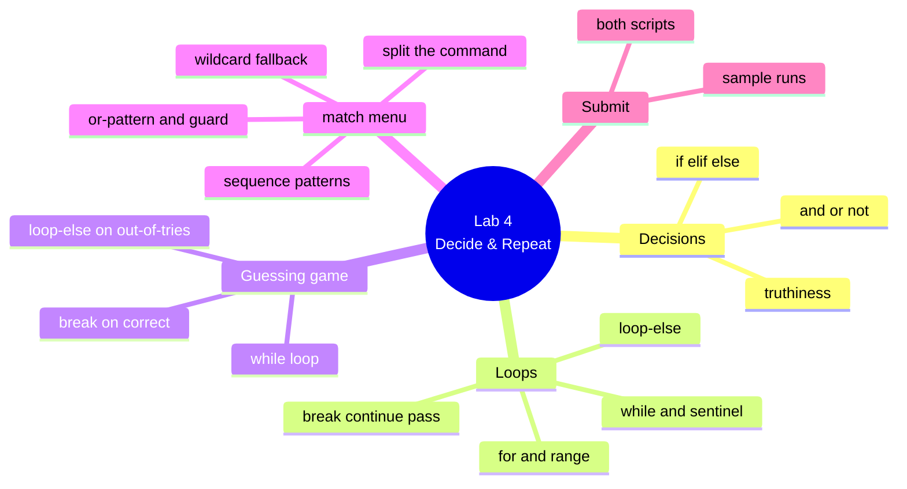

# Lab 4 — A Guessing Game & a `match`-Based Menu

**Python Mastery — Part 1: Foundations · Week 4 · Student Lab Guide**

> **Audience:** You are a student in Week 4 of Python Mastery, Part 1. You've already set up your
> toolchain (Week 1), worked with numbers (Week 2), and shaped text (Week 3). No new tools are needed
> this week.
> **Goal:** Make your programs *decide* and *repeat*. You'll write two small programs: a
> **number-guessing game** built from a `while` loop with `break` and a loop-`else`, and a
> **command menu** (`menu.py`) that routes typed commands with `match` / `case`. You do this on your
> own, after the live session, using the recording plus this guide.
> **Time:** about 60–90 minutes.

---

## Table of contents

<!-- export-png: session-04-lab-mindmap.png -->



<details>
<summary>ASCII fallback</summary>

```
Lab 4 — Decide & Repeat
├── Decisions ........ if / elif / else · truthiness · and / or / not
├── Loops ............ for + range · while + sentinel · break / continue / pass · loop-else
├── Guessing game .... while loop · break on correct guess · loop-else on out-of-tries
├── match menu ....... split command · sequence patterns · or-pattern + guard · wildcard fallback
└── Submit ........... both scripts · sample runs
```

</details>

---

## 1. What you'll build and why

In the live session you watched two demos. In **Demo 7** the trainer ran every kind of loop — a
`for` over a `range`, a `for` over a string, a `while` countdown — and steered them with `continue`,
`break`, and the loop-`else` clause. In **Demo 8** the trainer built a command dispatcher with
`match` / `case` that routed different typed commands to different actions based on their shape.

This lab is you building your own version of each. The first program — a guessing game — is the first
program in this course that actually *interacts* with you, looping until you win or run out of tries.
The second — a `match`-based menu — is a direct ancestor of the menu your capstone application will
use to run commands. So this isn't throwaway practice: the dispatcher shape you write here is the one
you'll reuse for the rest of the course. If a step doesn't work the first time, that's completely
normal — pause the recording, re-read the step, and try again.

---

## 2. Prerequisites

Before you start, make sure you have:

- The toolchain from Week 1 working: **Python 3.14**, **uv**, **Ruff**, and **VS Code**.
- The **session recording** open in another window so you can follow along.
- A folder to keep this week's work in (your existing course folder is fine).

**Versions this lab targets (pinned):**

| Tool | Version this lab uses | Role |
|---|---|---|
| **Python** | **3.14.6** (any 3.14.x) | The language; `match`/`case` needs 3.10+, fully present in 3.14 |
| **uv** | latest (Astral) | Runs your scripts in a managed environment (optional this week) |
| **Ruff** | latest (Astral) | Formats and lints your code |
| **VS Code** | latest | Your code editor |

Quick check that Python answers:

```bash
# macOS / Linux
python3.14 --version
# Windows
py -3.14 --version
```

You should see `Python 3.14.6` (or another `3.14.x`).

---

## 3. Warm up in the REPL (mirrors Demo 7)

Before writing files, spend five minutes in the REPL feeling how loops behave. Open it:

```bash
# macOS / Linux
python3.14
# Windows
py -3.14
```

> **REPL tip:** when you type a `for`, `while`, `if`, or `match`, the prompt changes from `>>>` to
> `...` for the indented lines. Finish the block by pressing **Enter on an empty `...` line**.

Try each of these and predict the output before you press the final Enter:

```pycon
>>> for i in range(0, 6, 2):
...     print(i)
...
0
2
4
>>> for n in range(10):
...     if n % 2 == 0:
...         continue
...     if n > 5:
...         break
...     print(n)
...
1
3
5
>>> target = 7
>>> for n in [1, 3, 5]:
...     if n == target:
...         print("found")
...         break
... else:
...     print("not found")
...
not found
```

**Checkpoint:** you've seen `range` stop *before* its end value, `continue` skip a turn, `break` exit
early, and the loop-`else` run only when no `break` happened. Type `exit()` to leave the REPL.

---

## 4. Build the number-guessing game (`guess.py`)

This mirrors **Demo 7**: a `while` loop, a `break` on success, and a loop-`else` for "out of tries".

### 4.1 Create the file

In your course folder, create a file named `guess.py`.

### 4.2 Write the game

Type this in (don't paste blindly — typing it helps it stick):

```python
import random

secret = random.randint(1, 20)
max_tries = 5

print("I'm thinking of a number between 1 and 20.")
print(f"You have {max_tries} tries.")

tries = 0
while tries < max_tries:
    tries += 1
    guess = int(input(f"Try {tries}/{max_tries} — your guess: "))

    if guess == secret:
        print(f"Correct! The number was {secret}. You won in {tries} tries.")
        break
    elif guess < secret:
        print("Too low.")
    else:
        print("Too high.")
else:
    print(f"Out of tries! The number was {secret}.")
```

### 4.3 Run it

```bash
# macOS / Linux
python3.14 guess.py
# Windows
py -3.14 guess.py
# or, in any environment:
uv run guess.py
```

Play it a few times. Notice two outcomes:

- **You guess correctly** → the `break` fires, the loop stops, and the `else` is **skipped**.
- **You run out of tries** → the `while` condition finally fails normally (no `break`), so the
  loop-`else` runs and reveals the number.

**Checkpoint:** the game ends with a win message when you guess right (before using all tries), and
with the "Out of tries!" message when you don't. The loop-`else` only appears in the losing case.

> **How it works:** `random.randint(1, 20)` picks the secret (we meet `random` properly in Week 13;
> here it just gives us a number). `int(input(...))` reads what you type and turns the text into a
> number — the same casting you did in Week 2. The `while tries < max_tries` caps the number of
> attempts, `tries += 1` moves the loop toward its exit, and `break` ends it the instant you win.

---

## 5. Build the `match`-based menu (`menu.py`)

This mirrors **Demo 8**: read a command line and route it with `match` / `case`.

### 5.1 Create the file

In the same folder, create a file named `menu.py`.

### 5.2 Write the dispatcher

```python
def dispatch(command):
    match command.split():
        case ["add", *words]:
            return f"added task: {' '.join(words)}"
        case ["done", id] if id.isdigit():
            return f"completed task #{id}"
        case ["list"] | ["ls"]:
            return "showing all tasks"
        case ["help"]:
            return "commands: add <task>, done <id>, list/ls, help, quit"
        case []:
            return "type a command (try 'help')"
        case _:
            return "unknown command — type 'help'"


def main():
    print("Mini menu. Type a command, or 'quit' to exit.")
    while True:
        command = input("> ")
        if command.strip() == "quit":
            print("bye")
            break
        print(dispatch(command))


if __name__ == "__main__":
    main()
```

### 5.3 Run it and try every shape

```bash
python3.14 menu.py     # or: py -3.14 menu.py   /   uv run menu.py
```

Type these commands one at a time and watch how each is routed:

| You type | Expected response | Why |
|---|---|---|
| `add buy milk` | `added task: buy milk` | literal `"add"` + `*words` captures the rest |
| `done 7` | `completed task #7` | guard `id.isdigit()` passes |
| `done abc` | `unknown command — type 'help'` | shape matched but **guard failed** → falls through |
| `ls` | `showing all tasks` | or-pattern `["list"] | ["ls"]` |
| `list` | `showing all tasks` | same or-pattern |
| `help` | the help line | literal `["help"]` |
| (just Enter) | `type a command (try 'help')` | empty `split()` is `[]` |
| `frobnicate` | `unknown command — type 'help'` | no case fits → `case _:` |
| `quit` | `bye` and exits | handled in `main`, before dispatch |

**Checkpoint:** your menu dispatches at least **four** distinct command shapes (you have six here:
`add`, `done`, `list`/`ls`, `help`, empty, unknown), the guard correctly rejects `done abc`, and the
`case _:` catches anything unexpected without crashing.

### 5.4 Tidy with Ruff

Keep your code clean, the same habit from Week 1:

```bash
uvx ruff format
uvx ruff check
```

**Checkpoint:** `uvx ruff check` reports `All checks passed!`.

---

## 6. Expected outcome / self-check

You're done with the core lab when **all** of these are true:

- [ ] `guess.py` runs, lets you guess up to the cap, and ends with a **win** message on a correct
      guess (loop-`else` skipped).
- [ ] `guess.py` ends with the **"Out of tries!"** message when you don't guess in time
      (loop-`else` runs).
- [ ] `menu.py` routes at least **four** command shapes plus an **unknown** fallback via `match`/`case`.
- [ ] `done 7` returns a completion message but `done abc` falls through to the fallback (the guard works).
- [ ] `uvx ruff check` reports `All checks passed!` on both files.

---

## 7. Where to look in the recording

If a step is unclear, scrub to the matching demo in the session recording:

| You're stuck on… | Watch | In the recording |
|---|---|---|
| `for`, `range`, a `while` countdown | **Demo 7 (D7)** | The "loops in action" segment |
| `continue` vs `break` | **Demo 7 (D7)** | The "skip evens, stop early" segment |
| The loop-`else` (win vs out-of-tries) | **Demo 7 (D7)** | The "search with loop-else" segment |
| `match`/`case` shapes and the guard | **Demo 8 (D8)** | The "the dispatcher" segment |
| Routing different inputs | **Demo 8 (D8)** | The "one input, the right route" segment |

---

## 8. Stretch goals (optional)

If you finished early and want to push a little further:

1. **Track a "best score"** in the game: count how many tries the win took, and after a win ask if
   the player wants to play again (wrap the whole game in an outer `while True` with a `break` on "no").
2. **Add a `remove` command** to the menu: `case ["remove", id] if id.isdigit():` returning
   `f"removed task #{id}"`. Confirm `remove abc` still falls through to the fallback.
3. **Add a count command** with a tail capture: `case ["echo", *words]:` that returns how many words
   followed (`len(words)`), to feel how `*words` collects a variable-length tail.
4. **Refactor the game into a small function** `play(low, high, max_tries)` so you can change the
   range without editing the loop — a gentle preview of next week's functions.

---

## 9. Reference — constructs used in this lab

| Construct | What it does |
|---|---|
| `if / elif / else` | Run the first branch whose condition is true |
| truthiness | `0`, `0.0`, `""`, `[]`, `{}`, `()`, `set()`, `None`, `False` are falsy; all else truthy |
| `and` / `or` / `not` | Combine or flip conditions |
| `0 <= x < 24` | Chained comparison — reads like a number line |
| `for x in seq:` | Walk each item of a sequence |
| `range(stop)` / `range(start, stop, step)` | Generate numbers; **stops before `stop`** |
| `while cond:` | Repeat while `cond` stays true |
| `break` | Exit the loop immediately |
| `continue` | Skip to the next iteration |
| `pass` | Do nothing (a placeholder statement) |
| `for/while ... else:` | The `else` runs only if the loop finished **without** `break` |
| `match subject:` / `case pattern:` | Branch on the **shape** of the data |
| `case "x":` (literal) | Match an exact value |
| `case name:` (capture) | Match anything and bind it to `name` |
| `case _:` (wildcard) | Match anything, bind nothing — the catch-all |
| `case [a, b]:` (sequence) | Match a sequence of that length, binding elements |
| `case [a, *rest]:` | `*rest` captures the remaining items as a list |
| `case A | B:` (or-pattern) | Match if either alternative matches |
| `case {"k": v}:` (mapping) | Match a dict containing key `"k"`; extra keys ignored |
| `case p if cond:` (guard) | Match the pattern **and** the extra condition |

---

## 10. Troubleshooting & limitations

**`ValueError: invalid literal for int()` in the game.** `int(input(...))` only works if you type a
whole number. Typing letters crashes it. That's expected for now — we learn to handle bad input
gracefully with exceptions in Week 11. For this lab, just type numbers.

**The loop-`else` "never runs" / "always runs".** Remember the rule: the `else` runs **only when the
loop finishes without hitting `break`**. In the game, a correct guess uses `break`, so the `else` is
skipped; running out of tries finishes the `while` normally, so the `else` runs. Make sure your `else`
is lined up with the `while`/`for` keyword, not indented inside the loop body.

**`SyntaxError` near `match` or `case`.** Confirm you're running Python 3.14 (`python3.14 --version`).
`match`/`case` needs Python 3.10 or newer; on 3.14 it's fully available. If your default `python`
points at an older version, use `python3.14` (or `py -3.14`, or `uv run`).

**A command routes to the wrong case (e.g. `done 7` says "unknown").** Almost always a **case order**
problem — a broader pattern placed above a narrower one wins first. Keep specific cases near the top
and `case _:` last. Also check that `done` matched a two-element list: `done 7` splits to
`["done", "7"]`, and the guard needs `"7".isdigit()` to be true.

**A bare name in a `case` "compares" instead of "captures".** This is by design: `case other:` does
**not** compare to a variable named `other` — it matches anything and binds it to `other`. Use a
literal (`case "other":`) if you mean an exact value.

**Tab / `...` prompt confusion in the REPL.** A multi-line block in the REPL shows the `...` prompt;
finish it with a blank line. If you find that fiddly, write the code in a `.py` file instead and run
the file — that's exactly why the game and menu are files, not REPL snippets.

**Limitations of this lab.** You're using `random` and `int(input(...))` before we've formally
covered them — treat them as "givens" this week; we cover `random` in Week 13 and robust input
handling in Week 11. The menu only prints what it *would* do; it doesn't yet store real tasks — that
arrives once we have data structures (Weeks 6–8) and persistence (Week 12).

---

## 11. Submission / sign-off

Submit the following to the course channel on Microsoft Teams (this is your Week 4 checkpoint, which
confirms you can branch, loop, and pattern-match before Week 5 wraps these into functions):

1. Your **`guess.py`** file.
2. A **sample run of the game** showing **both** outcomes — one screenshot/paste where you win (the
   loop-`else` is skipped) and one where you run out of tries (the loop-`else` fires).
3. Your **`menu.py`** file.
4. A **sample run of the menu** showing it routing at least four command shapes plus an unknown
   fallback — and showing that `done 7` works while `done abc` falls through.
5. A line confirming `uvx ruff check` reports `All checks passed!` on both files.

Once your trainer confirms these, you're signed off for Week 4. Keep both files — next week we
refactor the menu's dispatcher into a clean, typed function.

---

## 12. Sources

All steps and syntax verified against current official documentation on **2026-06-25**:

- [Python 3.14 Tutorial — More Control Flow Tools (`if`, `for`, `range`, `break`/`continue`, loop `else`, `match`)](https://docs.python.org/3.14/tutorial/controlflow.html)
- [PEP 636 — Structural Pattern Matching: Tutorial](https://peps.python.org/pep-0636/)
- [Python 3.14 — `match` statement reference (compound statements)](https://docs.python.org/3.14/reference/compound_stmts.html#the-match-statement)
- [Python `random.randint`](https://docs.python.org/3.14/library/random.html#random.randint)
- [Truth Value Testing (built-in types)](https://docs.python.org/3.14/library/stdtypes.html#truth-value-testing)
- [Ruff — The formatter & linter (`uvx ruff`)](https://docs.astral.sh/ruff/)
