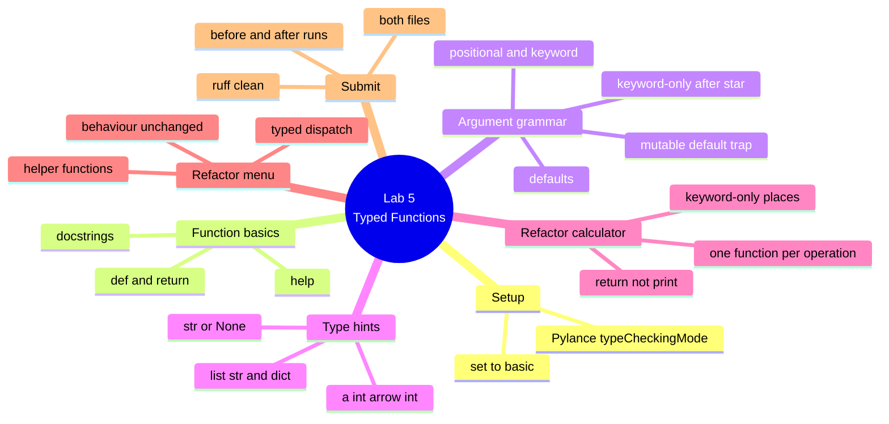

# Lab 5 — Refactor Into Clean, Typed Functions

**Python Mastery — Part 1: Foundations · Week 5 · Student Lab Guide**

> **Audience:** You are a student in Week 5 of Python Mastery, Part 1. You've set up your toolchain
> (Week 1), written a calculator (Week 2), formatted text (Week 3), and built a `match`-based menu
> (Week 4). You'll need **Lab 2's `calculator.py`** and **Lab 4's `menu.py`** in front of you — this
> lab rebuilds them.
> **Goal:** Turn two working-but-loose scripts into **clean, documented, fully typed functions** —
> without changing what they do. You'll write every kind of signature from Demo 9, add docstrings and
> type hints from Demo 10, and switch on the editor checking that makes those hints pay. You do this
> on your own, after the live session, using the recording plus this guide.
> **Time:** about 75–90 minutes.

---

## Table of contents

<!-- export-png: session-05-lab-mindmap.png -->



<details>
<summary>ASCII fallback</summary>

```
Lab 5 — Typed Functions
├── Setup ................. Pylance typeCheckingMode -> basic
├── Function basics ....... def & return · docstrings · help()
├── Argument grammar ...... positional/keyword · defaults · keyword-only after * · mutable-default trap
├── Type hints ............ a: int -> int · list[str] / dict[str, int] · str | None
├── Refactor calculator ... one function per operation · return not print · keyword-only places
├── Refactor menu ......... typed dispatch() · helper functions · behaviour unchanged
└── Submit ................ both files · before/after runs · ruff clean
```

</details>

---

## 1. What you'll build and why

In the live session you watched two demos. In **Demo 9** the trainer grew a single function through
every parameter kind Python has — positional, keyword, default, `*args`, `**kwargs`, keyword-only
behind a `*`, positional-only behind a `/` — and then walked deliberately into the mutable-default
trap and fixed it. In **Demo 10** the trainer made scope visible with LEGB, built a counter closure
with `nonlocal`, and then showed Pylance underlining a wrong-typed call *before anything ran*.

This lab is different from the previous four, and it's worth understanding why. You are not writing
anything new. You're going back to two programs you already own and already trust, and making them
properly good. That's called **refactoring**, and it's one of the most valuable habits in
professional programming: improving the *shape* of code without changing its *behaviour*.

That last part is the golden rule of this lab, and of every refactor you will ever do. **Same inputs,
same outputs.** Your calculator must produce the identical numbers it produced in Week 2, and your
menu must route the identical commands to the identical responses it routed in Week 4. You're
changing how the code is organised, not what it does. Run each program before you start, keep that
output, and compare against it when you're finished. If anything differs, you've introduced a bug —
and catching that is exactly the skill this lab is teaching.

The reason we do this now is that from Week 6 onwards, every lab in this course is written as
functions. This is the week your code stops being a script and starts being software.

---

## 2. Prerequisites

Before you start, make sure you have:

- The toolchain from Week 1 working: **Python 3.14**, **uv**, **Ruff**, and **VS Code**.
- **`calculator.py` from Lab 2** and **`menu.py` from Lab 4**. If you can't find them, both are
  reproduced in section 5.1 and 6.1 so you're never blocked.
- The **session recording** open in another window so you can follow along.

**Versions this lab targets (pinned):**

| Tool | Version this lab uses | Role |
|---|---|---|
| **Python** | **3.14.6** (any 3.14.x) | The language; all function syntax here needs 3.8+ |
| **Ruff** | **0.15.21** (any recent) | Formats and lints your code |
| **uv** | **0.11.28** (any recent) | Runs scripts; `uvx` runs Ruff without installing it |
| **VS Code** | latest | Your editor |
| **Pylance** | **2026.2.108** (any recent) | Reads your type hints and flags mistakes as you type |

Quick check that Python answers:

```bash
# macOS / Linux
python3.14 --version
# Windows
py -3.14 --version
```

You should see `Python 3.14.6` (or another `3.14.x`).

---

## 3. Setup — switch Pylance's type checking on

**Do this first.** This is the single most important setup step in the lab, and skipping it is the
most common reason students think type hints "don't do anything".

Pylance ships with type checking **turned off**. Out of the box, you can write perfect type hints,
call your function with completely wrong types, and the editor will say **nothing at all**. That's
not a bug and it's not your setup being broken — it's the default.

Turn it on:

1. Open your course folder in VS Code.
2. Press `Ctrl + Shift + P` (macOS: `Cmd + Shift + P`).
3. Type **`Preferences: Open Workspace Settings (JSON)`** and press Enter.
4. Add this setting (keep any settings already there):

```json
{
  "python.analysis.typeCheckingMode": "basic"
}
```

5. Save the file.

The valid values are **`off`**, **`basic`**, **`standard`**, and **`strict`** — and only those four.
The default is `off`; `basic` is the friendly setting for learning, and it's what your trainer used
in Demo 10.

**Verify it worked.** Create a scratch file called `check_setup.py` and type exactly this:

```python
def greet(name: str) -> str:
    return f"Hi, {name}!"


greet(123)
```

**Checkpoint:** you should see a **red squiggle under `123`**. Hover over it and you'll read something
like:

> Argument of type `"Literal[123]"` cannot be assigned to parameter `"name"` of type `"str"` in
> function `"greet"`

If you see that squiggle, you're ready. If you don't, work through the "No red squiggle" entry in
section 10 before continuing — the rest of this lab is much less useful without it. Once you've
confirmed it, delete `check_setup.py`.

---

## 4. Warm up in the REPL (mirrors Demo 9)

Before touching your files, spend ten minutes feeling the argument grammar. Open the REPL:

```bash
# macOS / Linux
python3.14
# Windows
py -3.14
```

> **REPL tip:** when you type a `def`, the prompt changes from `>>>` to `...` for the indented body.
> Finish the block by pressing **Enter on an empty `...` line**.

### 4.1 Defaults and keywords

```pycon
>>> def greet(name, greeting="Hi"):
...     return f"{greeting}, {name}!"
...
>>> greet("Asha")
'Hi, Asha!'
>>> greet("Asha", "Hello")
'Hello, Asha!'
>>> greet(greeting="Welcome", name="Ravi")
'Welcome, Ravi!'
>>> greet()
TypeError: greet() missing 1 required positional argument: 'name'
```

Notice the third call: the keywords are in the "wrong" order and it works perfectly, because keyword
arguments match **by name**, not position.

### 4.2 Keyword-only parameters

```pycon
>>> def make_task(title, *, priority="normal"):
...     return f"{title!r} priority={priority}"
...
>>> make_task("Buy milk", priority="high")
"'Buy milk' priority=high"
>>> make_task("Buy milk", "high")
TypeError: make_task() takes 1 positional argument but 2 were given
```

The bare `*` is a fence: everything after it **must** be passed by name. Note the error doesn't say
"keyword-only" — it counts positionals. If you ever see that message while sure you passed the right
number of arguments, go looking for a bare `*`.

### 4.3 The mutable-default trap — see it for yourself

This one is worth typing out, because seeing it is what makes it stick:

```pycon
>>> def add_item(item, basket=[]):
...     basket.append(item)
...     return basket
...
>>> add_item("a")
['a']
>>> add_item("b")
['a', 'b']
>>> add_item("c")
['a', 'b', 'c']
```

Your "empty" default is filling up. Default values are evaluated **once, when the function is
defined** — so that one list is shared by every call. You can even see it living on the function:

```pycon
>>> add_item.__defaults__
(['a', 'b', 'c'],)
```

The fix — default to `None` and build inside the body, so every call gets a fresh list:

```pycon
>>> def add_item(item, basket=None):
...     if basket is None:
...         basket = []
...     basket.append(item)
...     return basket
...
>>> add_item("a")
['a']
>>> add_item("b")
['b']
```

**Checkpoint:** you've seen a default fill up across calls, found the shared list on
`__defaults__`, and watched the `None` idiom fix it. Type `exit()` to leave the REPL.

**The rule to carry forever:** never use a mutable default — no lists, no dicts, no sets. Use `None`
and build it inside.

---

## 5. Refactor `calculator.py` (mirrors Demo 9)

### 5.1 Start from what you have

Your Lab 2 calculator looked roughly like this — one straight run of statements:

```python
a = float(input("First number: "))
b = float(input("Second number: "))

total = a + b
difference = a - b
floor_div = a // b
remainder = a % b
percentage = a / b * 100

print(f"Sum:            {round(total, 2)}")
print(f"Difference:     {round(difference, 2)}")
print(f"Floor division: {round(floor_div, 2)}")
print(f"Remainder:      {round(remainder, 2)}")
print(f"Percentage:     {round(percentage, 2)}")
```

**Before you change anything, run it and keep the output.** Use `7` and `2` as your inputs, and save
what it prints somewhere. That's your reference — the thing your refactor must still produce.

### 5.2 Write one function per operation

Create the new version. Each operation becomes a small function that **takes its inputs as
parameters** and **returns its result** — it does not print. That separation is the heart of the
refactor: calculating and displaying are two different jobs.

```python
"""A small calculator, refactored into typed functions."""


def add(a: float, b: float) -> float:
    """Return the sum of a and b."""
    return a + b


def subtract(a: float, b: float) -> float:
    """Return the difference of a and b."""
    return a - b


def floor_divide(a: float, b: float) -> float:
    """Return a floor-divided by b."""
    return a // b


def remainder(a: float, b: float) -> float:
    """Return the remainder of a divided by b."""
    return a % b
```

Notice what every one of these has: a **docstring** in the imperative ("Return the sum…", not "This
function returns…"), a **type hint on every parameter**, and a **return annotation**. That's the
standard you're aiming for on every function in this lab.

### 5.3 Add a keyword-only parameter where it earns its place

The lab asks you to use a **default** and a **keyword-only** parameter somewhere sensible. Rounding is
the natural home for both — most callers want 2 decimal places, but some might not:

```python
def percentage(a: float, b: float, *, places: int = 2) -> float:
    """Return a as a percentage of b, rounded to `places` decimals."""
    return round(a / b * 100, places)
```

Read that signature carefully, because it's doing three things from Demo 9 at once. `places` has a
**default** of `2`, so callers can ignore it. It sits **after the bare `*`**, so it's **keyword-only** —
you must write `places=4`, never just `4`. And it's **annotated** as an `int`.

Why force the keyword here? Because `percentage(7, 2, 4)` is unreadable — nobody knows what `4` means.
`percentage(7, 2, places=4)` reads like a sentence. That's the whole argument for keyword-only
parameters, and this is a real example of it.

### 5.4 Give the printing job its own function

```python
def format_result(label: str, value: float, *, places: int = 2) -> str:
    """Return a label and value as one aligned, rounded report line."""
    return f"{label:<16}{value:>10.{places}f}"
```

This reuses the f-string format mini-language from Week 3 — `:<16` left-aligns the label in 16
columns, `:>10.2f` right-aligns the number in 10 columns with 2 decimals. Notice it **returns** the
string rather than printing it, which means you could test it, reuse it, or write it to a file later.

### 5.5 Wire it together in `main()`

```python
def main() -> None:
    """Read two numbers and print every calculation."""
    a = float(input("First number: "))
    b = float(input("Second number: "))

    print(format_result("Sum:", add(a, b)))
    print(format_result("Difference:", subtract(a, b)))
    print(format_result("Floor division:", floor_divide(a, b)))
    print(format_result("Remainder:", remainder(a, b)))
    print(format_result("Percentage:", percentage(a, b)))


if __name__ == "__main__":
    main()
```

`main() -> None` is annotated too — `None` is the honest return type for a function that only prints.
The `if __name__ == "__main__":` guard is the same one `uv init` gave you in Week 1; we cover exactly
what it means in Week 9.

### 5.6 Run it and compare

```bash
python3.14 calculator.py     # or: py -3.14 calculator.py  /  uv run calculator.py
```

With inputs `7` and `2` you should see:

```
First number: 7
Second number: 2
Sum:                  9.00
Difference:           5.00
Floor division:       3.00
Remainder:            1.00
Percentage:         350.00
```

**Checkpoint:** the numbers match what your Lab 2 version produced for the same inputs. The layout is
tidier (that's `format_result` doing its job), but **every value is identical**. If a number changed,
you've changed behaviour — go back and find out why before moving on.

Try the keyword-only parameter directly, to prove it works both ways:

```bash
python3.14 -c "from calculator import percentage; print(percentage(7, 2)); print(percentage(7, 2, places=4))"
```

Expected: `350.0` then `350.0`. Now prove the fence is real:

```bash
python3.14 -c "from calculator import percentage; percentage(7, 2, 4)"
```

Expected: `TypeError: percentage() takes 2 positional arguments but 3 were given`.

---

## 6. Refactor `menu.py` (mirrors Demo 10)

### 6.1 Start from what you have

Your Lab 4 menu had a `dispatch(command)` function already — so this refactor is about **typing** it,
**documenting** it, and pulling its actions out into their own small functions.

**Run it first and keep the output**, same as before. Try `add buy milk`, `done 7`, `done abc`, `ls`,
`help`, an empty line, and `frobnicate`, and note exactly what each one returns.

### 6.2 Give each action its own typed function

Right now the bodies of your `case` branches build their strings inline. Pull each one out:

```python
"""A command menu, refactored into typed functions."""


def add_task(words: list[str]) -> str:
    """Return the confirmation for adding a task built from `words`."""
    return f"added task: {' '.join(words)}"


def complete_task(task_id: str) -> str:
    """Return the confirmation for completing the task with `task_id`."""
    return f"completed task #{task_id}"


def show_help(*, short: bool = False) -> str:
    """Return the help text, optionally in its short form."""
    if short:
        return "commands: add, done, list, help, quit"
    return "commands: add <task>, done <id>, list/ls, help, quit"
```

Look at `add_task(words: list[str]) -> str` — there's the `list[str]` hint from Slide 25, doing real
work. It says "give me a list of strings", which is exactly what `*words` captured in your `match`
statement. And `show_help` uses a **keyword-only** `short` flag with a default, so a caller must write
`show_help(short=True)` — never a bare `True`, which would tell the reader nothing.

### 6.3 Type the dispatcher

```python
def dispatch(command: str, *, unknown: str = "unknown command — type 'help'") -> str:
    """Route `command` to an action and return what happened."""
    match command.split():
        case ["add", *words]:
            return add_task(words)
        case ["done", task_id] if task_id.isdigit():
            return complete_task(task_id)
        case ["list"] | ["ls"]:
            return "showing all tasks"
        case ["help"]:
            return show_help()
        case []:
            return "type a command (try 'help')"
        case _:
            return unknown
```

The signature now says everything: it takes a `str`, it hands back a `str`, and the fallback message
is a **keyword-only parameter with a default** — so it behaves exactly as before unless a caller
deliberately overrides it. Every `case` returns; nothing prints. The printing stays in `main()`.

### 6.4 Keep `main()` as the only place that talks to the user

```python
def main() -> None:
    """Read commands in a loop until the user quits."""
    print("Mini menu. Type a command, or 'quit' to exit.")
    while True:
        command = input("> ")
        if command.strip() == "quit":
            print("bye")
            break
        print(dispatch(command))


if __name__ == "__main__":
    main()
```

### 6.5 Prove the behaviour didn't change

This is the part that matters. Check every command shape against your Lab 4 output:

```bash
python3.14 -c "
from menu import dispatch
for c in ['add buy milk', 'done 7', 'done abc', 'ls', 'list', 'help', '', 'frobnicate']:
    print(f'{c!r:18} -> {dispatch(c)!r}')
"
```

Expected — identical to Lab 4:

| You pass | Expected response |
|---|---|
| `'add buy milk'` | `'added task: buy milk'` |
| `'done 7'` | `'completed task #7'` |
| `'done abc'` | `"unknown command — type 'help'"` |
| `'ls'` | `'showing all tasks'` |
| `'list'` | `'showing all tasks'` |
| `'help'` | `'commands: add <task>, done <id>, list/ls, help, quit'` |
| `''` | `"type a command (try 'help')"` |
| `'frobnicate'` | `"unknown command — type 'help'"` |

**Checkpoint:** all eight responses match your Lab 4 version exactly. The guard still rejects
`done abc`, and `case _:` still catches `frobnicate`.

### 6.6 Watch your hints work

Open `menu.py` in VS Code and, at the bottom, temporarily type a deliberately wrong call:

```python
dispatch(123)
```

**Checkpoint:** a red squiggle appears under `123`, telling you an `int` can't be a `str`. Your own
annotation just caught your own mistake, before running anything. Delete the line once you've seen it.

Try `show_help(True)` too — Pylance will object, and so will Python if you run it:
`TypeError: show_help() takes 0 positional arguments but 1 was given`. The fence works.

### 6.7 Tidy with Ruff

```bash
uvx ruff format
uvx ruff check
```

**Checkpoint:** `uvx ruff check` reports `All checks passed!` on both files.

Now try the rule from Demo 9 that isn't on by default:

```bash
uvx ruff check --select B006
```

**Checkpoint:** also `All checks passed!` — because you have no mutable defaults. If Ruff reports
`B006` here, you've left a `=[]` or `={}` in a signature; fix it with the `None` idiom from section 4.3.

---

## 7. Expected outcome / self-check

You're done with the core lab when **all** of these are true:

- [ ] `python.analysis.typeCheckingMode` is set to **`basic`**, and a deliberately wrong call gets a
      red squiggle.
- [ ] `calculator.py` has **one function per operation**, each **returning** (not printing) its result.
- [ ] `menu.py` has a typed `dispatch(command: str) -> str` plus small helper functions per action.
- [ ] **Every** function in both files has a **docstring** and **type hints on all parameters and the
      return**.
- [ ] At least one **default** parameter and at least one **keyword-only** parameter (after a bare `*`)
      are used where they genuinely improve readability.
- [ ] **Behaviour is unchanged:** the calculator prints the same values for the same inputs, and all
      eight menu command shapes return exactly what they returned in Lab 4.
- [ ] **No mutable defaults anywhere** — `uvx ruff check --select B006` passes.
- [ ] `uvx ruff check` reports `All checks passed!` on both files.

---

## 8. Where to look in the recording

If a step is unclear, scrub to the matching demo in the session recording:

| You're stuck on… | Watch | In the recording |
|---|---|---|
| Defaults, keyword arguments, and their errors | **Demo 9 (D9)** | The "positional, keyword, default" segment |
| `*args` / `**kwargs` | **Demo 9 (D9)** | The "`*args` and `**kwargs`" segment |
| The bare `*` (keyword-only) and the `/` (positional-only) | **Demo 9 (D9)** | The "keyword-only & positional-only" segment |
| The mutable-default trap and the `None` fix | **Demo 9 (D9)** | The "mutable-default trap" segment |
| Getting Ruff to report `B006` | **Demo 9 (D9)** | The "the fix — and what Ruff says" segment |
| Why a function's variables are its own (LEGB) | **Demo 10 (D10)** | The "LEGB, live" segment |
| `UnboundLocalError` | **Demo 10 (D10)** | The "LEGB, live" segment |
| Switching Pylance's checking on / the red squiggle | **Demo 10 (D10)** | The "Pylance catches it" segment |
| Why hints don't stop a wrong call at runtime | **Demo 10 (D10)** | The "the runtime doesn't care" segment |

---

## 9. Stretch goals (optional)

If you finished early and want to push further:

1. **Add a `remove` command** to the menu with its own typed helper —
   `def remove_task(task_id: str) -> str:` — routed by
   `case ["remove", task_id] if task_id.isdigit():`. Confirm `remove abc` still falls through to the
   fallback.
2. **Use the keyword-only parameters you built.** Call `percentage(7, 2, places=4)` and
   `show_help(short=True)` and see the difference. Then try passing them positionally and read the
   `TypeError` — that's the fence doing its job.
3. **Write a `divide` function that handles zero** — return `str | None` (the union syntax from
   Slide 25), giving `None` when `b` is `0`. Notice how the hint documents the "or nothing" case that
   your caller has to handle.
4. **Try `*args`.** Write `def total(*numbers: float) -> float:` that sums however many numbers it's
   given, and call it with two, then five, then none. This is the shape you'd need to extend the
   calculator beyond exactly two inputs.
5. **Build a counter closure of your own.** Write `make_counter()` from Demo 10 from scratch, without
   looking, then make two independent counters and confirm they don't interfere. If you can explain
   why `nonlocal` is required, you've genuinely understood scope.
6. **Break it on purpose.** Remove a `nonlocal`, or write `count = count + 1` against a global, and
   read the `UnboundLocalError` carefully. Deliberately causing an error you can predict is one of the
   fastest ways to learn.

---

## 10. Troubleshooting & limitations

**No red squiggle on a wrong-typed call.** Almost always `typeCheckingMode`. Work through these in
order: (1) confirm `"python.analysis.typeCheckingMode": "basic"` is in your **workspace** settings
(`Ctrl/Cmd + Shift + P` → *Preferences: Open Workspace Settings (JSON)*) — a setting in the wrong file
won't apply; (2) reload the window (`Ctrl/Cmd + Shift + P` → *Developer: Reload Window*); (3) check the
interpreter in the status bar (bottom right) says **3.14**; (4) give Pylance 10–15 seconds to start on
first open. Remember the valid values are only `off`, `basic`, `standard`, `strict` — if you typed
`recommended` or `all` (those belong to a different tool), Pylance rejects the setting outright.

**`ruff check` says `All checks passed!` on code with a mutable default.** That's expected, and it's a
real lesson. Ruff's default rule set is deliberately small (`E4`, `E7`, `E9`, `F`) and **`B006` is not
in it**. You have to opt in with `uvx ruff check --select B006`, or add it to your `pyproject.toml`:

```toml
[tool.ruff.lint]
extend-select = ["B006"]
```

**`TypeError: ... takes 2 positional arguments but 3 were given`** on a function you're sure takes 3.
Look for a bare `*` in the signature. Everything after it is keyword-only, so it doesn't count as a
positional slot. Call it with the name: `percentage(7, 2, places=4)`.

**`TypeError: ... got some positional-only arguments passed as keyword arguments`.** The mirror image:
there's a `/` in the signature, and everything before it must be passed **without** a name. You'll meet
this most often with built-ins — `len(obj=[1,2])` fails for exactly this reason.

**`UnboundLocalError: cannot access local variable 'x' where it is not associated with a value`.** You
assigned to `x` somewhere in the function, which makes `x` **local for the whole function**, and then
read it before setting it. Python does *not* fall back to the global. Either rename the local, or pass
the value in as a parameter (much preferred), or use `global`/`nonlocal` deliberately.

**My function returns `None` unexpectedly.** You almost certainly used `print(...)` where you meant
`return ...`. `print` shows a value to a human; `return` hands it back to your code. In this lab, only
`main()` should print — everything else returns.

**My refactored output differs from the original.** Stop and find out why before going further — that's
the entire point of the exercise. The usual causes are: rounding moved (e.g. `round()` applied twice,
or a format spec rounding a value that was already rounded), or a function printing *and* returning so
something appears twice, or an operation reordered. Compare line by line against the output you saved
before you started.

**Type hints don't stop anything at runtime.** This is by design, not a fault. `add("two", "three")`
returns `'twothree'` and Python raises nothing at all, because hints are **never enforced when your
code runs** — the payoff is entirely in your editor and in type checkers, before you run. Part 2 puts
a real type checker behind them and makes them properly rigorous across a whole project.

**Limitations of this lab.** You're annotating with the basics only — `int`, `float`, `str`, `bool`,
`list[str]`, `dict[str, int]`, and `X | None`. That's deliberate: the full typing system (generics,
protocols, `TypedDict`, type aliases, and running a checker over an entire project) is Part 2. Your
menu still only *prints* what it would do rather than storing real tasks — that arrives once we have
data structures (Weeks 6–8) and persistence (Week 12). And `float(input(...))` still crashes on
non-numeric input; graceful error handling is Week 11.

---

## 11. Reference — constructs used in this lab

| Construct | What it does |
|---|---|
| `def name(params):` | Define a function — the body runs only when **called** |
| `return value` | Hand a value back to the caller and exit the function immediately |
| no `return` / bare `return` | The function returns **`None`** |
| `"""Docstring."""` | First string in the body; `help()` reads it. Write it imperatively |
| `help(func)` | Print the signature and docstring |
| `def f(a, b="x")` | `a` is required (positional); `b` has a **default**, so it's optional |
| `f(b="y", a=1)` | **Keyword arguments** — matched by name, order doesn't matter |
| `def f(*args)` | Collect leftover **positional** arguments into a **tuple** |
| `def f(**kwargs)` | Collect leftover **keyword** arguments into a **dict** |
| `def f(a, *, b)` | `b` is **keyword-only** — everything after the bare `*` must be named |
| `def f(a, b, /)` | `a`, `b` are **positional-only** — everything before `/` must not be named |
| `def f(x, acc=[])` | ⚠️ **The trap** — one list, created at `def` time, shared by every call |
| `def f(x, acc=None)` | ✅ The fix — build the fresh list **inside** the body |
| `func.__defaults__` | The default values stored on the function object |
| `func.__annotations__` | The type hints stored on the function object (and ignored at runtime) |
| **LEGB** | Name lookup order: **L**ocal → **E**nclosing → **G**lobal → **B**uilt-in; first hit wins |
| assignment in a function | Makes the name **local** for the whole function — this is the LEGB default |
| `global x` | "Assign to the **module-level** `x`" — rare, and loud. Prefer a return value |
| `nonlocal x` | "Assign to the **enclosing function's** `x`" — reaches out exactly one level |
| closure | An inner function + the enclosing variables it keeps alive after the outer one returns |
| `UnboundLocalError` | You read a name that assignment made local, before it had a value |
| `lambda n: n * 2` | A one-expression anonymous function; its natural home is `key=` |
| `sorted(xs, key=lambda t: t[1])` | Sort by a computed key |
| `def add(a: int) -> int:` | **Type hints** — annotate parameters and the return |
| `list[str]`, `dict[str, int]` | Built-in generics — **no import needed** |
| `str \| None` | "A `str` **or** nothing" (the modern spelling of `Optional[str]`) |
| hints at runtime | **Not enforced.** Python reads, stores, and ignores them |
| `ruff check --select B006` | Opt in to the mutable-default rule — it is **not** on by default |
| `python.analysis.typeCheckingMode` | Pylance setting: `off` (default), `basic`, `standard`, `strict` |

---

## 12. Submission / sign-off

Submit the following to the course channel on Microsoft Teams (this is your Week 5 checkpoint, which
confirms your functions are typed and documented and that prior behaviour is preserved — before Week 6
starts handing them real data structures):

1. Your refactored **`calculator.py`**.
2. Your refactored **`menu.py`**.
3. A **before-and-after run of the calculator** using the same inputs (`7` and `2` is fine), showing
   the values are **identical**.
4. A **run of the menu** showing all eight command shapes returning exactly what they returned in
   Lab 4 — including `done 7` working and `done abc` falling through to the fallback.
5. A **screenshot of the red squiggle** on a deliberately wrong-typed call (this confirms you have
   `typeCheckingMode` switched on and your hints are doing real work).
6. A line confirming both `uvx ruff check` and `uvx ruff check --select B006` report
   `All checks passed!` on both files.

Once your trainer confirms these, you're signed off for Week 5. Keep both files — next week your
typed functions start taking in and handing back real lists and tuples, and `list[str]` stops being a
hint and becomes something you build.

---

## 13. Sources

All steps, syntax, versions, and tool behaviour verified by running them against Python 3.14.6,
Ruff 0.15.21, and the Pyright 1.1.411 engine on **2026-07-16**:

- [Python 3.14 Tutorial — Defining Functions & More on Defining Functions](https://docs.python.org/3.14/tutorial/controlflow.html#defining-functions)
- [Python 3.14 Tutorial — Default Argument Values (incl. the shared-default warning)](https://docs.python.org/3.14/tutorial/controlflow.html#default-argument-values)
- [Python 3.14 Tutorial — Keyword Arguments, Special Parameters, Arbitrary Argument Lists](https://docs.python.org/3.14/tutorial/controlflow.html#special-parameters)
- [Python 3.14 Tutorial — Documentation Strings](https://docs.python.org/3.14/tutorial/controlflow.html#documentation-strings)
- [Python 3.14 Language Reference — Execution model / naming & binding (LEGB, `global`, `nonlocal`)](https://docs.python.org/3.14/reference/executionmodel.html#naming-and-binding)
- [Python 3.14 — `typing` module ("The Python runtime does not enforce function and variable type annotations")](https://docs.python.org/3.14/library/typing.html)
- [PEP 570 — Python Positional-Only Parameters](https://peps.python.org/pep-0570/)
- [PEP 604 — Allow writing union types as `X | Y`](https://peps.python.org/pep-0604/)
- [PEP 3107 / PEP 484 — Function annotations & type hints](https://peps.python.org/pep-0484/)
- [Ruff — `mutable-argument-default` (B006)](https://docs.astral.sh/ruff/rules/mutable-argument-default/)
- [Ruff — Rule selection & default rule set](https://docs.astral.sh/ruff/linter/#rule-selection)
- [Pylance — `python.analysis.typeCheckingMode` (default is `off`)](https://github.com/microsoft/pylance-release/blob/main/docs/settings/python_analysis_typeCheckingMode.md)
- [Pyright — Configuration (`typeCheckingMode` valid values)](https://github.com/microsoft/pyright/blob/main/docs/configuration.md)
