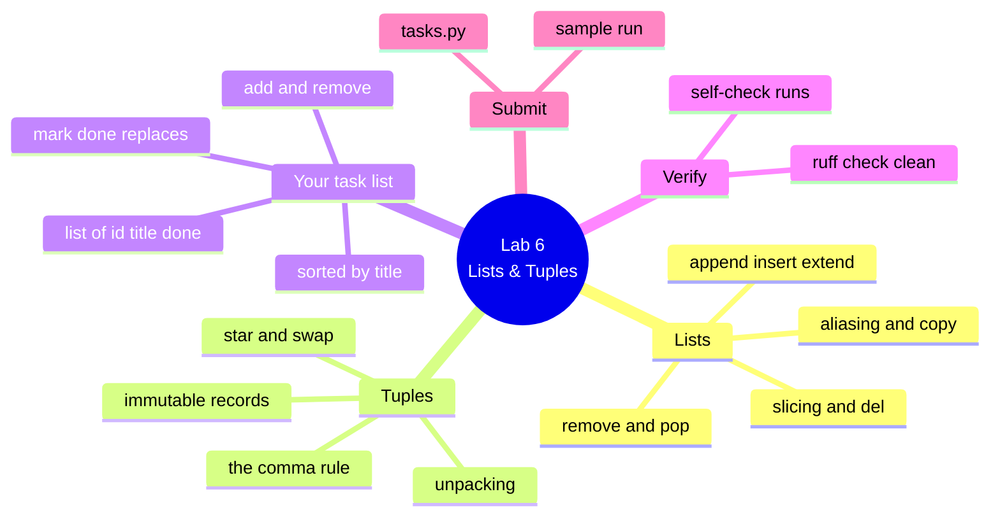

# Lab 6 — An In-Memory Task List with Lists & Tuples

**Python Mastery — Part 1: Foundations · Week 6 · Student Lab Guide**

> **Audience:** You are a student in Week 6 of Python Mastery, Part 1. You've set up your toolchain
> (Week 1), worked with numbers (Week 2) and text (Week 3), learned to branch and loop (Week 4), and
> packaged logic into typed functions (Week 5). No new tools are needed this week.
> **Goal:** Build `tasks.py` — the first real data model for the task app you've been growing since
> Week 1. It keeps a list of `(id, title, done)` tuples and offers **add**, **remove by id**,
> **mark-done**, and **sorted-by-title** as typed, documented functions. You do this on your own,
> after the live session, using the recording plus this guide.
> **Time:** about 60–90 minutes.

---

## Table of contents

<!-- export-png: session-06-lab-mindmap.png -->



<details>
<summary>ASCII fallback</summary>

```
Lab 6 — Lists & Tuples
├── Lists ............ append/insert/extend · remove/pop · slicing & del · aliasing & copy
├── Tuples ........... immutable records · the comma rule · unpacking · star & swap
├── Your task list ... list of (id, title, done) · add & remove · mark_done REPLACES · sorted_by_title
├── Verify ........... self-check runs · ruff check clean
└── Submit ........... tasks.py · sample run
```

</details>

---

## 1. What you'll build and why

In the live session you watched two demos. In **Demo 11** the trainer built a to-do list and put every
core list method through its paces — `append`, `insert`, `extend`, `remove`, `pop` — then slice-assigned
a range away, and then walked straight into the aliasing bug: writing `b = a`, appending to `b`, and
watching `a` change too. In **Demo 12** the trainer modelled a single task as the tuple
`(id, title, done)`, proved it refuses to be reassigned, unpacked it into three friendly names, and
finished by looping over a list of task tuples and printing something that finally looked like a real
to-do list.

This lab is you building that task list for real. Up to now every program you've written has thrown its
data away the moment it finished a line. This one *holds* data — a growing collection of tasks you can
add to, tick off, remove, and sort. It is the first thing in this course that behaves like software you'd
actually use, and it is the data model that Week 7 upgrades, Week 8 makes idiomatic, and Week 14
eventually turns into a class. Build it carefully and it will carry you a long way.

Two parts of this lab are deliberately tricky, and they are where the real learning is. Your `mark_done`
function cannot edit a tuple, because tuples are immutable — so you will have to *build a new tuple* and
put it back into the list. And your `sorted_by_title` function must hand back a **new** list without
disturbing the order you're storing — which means `sorted()`, not `.sort()`. Neither is an accident.
They're the two ideas from the session, made concrete.

---

## 2. Prerequisites

You already have everything from Labs 1–5. Confirm your toolchain before you start:

```bash
python3.14 --version      # -> Python 3.14.6  (or later 3.14.x)
uvx ruff --version        # -> ruff 0.15.x
```

| Tool | Pinned version | Why you need it |
|---|---|---|
| **Python** | **3.14.6** (or later 3.14.x) | The interpreter this course is pinned to |
| **Ruff** | **0.15.x** (via `uvx ruff`) | Formats and lints your file — your checkpoint requires it clean |
| **uv** | **0.11.x** | Supplies Python and runs Ruff without installing it |
| **VS Code** | current, with Pylance | Your editor; Pylance reads the type hints you write |

On **Windows**, use `py -3.14` wherever this guide says `python3.14`. If `python3.14` isn't on your
PATH at all, `uv run python` works everywhere and gives you the same 3.14 interpreter.

Nothing in this lab needs the internet, an account, or a third-party package. Lists and tuples are
built into the language, and they are **unchanged in Python 3.14** — everything here would work
identically on any 3.10+ interpreter. The version pin is so the whole cohort sees the same thing.

Create a folder for this week's work and put your file in it, beside your earlier labs:

```bash
mkdir -p ~/pymastery/week06
cd ~/pymastery/week06
```

---

## 3. Warm up in the REPL (mirrors Demo 11)

Before you write any file, spend ten minutes in the REPL re-running the moments from Demo 11 with your
own hands. This is not optional busywork — the aliasing behaviour in step 3.3 is the single idea most
likely to bite you later this week, and reading about it is not the same as watching it happen to a list
you typed yourself.

Open the REPL:

```bash
python3.14
```

**3.1 — Grow and shrink a list.** Type these one line at a time and watch the list change after each:

```pycon
>>> tasks = ["write report", "buy milk"]
>>> tasks.append("call bank")
>>> tasks
['write report', 'buy milk', 'call bank']
>>> tasks.insert(0, "pay rent")
>>> tasks.extend(["water plants", "book flights"])
>>> tasks
['pay rent', 'write report', 'buy milk', 'call bank', 'water plants', 'book flights']
>>> tasks.remove("buy milk")
>>> tasks.pop()
'book flights'
>>> tasks.pop(0)
'pay rent'
>>> tasks
['write report', 'call bank', 'water plants']
```

Notice that `pop()` **handed you back** the item it removed, while `remove()` gave you nothing. That is
the distinction to keep: `remove` takes a **value**, `pop` takes an **index** and returns the item.

**3.2 — Slice, slice-assign, and `del`.**

```pycon
>>> tasks[1:3]
['call bank', 'water plants']
>>> tasks[1:3] = ["ring the bank"]
>>> tasks
['write report', 'ring the bank']
>>> del tasks[0]
>>> tasks
['ring the bank']
```

Two items went out and one came in, and the list resized itself around the change. A string could never
do that — this works because a list is **mutable**.

**3.3 — The aliasing bug. Do not skip this one.**

```pycon
>>> a = ["write report", "buy milk"]
>>> b = a
>>> b.append("call bank")
>>> a
['write report', 'buy milk', 'call bank']
>>> a is b
True
```

Read that carefully. You appended to `b`. You never mentioned `a`. And `a` grew anyway — because
`b = a` did **not** make a copy. It made a second name for the same list. Now fix it:

```pycon
>>> c = a.copy()
>>> c is a
False
>>> c.append("only in c")
>>> a
['write report', 'buy milk', 'call bank']
```

This time `a` is untouched. `.copy()`, `a[:]`, and `list(a)` all give you a genuinely separate list.
And remember the two questions: **`is` asks "same object?"; `==` asks "same contents?"**

**3.4 — Tuples and unpacking (mirrors Demo 12).**

```pycon
>>> task = (1, "write report", False)
>>> task[0] = 9
Traceback (most recent call last):
  File "<python-input-9>", line 1, in <module>
    task[0] = 9
    ~~~~^^^
TypeError: 'tuple' object does not support item assignment
>>> tid, title, done = task
>>> title
'write report'
>>> type((1))
<class 'int'>
>>> type((1,))
<class 'tuple'>
```

The `TypeError` is the whole point of a tuple, not a problem to solve. And that last pair is the trap
worth burning in: **the comma makes the tuple, not the brackets.**

> The traceback's `<python-input-9>` number will differ in your session, and Python draws `~~~^^^`
> carets under the failing part. Both are cosmetic — the last line is what matters.

Leave the REPL with `exit()` when you're done.

---

## 4. Design your task model

Your whole app rests on one shape:

```python
Task = tuple[int, str, bool]      # (id, title, done)
```

A **list** of these tuples is your task store. The list is mutable, so it can grow and shrink all day.
Each tuple is immutable, so an individual task can never be quietly corrupted. A mutable collection of
immutable records — that's the design, and it's a genuinely good one.

That first line is also a **type alias**, and it's worth writing. It lets you annotate your functions
with `list[Task]` instead of the unreadable `list[tuple[int, str, bool]]` everywhere, and Pylance will
expand it for you when you hover.

Create `tasks.py` in your `week06` folder and start it like this:

```python
"""An in-memory task list built from a list of (id, title, done) tuples.

Week 6 lab — Python Mastery, Part 1: Foundations.
"""

Task = tuple[int, str, bool]
```

---

## 5. Write the functions

Write these one at a time, and run the file after each one. Every function gets a **docstring** and
**full type hints** — that's the Week 5 habit, and it's the standard from here to the capstone.

**5.1 — `next_id`.** Before you can add a task you need an id for it. The simplest rule that works: one
more than the highest id currently in use, and `1` when the list is empty.

```python
def next_id(tasks: list[Task]) -> int:
    """Return the next free task id (one more than the highest id in use)."""
    if not tasks:
        return 1
    return max(tid for tid, _title, _done in tasks) + 1
```

Two things worth noticing. `if not tasks:` is the truthiness idiom from Week 4 — an empty list is falsy,
so this reads as "if there are no tasks". And the `_title` and `_done` names use the underscore
convention that says "I have to unpack this, but I'm not going to use it" — a small politeness that
tells your reader, and Ruff, that you meant it.

**5.2 — `add_task`.** Append a new, not-done task and hand back the id you gave it.

```python
def add_task(tasks: list[Task], title: str) -> int:
    """Append a new, not-done task to `tasks` and return its new id.

    Mutates `tasks` in place, the way `list.append` does.
    """
    new_id = next_id(tasks)
    tasks.append((new_id, title, False))
    return new_id
```

Note the **double brackets** in `tasks.append((new_id, title, False))`. The inner pair builds the tuple;
the outer pair is the call to `append`. Write single brackets and you'll be passing three separate
arguments to a method that takes one — and Python will tell you so.

**5.3 — `remove_task`.** Find the task with a given id and delete it. Return `True` if you removed
something, `False` if that id wasn't there.

```python
def remove_task(tasks: list[Task], task_id: int) -> bool:
    """Remove the task with `task_id`. Return True if a task was removed."""
    for index, (tid, _title, _done) in enumerate(tasks):
        if tid == task_id:
            del tasks[index]
            return True
    return False
```

You need the **position** to delete, and the **id** to match on, so `enumerate` gives you both at once.
Look closely at how the loop variable unpacks: `index, (tid, _title, _done)` — `enumerate` hands you a
pair of *(index, item)*, and the item is itself a three-tuple, so you unpack it in place with the inner
brackets. That's nested unpacking, and it's exactly the sort of thing that makes tuples pleasant.

Returning `True`/`False` rather than using `list.remove()` is deliberate: `remove()` matches on the whole
value and raises a `ValueError` when it misses, and neither is what you want here.

**5.4 — `mark_done`.** This is the interesting one. **A tuple cannot be changed.** There is no way to
reach into `(2, "buy milk", False)` and flip that `False`. So you build a **new** tuple with the flag
flipped, and assign it back into the list at the same index:

```python
def mark_done(tasks: list[Task], task_id: int) -> bool:
    """Mark the task with `task_id` as done. Return True if a task was changed.

    A tuple cannot be changed in place, so the old tuple is *replaced* with a
    new one at the same position.
    """
    for index, (tid, title, done) in enumerate(tasks):
        if tid == task_id:
            if done:
                return False
            tasks[index] = (tid, title, True)
            return True
    return False
```

Sit with `tasks[index] = (tid, title, True)` for a moment, because it is the sentence this whole session
was building towards. You are **mutating the list** — that's allowed, lists are mutable — while
**respecting the immutability of the tuple** — you didn't edit the old record, you replaced it with a new
one. If that line makes sense to you, you have understood Week 6.

The `if done: return False` guard means "already done" reports no change, rather than silently claiming
it did something.

**5.5 — `sorted_by_title`.** Hand back a **new** list, sorted by title, leaving the stored order alone.

```python
def sorted_by_title(tasks: list[Task]) -> list[Task]:
    """Return a NEW list of tasks sorted by title, leaving `tasks` untouched."""
    return sorted(tasks, key=lambda task: task[1].lower())
```

This must be `sorted()`, **not** `.sort()`. `.sort()` would rearrange your stored list in place and
permanently scramble the order you were keeping — and it returns `None`, so a tempting
`return tasks.sort()` would hand your caller nothing at all. The `key=lambda task: task[1]` says "sort by
slot one" — the title — and `.lower()` makes it case-insensitive, so `"Buy milk"` sorts next to
`"buy milk"` instead of ahead of everything lowercase.

**5.6 — Display helpers.** Two small functions to make the output readable:

```python
def format_task(task: Task) -> str:
    """Return one printable line for a task, e.g. `[x] 2. buy milk`."""
    tid, title, done = task
    mark = "x" if done else " "
    return f"[{mark}] {tid}. {title}"


def show_tasks(tasks: list[Task], heading: str = "Tasks") -> None:
    """Print every task under a heading, or a friendly note when empty."""
    print(f"\n{heading}")
    if not tasks:
        print("  (nothing to do)")
        return
    for task in tasks:
        print("  " + format_task(task))
```

`format_task` unpacks the tuple into three names on its first line — that's Demo 12's move. `show_tasks`
uses a **default argument** (`heading: str = "Tasks"`), which is straight from Week 5.

---

## 6. Wire up `main()`

Finish the file with a scripted demonstration that exercises every operation, plus the `__main__` guard
you've used since Week 1:

```python
def main() -> None:
    """Run a short scripted demonstration of every task operation."""
    tasks: list[Task] = []

    add_task(tasks, "write report")
    add_task(tasks, "buy milk")
    add_task(tasks, "call bank")
    add_task(tasks, "renew passport")
    show_tasks(tasks, "After adding four tasks")

    mark_done(tasks, 2)
    show_tasks(tasks, "After marking task 2 done")

    remove_task(tasks, 4)
    show_tasks(tasks, "After removing task 4")

    show_tasks(sorted_by_title(tasks), "Sorted by title (a new list)")
    show_tasks(tasks, "Stored order is untouched")


if __name__ == "__main__":
    main()
```

The last two calls are the important pair, and they're arranged that way on purpose. The first shows the
tasks in title order; the second shows your stored list still in **id** order, exactly as you left it.
Seeing those two different orders printed back to back is your proof that `sorted_by_title` returned a
new list instead of trampling your data.

---

## 7. Run it and tidy with Ruff

```bash
python3.14 tasks.py
uvx ruff format tasks.py
uvx ruff check tasks.py
```

Expected from the last two:

```
1 file left unchanged
All checks passed!
```

If `ruff format` reports `1 file reformatted`, that's fine — it just tidied your spacing. Re-run
`python3.14 tasks.py` afterwards to confirm it still behaves, and include the clean `ruff check` line in
your submission.

---

## 8. Expected outcome / self-check

Running `python3.14 tasks.py` should print exactly this:

```
After adding four tasks
  [ ] 1. write report
  [ ] 2. buy milk
  [ ] 3. call bank
  [ ] 4. renew passport

After marking task 2 done
  [ ] 1. write report
  [x] 2. buy milk
  [ ] 3. call bank
  [ ] 4. renew passport

After removing task 4
  [ ] 1. write report
  [x] 2. buy milk
  [ ] 3. call bank

Sorted by title (a new list)
  [x] 2. buy milk
  [ ] 3. call bank
  [ ] 1. write report

Stored order is untouched
  [ ] 1. write report
  [x] 2. buy milk
  [ ] 3. call bank
```

Work down this checklist before you submit:

- [ ] Four tasks are added and numbered **1, 2, 3, 4** automatically.
- [ ] Marking task 2 puts an **`x`** in its box and leaves the others alone.
- [ ] Removing task 4 leaves tasks 1, 2 and 3 in place.
- [ ] **"Sorted by title"** lists *buy milk*, *call bank*, *write report* — that is, **id 2, 3, 1**.
- [ ] **"Stored order is untouched"** lists them back in id order **1, 2, 3**. If this block matches the
      sorted one, you used `.sort()` somewhere you needed `sorted()`.
- [ ] Every function has a **docstring** and **type hints** on its parameters and return.
- [ ] `uvx ruff check tasks.py` prints `All checks passed!`

One more check worth doing by hand, because it proves you got the immutability point. Add this
temporarily at the end of `main()`, run it, then delete it:

```python
    print(mark_done(tasks, 99))     # -> False   (no such task)
    print(mark_done(tasks, 2))      # -> False   (already done)
    print(remove_task(tasks, 99))   # -> False   (no such task)
```

All three should print `False` without raising anything.

---

## 9. Where to look in the recording

| If you're stuck on… | Watch |
|---|---|
| List methods — `append` vs `extend`, `remove` vs `pop` | **Demo 11**, steps 1–2 |
| Slicing, slice assignment, `del` | **Demo 11**, step 3 |
| Why `b = a` doesn't copy, and how `.copy()` fixes it | **Demo 11**, steps 4–5 — the centrepiece |
| `.sort()` returning `None` vs `sorted()` returning a list | **Demo 11**, step 6, and the Slide 33 talk |
| Tuples refusing assignment; the trailing-comma rule | **Demo 12**, steps 2–3 |
| Unpacking `tid, title, done = task`; the swap; `*rest` | **Demo 12**, steps 4–5 |
| Looping over a list of tuples and printing it | **Demo 12**, step 6 — the shape this lab is built on |
| Sorting tuples by title with `key=lambda` | **Demo 12**, step 7 |

---

## 10. Stretch goals (optional)

Only after the checklist above passes. None of these are required for sign-off.

1. **`toggle_done`** — flip a task's done-flag either way instead of only setting it to `True`. Same
   replace-the-tuple move, with `not done` instead of `True`.
2. **`tasks_by_status`** — return two new lists, one of done tasks and one of pending, as a tuple:
   `return done_list, pending_list`. Note you're returning a **tuple** — the comma makes it — and the
   caller unpacks it with `done, pending = tasks_by_status(tasks)`.
3. **Sort by done, then title** — a `key` can return a tuple, and tuples compare item by item. Try
   `key=lambda t: (t[2], t[1].lower())` and reason about why pending tasks come first (`False` sorts
   before `True`, because `bool` is an `int` — Week 2).
4. **Reuse the Week 4 menu.** Bring your `menu.py` dispatcher across and wire `add`, `done`, `list` and
   `remove` to these functions, so you can drive the list by typing commands. This is a genuine preview
   of the capstone.
5. **Fix the id-reuse flaw.** Add tasks 1, 2, 3, remove task 3, then add another — and watch the new one
   get id 3 again, because `next_id` looks at the highest *current* id. Track a counter instead and think
   about where it would have to live.

---

## 11. Reference — what you used in this lab

| Construct | Example | What it does |
|---|---|---|
| List literal | `tasks = ["a", "b"]` | An ordered, **mutable** collection |
| `append(x)` | `tasks.append("c")` | Adds **one** item at the end; returns `None` |
| `extend(it)` | `tasks.extend(["c", "d"])` | Adds **each** item from an iterable |
| `insert(i, x)` | `tasks.insert(0, "a")` | Puts `x` **before** index `i` |
| `remove(v)` | `tasks.remove("b")` | Removes first item **equal to** `v`; `ValueError` if absent |
| `pop([i])` | `tasks.pop()` / `tasks.pop(0)` | Removes **by index** and **returns** the item |
| `index(v)` | `tasks.index("b")` | Position of first match; `ValueError` if absent |
| `count(v)` | `tasks.count("b")` | How many times `v` appears (`0` is safe) |
| `copy()` | `b = a.copy()` | A **new** list — also `a[:]` or `list(a)` |
| Slice assignment | `tasks[1:3] = ["x"]` | Replaces a whole range; the list resizes |
| `del` | `del tasks[0]` / `del tasks[:]` | Deletes **by position**; returns nothing |
| `is` vs `==` | `a is b` / `a == b` | **Same object?** vs **same contents?** |
| Tuple literal | `task = (1, "t", False)` | An ordered, **immutable** record |
| The comma rule | `(1,)` is a tuple; `(1)` is an `int` | The **comma** makes a tuple, not the brackets |
| Unpacking | `tid, title, done = task` | Counts must match, or `ValueError` |
| Star-unpacking | `first, *rest = nums` | `*rest` collects the remainder — always a **list** |
| Swap | `a, b = b, a` | No temporary needed; right side is built first |
| `enumerate` | `for i, t in enumerate(tasks):` | Index **and** item on every turn |
| `sorted(it)` | `sorted(tasks)` | A **new** sorted list; original untouched |
| `.sort()` | `tasks.sort()` | Sorts **in place**; returns `None` |
| `key=` | `sorted(tasks, key=lambda t: t[1])` | What to sort **by** |
| Type alias | `Task = tuple[int, str, bool]` | A readable name for a type |

---

## 12. Troubleshooting & limitations

**`AttributeError: 'tuple' object has no attribute 'append'`.** You tried to grow a tuple. Tuples are
immutable — check whether you meant to act on the **list** (`tasks`) rather than one task record.

**`TypeError: 'tuple' object does not support item assignment`.** You tried to edit a task in place,
almost certainly inside `mark_done` with something like `task[2] = True`. That's the lesson, not a bug:
build a new tuple and assign it into the list — `tasks[index] = (tid, title, True)`.

**Your list is empty, or `None`, after sorting.** You wrote `tasks = tasks.sort()`. `.sort()` returns
`None`, so you replaced your list with nothing. Either call `tasks.sort()` on its own line, or — as this
lab needs — use `sorted(tasks, ...)` and return the result.

**"Stored order is untouched" prints in title order.** Your `sorted_by_title` mutated the stored list.
You used `.sort()` where you needed `sorted()`.

**Your stored list changed when you didn't expect it to.** You passed the list somewhere and it got
mutated — remember that a list argument is **not** copied when you pass it to a function. That's exactly
the aliasing behaviour from Demo 11, and here it's intentional: `add_task`, `remove_task` and `mark_done`
are *meant* to mutate the list you hand them. If you ever want a snapshot that can't be touched, take a
`.copy()` first.

**`TypeError: list.append() takes exactly one argument (3 given)`.** Single brackets instead of double
in `tasks.append((new_id, title, False))`. The inner pair builds the tuple.

**`ValueError: too many values to unpack (expected 2, got 3)`.** Your unpacking count doesn't match the
tuple's length — most likely in an `enumerate` loop, where you need `for index, (tid, title, done) in ...`
with the inner brackets.

**`TypeError: '<' not supported between instances of 'str' and 'int'`.** You're sorting a mix of types.
Check that your `key` returns the same kind of thing for every task.

**Ruff flags `F841 local variable ... is assigned to but never used`.** You unpacked a name you never
used. Prefix it with an underscore — `_title`, `_done` — to say you meant it.

**Limitations of this lab.** Your task list lives in memory only: close the program and it's gone.
Persistence arrives in Week 12, when these tasks get saved to a JSON file. There's no input validation
either — pass a non-existent id and you get a polite `False` rather than a proper error, because custom
exceptions are Week 11. Finding a task by id means walking the whole list, which is fine for ten tasks
and wrong for ten thousand; Week 7 fixes that by keying tasks in a **dictionary**. And `next_id` reuses
ids after a removal (stretch goal 5). None of these are bugs to fix this week — they're the reasons the
next few weeks exist.

---

## 13. Submission / sign-off

Post the following to the **course channel on Microsoft Teams** (this is your Week 6 checkpoint, which
confirms you can model data with lists and tuples before Week 7 re-models it with dictionaries):

1. Your **`tasks.py`** file.
2. A **sample run** — the full output of `python3.14 tasks.py`, showing all five blocks, and in
   particular showing **"Sorted by title"** and **"Stored order is untouched"** in **different orders**.
3. A line confirming `uvx ruff check tasks.py` reports `All checks passed!`.
4. One sentence, in your own words, explaining **why `mark_done` has to replace the tuple** instead of
   editing it. This is the idea the week turns on, and writing it down is how you'll know you have it.

Once your trainer confirms these, you're signed off for Week 6. **Keep `tasks.py`** — next week you
re-model it as a dictionary keyed by id, and you'll want this version to compare against.

---

## 14. Sources

All syntax, method signatures, error messages, and outputs in this guide were verified by execution
against **CPython 3.14.6** and against current official documentation on **2026-07-16**:

- [Python 3.14 Tutorial — Data Structures (list methods, `del`, tuples, packing/unpacking, sequence comparison)](https://docs.python.org/3.14/tutorial/datastructures.html)
- [Python 3.14 Library Reference — Sequence Types: `list`, `tuple`, `range`](https://docs.python.org/3.14/library/stdtypes.html#sequence-types-list-tuple-range)
- [Python 3.14 Library Reference — Mutable Sequence Types (`sort`, `copy`, slice assignment)](https://docs.python.org/3.14/library/stdtypes.html#mutable-sequence-types)
- [Python 3.14 — `sorted()` and the `key` argument](https://docs.python.org/3.14/library/functions.html#sorted)
- [Python 3.14 Tutorial — Defining Functions & default arguments](https://docs.python.org/3.14/tutorial/controlflow.html#defining-functions)
- [PEP 3132 — Extended Iterable Unpacking (`first, *rest`)](https://peps.python.org/pep-3132/)
- [What's New in Python 3.14](https://docs.python.org/3.14/whatsnew/3.14.html) — confirms lists and tuples are unchanged in 3.14
- [Ruff — the formatter & linter (`uvx ruff`)](https://docs.astral.sh/ruff/)
- [uv — Python version management & tool running](https://docs.astral.sh/uv/)
