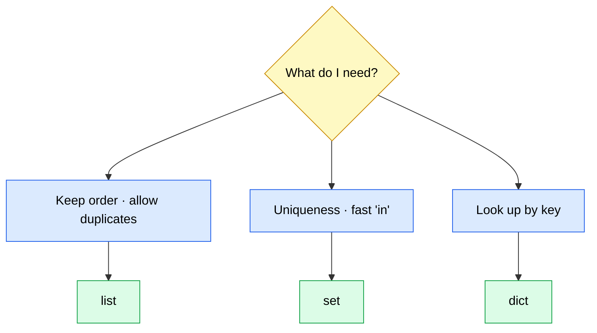

<!-- _class: title -->

# Sets & Dictionaries

## Python Mastery — Part 1: Foundations · Week 7

**Rathinam Trainers & Consultants**
Live on Microsoft Teams · recorded

---

<!-- _class: section -->

# Recap & today

## Where we are in the journey

---

## Last week — Lists & Tuples

- **Lists** mutate: `append`, `insert`, `remove`, `pop`, `sort`
- **Aliasing**: `b = a` shares one list — `b = a.copy()` fixes it
- **Tuples** are immutable records: `(id, title, done)`
- **Unpacking**: `tid, title, done = task`, `a, b = b, a`

> You can hold tasks **in order**. Today we hold them **by key**.

---

## Today's goal

By the end of this session you'll understand how to:

- Use **sets** for uniqueness and **set algebra** (`|`, `&`, `-`, `^`)
- Build, access, and iterate **dictionaries**
- **Choose** between a list, a set, and a dict
- Reach for **`Counter`**, **`defaultdict`**, and **`namedtuple`**

---

<!-- _class: section -->

# Sets

## Uniqueness, membership, and set algebra

---

## What is a set?

A set is an **unordered** collection of **unique**, **hashable** values.

```python
tags = {"work", "urgent", "email"}
```

- **No duplicates** — ever. Adding a duplicate is a no-op
- **No order** — no `tags[0]`, no slicing
- **Fast membership** — `"work" in tags` is near-instant

Think: *"which things do I have?"* — not *"what order are they in?"*

---

## Making a set — and the `{}` trap

```python
tags = {"work", "urgent"}      # a set
empty = set()                  # the ONLY way to make an empty set
oops = {}                      # this is an empty DICT!
```

- `{}` was a dict **before** sets existed — dict kept the syntax
- `set("hello")` → `{'h', 'e', 'l', 'o'}` — it iterates the string

---

## Adding and removing

```python
tags.add("home")        # add one; adding twice changes nothing
tags.discard("zzz")     # remove if present — silent if absent
tags.remove("zzz")      # KeyError if absent
```

- `add` is **idempotent** — safe to call again and again
- `discard` = *"make sure it's gone"*
- `remove` = *"it should be there — shout if not"*

---

## Set algebra

```python
mine  = {"work", "urgent", "email"}
yours = {"urgent", "home", "email"}
```

- `mine | yours` — **union** · in **either** set
- `mine & yours` — **intersection** · in **both**
- `mine - yours` — **difference** · in mine, **not** yours
- `mine ^ yours` — **symmetric difference** · in **exactly one**

Also spelled `.union()`, `.intersection()`, `.difference()` — and the
**methods accept any iterable**, while the **operators demand a set**.

---

## The dedupe idiom

```python
tags = ["work", "urgent", "work", "email", "urgent", "work"]
unique = set(tags)          # {'work', 'urgent', 'email'}
len(tags), len(unique)      # (6, 3)
```

To get a **stable, ordered** result back:

```python
sorted(set(tags))           # ['email', 'urgent', 'work']
```

`set(...)` throws order away — `sorted(...)` gives you a fresh one.

---

## Why sets are fast

Searching a **list** checks items one by one. A **set** jumps
straight to the answer by hash.

```python
target in big_list     #  ~924 microseconds
target in big_set      #  ~30 nanoseconds
```

*(100,000 items, worst case, measured on Python 3.14.6)*

Roughly **30,000× faster** — and the gap grows with size.

---

## Sets are unordered — really

```python
>>> {"work", "urgent", "email"}
{'work', 'email', 'urgent'}     # this run
{'email', 'urgent', 'work'}     # next run — same set!
```

- Display order is **arbitrary** and can change **between runs**
- Never rely on it; never test against it
- Need a fixed order? **`sorted(...)`**

---

<!-- _class: lead -->

# Watch this

## Demo 13 — set algebra & dedupe

---

<!-- _class: dark -->

## Demo 13 — what we'll do

- Build two tag sets and run **`|`, `&`, `-`, `^`**
- Collapse a duplicate-ridden list with **`set(...)`**
- Get a stable view back with **`sorted(...)`**
- **Time** `in` on a set vs a list — live
- See a set reject an **unhashable** list

---

<!-- _class: dark -->

## Set algebra, live

```pycon
>>> mine  = {"work", "urgent", "email"}
>>> yours = {"urgent", "home", "email"}
>>> sorted(mine | yours)
['email', 'home', 'urgent', 'work']
>>> sorted(mine & yours)
['email', 'urgent']
>>> sorted(mine - yours)
['work']
>>> sorted(mine ^ yours)
['home', 'work']
```

---

## What you just saw

- Four operators answered four **questions** about two collections
- `set(list)` deduped in one call — order gone, uniqueness gained
- Membership on a set was **thousands of times** faster
- Sets hold **hashable** things only — no lists inside

---

<!-- _class: section -->

# Dictionaries

## Keyed data — the workhorse container

---

## What is a dict?

A dict maps a **key** to a **value**. Look-ups go by key, not position.

```python
tasks = {
    1: {"title": "Buy milk", "done": False, "tags": ["shopping"]},
    2: {"title": "Write report", "done": False, "tags": ["work"]},
}
tasks[1]["title"]        # 'Buy milk' — direct, no searching
```

- Keys are **unique** and **hashable** (like set elements)
- Values are anything at all — including more dicts

---

## Access — and missing keys

```python
tasks[1]                 # the task
tasks[99]                # KeyError: 99   <- crashes
tasks.get(99)            # None           <- safe
tasks.get(99, "none")    # 'none'         <- safe with a default
99 in tasks              # False          <- just asking
```

`[...]` says *"it must be there"*. `.get(...)` says *"it might be."*

---

## The everyday methods

```python
tasks[5] = {...}                    # add or overwrite
tasks.setdefault(5, {})             # get, or insert-then-get
tasks.update(other)                 # merge another dict in
tasks.pop(3)                        # remove & return  (KeyError if absent)
tasks.pop(3, None)                  # remove & return, safe
len(tasks)                          # how many keys
```

---

## Iterating a dict

```python
for tid in tasks:                   # keys (the default!)
    ...
for title in tasks.values():        # values
    ...
for tid, task in tasks.items():     # both — the one you'll use most
    print(tid, task["title"])
```

Looping a dict gives you **keys**, not items — a classic first surprise.

---

## Views are live

```pycon
>>> ks = tasks.keys()
>>> ks
dict_keys([1, 2, 3])
>>> tasks[4] = {...}
>>> ks
dict_keys([1, 2, 3, 4])     # the SAME view, updated
```

`.keys()`, `.values()`, `.items()` are **windows**, not snapshots.
Need a frozen copy? `list(tasks.keys())`.

---

## Keys must be hashable

```pycon
>>> {["a", "b"]: 1}
TypeError: cannot use 'list' as a dict key (unhashable type: 'list')
>>> {("a", "b"): 1}         # a tuple is fine
{('a', 'b'): 1}
```

- **Hashable**: `str`, `int`, `float`, `bool`, `tuple`, `frozenset`
- **Not**: `list`, `dict`, `set` — they can change
- Python **3.14** spells this error out for you

---

## Dicts keep insertion order

```pycon
>>> d = {"b": 1, "a": 2}
>>> list(d)
['b', 'a']              # insertion order, not sorted
```

- Guaranteed by the **language** since Python 3.7
- Sets do **not** make this promise — dicts do
- Want alphabetical? `sorted(d)` or `sorted(d.items())`

---

## A preview — comprehensions

```python
{tid: t["title"] for tid, t in tasks.items()}   # dict comprehension
{tag for t in tasks.values() for tag in t["tags"]}   # set comprehension
```

Build a whole container in **one expression**.

> Full treatment next week — today just recognize the shape.

---

## Choosing a container



Ask what you'll **do** with it, not what it looks like.

---

## `Counter` — how many of each?

```pycon
>>> from collections import Counter
>>> counts = Counter(["urgent", "work", "urgent", "home"])
>>> counts
Counter({'urgent': 2, 'work': 1, 'home': 1})
>>> counts.most_common(2)
[('urgent', 2), ('work', 1)]
>>> counts["never-seen"]
0
```

A dict of tallies — and a missing key is **`0`**, not a `KeyError`.
Reading a missing key does **not** add it (unlike `defaultdict`).

---

## `defaultdict` — group without the fuss

```python
from collections import defaultdict

by_tag = defaultdict(list)
for tid, task in tasks.items():
    for tag in task["tags"]:
        by_tag[tag].append(tid)      # no "if tag not in..." needed
```

The **factory** (`list`) is called to birth any missing key.

> Careful: *reading* a missing key **creates** it.

---

## `namedtuple` — a tuple with names

```pycon
>>> from collections import namedtuple
>>> Task = namedtuple("Task", ["id", "title", "done"])
>>> t = Task(1, "Buy milk", False)
>>> t.title
'Buy milk'
>>> t
Task(id=1, title='Buy milk', done=False)
```

`task[1]` becomes `task.title` — same tuple, readable.

---

<!-- _class: lead -->

# Watch this

## Demo 14 — dict-of-tasks + `Counter` / `defaultdict`

---

<!-- _class: dark -->

## Demo 14 — what we'll do

- Build **`tasks`** keyed by id — the model we keep for good
- `get`, `.items()`, add and remove keys
- Rank tags with **`Counter`**
- Group task ids by tag with **`defaultdict(list)`**
- Sketch a task record as a **`namedtuple`**

---

<!-- _class: dark -->

## Tallies and groups, live

```pycon
>>> Counter(all_tags).most_common(2)
[('urgent', 3), ('home', 2)]

>>> by_tag = defaultdict(list)
>>> for tid, t in tasks.items():
...     for tag in t["tags"]:
...         by_tag[tag].append(tid)
>>> dict(by_tag)
{'shopping': [1], 'urgent': [1, 2, 4], 'work': [2], 'home': [3, 4]}
```

---

## What you just saw

- A **dict-of-dicts** keyed by id — lookup with no searching
- `.items()` gave us id **and** task in one loop
- `Counter` ranked the tags in **one line**
- `defaultdict(list)` grouped ids with **no key-checking**

> This keyed model is the task app from here to the capstone.

---

<!-- _class: section -->

# Wrap-up

## Q&A + this week's homework

---

## Lab 7 — the keyed task model

1. **Re-model** Lab 6's tuples as a **dict keyed by id**,
   each value a dict with `title` / `done` / `tags`
2. Keep the same ops: **add, remove, mark-done, list-by-title**
3. **Dedupe** tags with a `set` (Demo 13)
4. **`Counter`** tag frequency + **`defaultdict`** group-by-tag
5. **Submit:** `tasks.py` + sample output to the Teams channel

Mirror **Demo 13** for the sets, **Demo 14** for the dict model.

---

## Next week

- **Week 8 — Comprehensions & Looping Idioms**
- Today's loops collapse into **one-line comprehensions**
- `enumerate`, `zip`, and `sorted(key=...)` make the task list shine

---

<!-- _class: lead -->

# See you in the lab.

## Questions?
