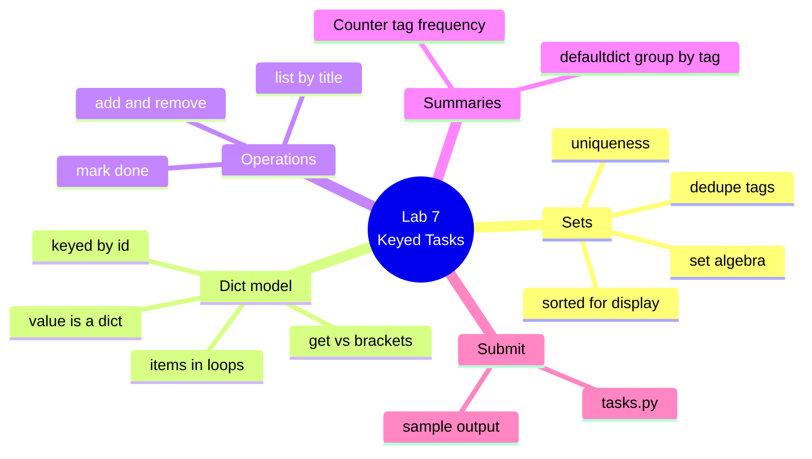

# Lab 7 — The Keyed Task Model

**Python Mastery — Part 1: Foundations · Week 7 · Student Lab Guide**

> **Audience:** You are a student in Week 7 of Python Mastery, Part 1. You've set up your toolchain
> (Week 1), worked with numbers (Week 2) and text (Week 3), learned to branch and loop (Week 4),
> wrapped logic into functions (Week 5), and built a task list from lists and tuples (Week 6). No new
> tools are needed this week — `collections` ships with Python.
> **Goal:** Re-model your task app so tasks are stored **by id** in a dictionary instead of hunted for
> in a list, dedupe tags with a **set**, and summarise your data with **`Counter`** and
> **`defaultdict`**. You do this on your own, after the live session, using the recording plus this
> guide.
> **Time:** about 60–90 minutes.

---

## Table of contents

<!-- export-png: session-07-lab-mindmap.png -->



<details>
<summary>ASCII fallback</summary>

```
Lab 7 — Keyed Tasks
├── Sets ........... uniqueness · set algebra · dedupe tags · sorted for display
├── Dict model ..... keyed by id · value is a dict · get vs brackets · items in loops
├── Operations ..... add · remove · mark done · list by title
├── Summaries ...... Counter tag frequency · defaultdict group by tag
└── Submit ......... tasks.py · sample output
```

</details>

---

## 1. What you'll build and why

In the live session you watched two demos. In **Demo 13** the trainer built two sets of tags, ran the
four set-algebra operators on them, collapsed a duplicate-ridden list with `set(...)`, and timed
membership on a set against a list — the set won by roughly thirty thousand times. In **Demo 14** the
trainer rebuilt the task app as a dictionary keyed by id, then ranked tags with `Counter` and grouped
task ids by tag with `defaultdict(list)`.

This lab is you doing the same thing to your own task app. Last week your tasks lived in a list of
`(id, title, done)` tuples. That worked, but think about what "mark task 7 as done" actually cost you:
your code had to walk the whole list, checking each id, until it found the right one. You knew exactly
which task you wanted — you said its number — and your program still had to go looking.

This week that search disappears. Not gets shorter: **disappears**. That's the whole point of the
exercise, and the thing to watch for as you work. When you finish a function and notice the `for` loop
you used to need is simply gone, that's the lesson landing.

By the end you'll have a `tasks.py` holding a dict-of-dicts keyed by id, with the same four operations
you had last week plus two new tag summaries. This model is not a throwaway. It's the shape your task
app keeps from now to the Week 16 capstone, and in Week 12 it's what you'll write straight out to a
JSON file — because a dict-of-dicts and a JSON object are very nearly the same idea.

---

## 2. Prerequisites

You need the toolchain from Lab 1 and the task data from Lab 6.

| What | Version / state | Check it |
|---|---|---|
| Python | **3.14.6** (any 3.14.x) | `python3.14 --version` |
| uv | **0.11.28** or later | `uv --version` |
| Ruff | **0.15.21** or later (via `uvx`) | `uvx ruff --version` |
| Your Lab 6 `tasks.py` | the list-of-tuples version | open it — you'll rewrite it |

On **Windows**, use `py -3.14` everywhere this guide says `python3.14`. Inside a `uv` project you can
also use `uv run python`.

Everything this week is **offline and free**. `collections` is part of the standard library — there is
nothing to install, and `import` just works.

> **Don't have Lab 6 finished?** You can still do this lab. Section 4 gives you a starting `tasks`
> dict to type in directly. Do go back and finish Lab 6 afterwards, though — Week 8 refactors both.

---

## 3. Warm up with sets in the REPL

Before touching your file, spend five minutes with sets so the ideas are in your fingers. Open the
REPL with `python3.14` and follow along. This mirrors **Demo 13**.

```pycon
>>> mine  = {"work", "urgent", "email"}
>>> yours = {"urgent", "home", "email", "email"}
>>> yours
{'email', 'urgent', 'home'}
```

Notice `yours` has **three** elements even though you typed four — the duplicate `"email"` collapsed
on creation, with no error. That's a set doing its one job.

Now the four operators. Each answers a question:

```pycon
>>> sorted(mine | yours)          # union — in either
['email', 'home', 'urgent', 'work']
>>> sorted(mine & yours)          # intersection — in both
['email', 'urgent']
>>> sorted(mine - yours)          # difference — mine, not yours
['work']
>>> sorted(mine ^ yours)          # symmetric difference — in exactly one
['home', 'work']
```

And the dedupe idiom you'll use in Section 5:

```pycon
>>> tags = ["work", "urgent", "work", "email", "urgent", "work"]
>>> len(tags), len(set(tags))
(6, 3)
>>> sorted(set(tags))
['email', 'urgent', 'work']
```

> ### ⚠️ Read this before your output confuses you
>
> **A set has no order, and its display order changes between runs.** If you print a raw set, run
> your program again, and see the elements in a different order — **nothing is broken**. Python
> randomises string hashing each time it starts, so set display order is genuinely arbitrary.
>
> Your set contents will always match this guide. Your set **order** may not, and it may not even
> match your own previous run. Do not try to fix this. Do not debug it.
>
> **The fix, whenever you display anything that came out of a set, is `sorted(...)`.** That's why
> every line above is wrapped in it, and it's why this lab asks you to sort your tag output. Get in
> this habit now and a whole category of confusion never happens to you.

One last thing to try, because you'll meet the error eventually:

```pycon
>>> {["a", "b"]}
TypeError: cannot use 'list' as a set element (unhashable type: 'list')
>>> {("a", "b")}
{('a', 'b')}
```

A list can change, so Python can't hash it, so it can't go in a set. A tuple can't change, so it can.
(That clear message is new in Python 3.14 — older versions just said `unhashable type: 'list'`.)

---

## 4. Build the keyed model

Create a new `tasks.py` (keep last week's around for comparison — it's instructive). Start with the
model:

```python
"""Week 7 task store — tasks keyed by id, with tags."""

from collections import Counter, defaultdict

tasks = {
    1: {"title": "Buy milk", "done": False, "tags": ["shopping", "urgent"]},
    2: {"title": "Write report", "done": False, "tags": ["work", "urgent"]},
    3: {"title": "Call plumber", "done": True, "tags": ["home"]},
    4: {"title": "Pay bills", "done": False, "tags": ["home", "urgent"]},
}
```

Look carefully at the shape, because it has two levels and both matter. The **outer** dict maps an id
to a task. The **value** at each key is *itself* a dict, holding everything about that task — its
title, whether it's done, and its tags. That's the dict-of-dicts, and it's common precisely because
each task can carry as many fields as it needs without you changing the structure.

Compare it to last week's `(1, "Buy milk", False)`. The tuple worked, but you had to *remember* that
position 1 meant the title. Here the data says `"title"`. Six months from now, that difference is
everything.

Now feel the payoff:

```pycon
>>> tasks[1]["title"]
'Buy milk'
```

Straight there. No loop, no scanning, no `if task[0] == 1`. Hold on to that feeling — you're about to
rewrite four functions and watch that loop vanish from every one of them.

---

## 5. Write the four operations

Add these functions below the model. These are last week's operations, re-expressed against a dict.

### 5.1 Add a task

```python
def add_task(store, task_id, title, tags):
    """Add a task. Tags are de-duplicated via a set, then stored sorted."""
    store[task_id] = {"title": title, "done": False, "tags": sorted(set(tags))}
    return store[task_id]
```

Two things worth noticing. Assigning to a key **adds it if new and overwrites it if not** — there's no
separate "add" method, assignment is it. And `sorted(set(tags))` is Section 3's idiom doing real work:
the `set` guarantees a task can't carry `"urgent"` twice even if you pass it twice, and the `sorted`
gives you a stable order back so your output doesn't shuffle between runs.

### 5.2 Remove a task

```python
def remove_task(store, task_id):
    """Remove a task by id. Returns the removed task, or None if absent."""
    return store.pop(task_id, None)
```

`pop` removes the key and hands you back its value. That second argument is what makes it safe —
without it, popping a missing id raises `KeyError`. Here we've decided removing a non-existent task is
acceptable and returns `None`.

### 5.3 Mark a task done

```python
def mark_done(store, task_id):
    """Mark a task done. Returns True if it existed."""
    task = store.get(task_id)
    if task is None:
        return False
    task["done"] = True
    return True
```

**This is the function to compare against last week's.** Last week this had to loop the list looking
for a matching id, and then — because tuples are immutable — rebuild the tuple and put it back. Here
it's a `get`, a check, and an assignment. The loop is gone, and so is the rebuild, because the value
is a mutable dict.

### 5.4 List tasks sorted by title

```python
def list_by_title(store):
    """Return (id, task) pairs sorted by title, without touching stored order."""
    return sorted(store.items(), key=lambda pair: pair[1]["title"])
```

`.items()` gives you `(id, task)` pairs. `sorted` returns a **new** list and leaves your dict's own
insertion order alone — the same `sorted` vs `.sort()` distinction you met last week.

The `key=lambda ...` part is next week's material, so don't worry if it looks strange. Read it as
"sort these pairs by the title inside the second element". It's here because you need it to sort, and
Week 8 explains it properly.

---

## 6. Add the two summaries

This is the new capability this week, and it mirrors **Demo 14**.

### 6.1 Flatten the tags

Both summaries need every tag from every task. Write it as a plain loop:

```python
def all_tags(store):
    """Every tag across every task, with repeats (feeds Counter)."""
    result = []
    for task in store.values():
        result.extend(task["tags"])
    return result


def unique_tags(store):
    """The distinct tags, sorted for stable display."""
    return sorted(set(all_tags(store)))
```

Note the split: `all_tags` **keeps** repeats, because `Counter` needs them to count. `unique_tags`
throws them away with `set` and sorts for display. Same data, two questions.

> In the demo the trainer wrote `all_tags` as a one-line comprehension. Next week you'll learn to
> collapse this loop into exactly that. The explicit loop above is correct and clear — use it today.

### 6.2 Tag frequency with `Counter`

```python
def tag_counts(store):
    """Counter of tag -> number of tasks carrying it."""
    return Counter(all_tags(store))
```

That's the whole thing. Hand `Counter` a list and it tells you how many of each. To display a
leaderboard, `.most_common()` gives you pairs ranked highest-first.

A `Counter` is a dict, so a missing key would normally raise `KeyError` — but it deliberately returns
**`0`** instead, which is the sensible answer to "how many times did I see something I never saw".
Reading a missing key does **not** add it.

### 6.3 Group by tag with `defaultdict`

```python
def group_by_tag(store):
    """Map each tag to the list of task ids carrying it."""
    grouped = defaultdict(list)
    for task_id, task in store.items():
        for tag in task["tags"]:
            grouped[tag].append(task_id)
    return dict(grouped)
```

Look at what **isn't** here: no "is this tag already a key? if not, create an empty list first". With a
plain dict you'd need that check in front of every single `append`. `defaultdict(list)` calls the
factory to birth a missing key the moment you touch it.

Pass `list` **without parentheses** — you're handing over the function so the defaultdict can call it
each time it needs one. `list()` with parentheses would call it once, now, and pass in a single list.

The `dict(grouped)` at the end converts back to a plain dict before returning — a small kindness so
callers get something that prints normally and won't sprout keys when read.

> **The sharp edge:** *reading* a missing key from a `defaultdict` **creates** it. Just looking at
> `grouped["nonsense"]` gives you `[]` and leaves `"nonsense"` in your dict permanently. That's the
> exact opposite of `Counter`. To check without creating, use `in`. Note also that `.get()` does
> **not** use the factory — it returns `None` and inserts nothing.

---

## 7. Wire up the output

Add a `__main__` block so running the file demonstrates everything:

```python
if __name__ == "__main__":
    add_task(tasks, 5, "Book flights", ["travel", "urgent", "travel"])
    mark_done(tasks, 1)
    remove_task(tasks, 3)

    print("== Tasks by title ==")
    for task_id, task in list_by_title(tasks):
        mark = "x" if task["done"] else " "
        print(f"[{mark}] {task_id}: {task['title']:<15} {','.join(task['tags'])}")

    print("\n== Unique tags ==")
    print(", ".join(unique_tags(tasks)))

    print("\n== Tag frequency ==")
    for tag, count in tag_counts(tasks).most_common():
        print(f"{tag:<10} {count}")

    print("\n== Tasks grouped by tag ==")
    for tag, ids in sorted(group_by_tag(tasks).items()):
        print(f"{tag:<10} {ids}")
```

Notice the `add_task` call passes `"travel"` **twice** — deliberately, to prove your set-dedupe works.
And notice every display loop is sorted, so your output is identical on every run.

---

## 8. Expected outcome — check yourself

Run it:

```bash
python3.14 tasks.py
```

You should see **exactly** this:

```
== Tasks by title ==
[ ] 5: Book flights    travel,urgent
[x] 1: Buy milk        shopping,urgent
[ ] 4: Pay bills       home,urgent
[ ] 2: Write report    work,urgent

== Unique tags ==
home, shopping, travel, urgent, work

== Tag frequency ==
urgent     4
shopping   1
work       1
home       1
travel     1

== Tasks grouped by tag ==
home       [4]
shopping   [1]
travel     [5]
urgent     [1, 2, 4, 5]
work       [2]
```

Work through these checkpoints:

1. **Book flights shows `travel,urgent` — not `travel,urgent,travel`.** Your set-dedupe works.
2. **Buy milk has `[x]`.** `mark_done(tasks, 1)` reached in and mutated the task's dict directly.
3. **Call plumber is absent, and `home` maps to `[4]` alone.** `remove_task` popped task 3, and the
   grouping reflects it.
4. **The list is alphabetical by title** — Book, Buy, Pay, Write — while the dict itself still holds
   insertion order. `sorted` returned a view; it didn't reorder your data.
5. **`urgent` is top with 4.** Tasks 1, 2, 4, and 5 all carry it.
6. **Run it three more times. The output is byte-for-byte identical every time.** That's `sorted`
   earning its place. If anything shuffles, you're displaying a raw set somewhere — find it and sort it.

Then check your formatting and lint:

```bash
uvx ruff format tasks.py
uvx ruff check tasks.py
```

Expected: `1 file reformatted` (or `1 file left unchanged`), then `All checks passed!`.

---

## 9. Where to look in the recording

| If you're stuck on… | Watch | What the trainer does |
|---|---|---|
| Sets, set algebra, dedupe | **Demo 13** | Builds two tag sets, runs `\|` `&` `-` `^`, dedupes with `set(...)`, restores order with `sorted(...)` |
| Why your set order keeps changing | **Demo 13**, the re-run step | Runs the same set literal three times and gets three different orders |
| Sets being fast | **Demo 13**, the `timeit` step | Times `in` on a 100,000-item list vs set — microseconds vs nanoseconds |
| The dict model, `get` vs `[...]` | **Demo 14**, steps 1–3 | Builds the keyed dict, shows `KeyError` vs `.get()` |
| Looping with `.items()` | **Demo 14**, step 4 | Unpacks id and task in the `for` line |
| `Counter` | **Demo 14**, steps 6–7 | Flattens the tags, ranks them, shows a missing key returning `0` |
| `defaultdict` | **Demo 14**, step 8 | Groups ids by tag with no key-checking, then shows reading a missing key creating it |
| `namedtuple` | **Demo 14**, step 10 | Sketches a task record with named fields |

---

## 10. Stretch goals

Optional. Do them if you have time — each one is a real idea, not busywork.

1. **Tag search.** Write `find_by_tag(store, tag)` returning the ids carrying a tag. Do it twice: once
   by looping every task, once by building `group_by_tag(store)` and doing a single lookup. That's the
   whole lesson of this week, in one comparison.
2. **Set algebra on real tasks.** Write `shared_tags(store, id_a, id_b)` returning the tags two tasks
   have in common (`&`), and `only_in(store, id_a, id_b)` returning what the first has that the second
   doesn't (`-`).
3. **A `namedtuple` view.** Build a `TaskRecord = namedtuple("TaskRecord", ["id", "title", "done"])`
   and a function returning your tasks as a list of them. Notice how much nicer `t.title` reads than
   `t[1]`.
4. **Guard against duplicate ids.** Make `add_task` refuse to overwrite an existing id — return `False`
   instead. Use `in`, and think about why `.get()` would also work but `[...]` would not.
5. **Prove the speed claim yourself.** Use `timeit` from the shell to compare `in` on a large list vs a
   large set, the way the trainer did. Try 10,000 items and then 1,000,000 and watch which number moves.

---

## 11. Reference table

Everything this lab uses, in one place.

| Operation | Syntax | Notes |
|---|---|---|
| Empty set | `set()` | **Not** `{}` — that's an empty dict |
| Set literal | `{"a", "b"}` | Duplicates collapse silently |
| Add to set | `s.add(x)` | Idempotent — adding twice is harmless |
| Remove from set | `s.discard(x)` / `s.remove(x)` | `discard` silent; `remove` raises `KeyError` |
| Union / intersection | `a \| b` / `a & b` | Or `.union(...)` / `.intersection(...)` |
| Difference / symmetric | `a - b` / `a ^ b` | `-` is **not** symmetric; `^` is |
| Operator vs method | `a & b` vs `a.intersection(it)` | Methods accept any iterable; operators demand a set |
| Dedupe a list | `set(items)` | Order is lost |
| Dedupe + display | `sorted(set(items))` | **The idiom.** Use it every time you print |
| Dict literal | `{1: {...}, 2: {...}}` | Keys unique + hashable; values anything |
| Access (must exist) | `d[k]` | `KeyError` if absent |
| Access (might exist) | `d.get(k)` / `d.get(k, default)` | `None` or your default; never raises |
| Membership | `k in d` | Checks **keys**; never creates |
| Add / overwrite | `d[k] = v` | Assignment is the "add" method |
| Get-or-insert | `d.setdefault(k, default)` | Returns existing, or inserts then returns |
| Remove | `d.pop(k)` / `d.pop(k, default)` | `KeyError` without a default |
| Merge | `d.update(other)` | `other`'s keys win on collision |
| Loop keys | `for k in d:` | The default — **keys**, not values |
| Loop values | `for v in d.values():` | |
| Loop both | `for k, v in d.items():` | The one you'll use most |
| Views are live | `d.keys()` etc. | A window, not a snapshot; wrap in `list()` to freeze |
| Count things | `Counter(items)` | Missing key → `0`, and does **not** insert |
| Rank things | `counts.most_common(n)` | Highest first; ties in first-seen order |
| Group things | `defaultdict(list)` | Factory **without** parentheses; `[...]` on a missing key **creates** it |
| Named record | `namedtuple("T", ["a", "b"])` | `t.a` instead of `t[0]`; still a tuple |
| Insertion order | dicts only | Guaranteed since Python 3.7. **Sets promise nothing** |

---

## 12. Troubleshooting & limitations

**"My tag order is different from the guide / changes every run."** Expected, not a bug — see the
warning in Section 3. You're displaying a raw set. Wrap it in `sorted(...)`. Set display order is
randomised per interpreter start by design.

**`TypeError: cannot use 'list' as a dict key (unhashable type: 'list')`.** You used a list where a
key must go. Keys must be unchangeable: `str`, `int`, `float`, `bool`, `tuple`, `frozenset`. If you
need a compound key, use a **tuple**. (On Python 3.13 and older this message is just
`unhashable type: 'list'` — same cause.)

**`KeyError: 7`.** You used `d[7]` on an id that isn't there. Decide what you mean: if the task
*should* exist, the `KeyError` is correct and it's telling you about a real bug — find out why it's
missing. If it legitimately might not exist, use `.get(7)` or check `7 in tasks` first. Don't reflexively
switch to `.get` everywhere; that turns loud bugs into silent `None`s that break somewhere else.

**`RuntimeError: dictionary changed size during iteration`.** You added or removed keys while looping
the dict. Views are live — you rearranged the room while looking through the window. Loop over a
snapshot instead: `for k in list(tasks):`.

**My `defaultdict` grew keys I never added.** You *read* a missing key. Reading
`grouped["anything"]` creates it. Use `in` to check without creating. This is the documented
behaviour and the trade-off you accepted for not having to check before appending.

**`grouped.get("tag")` returns `None`, not `[]`.** Correct and documented — the factory fires only for
`[...]`, never for `.get()`. Use `grouped["tag"]` if you want the empty list.

**`for t in tasks:` gives me numbers, not tasks.** Looping a dict yields its **keys**. You want
`tasks.values()` for the tasks, or `tasks.items()` for both.

**`{}` gave me a dict when I wanted a set.** `{}` is an empty dict — a historical quirk, dicts had the
braces first. Use `set()`.

**`d.values() == d.values()` is `False`.** Genuinely surprising, and documented: value views never
compare equal, even to themselves. Compare `list(d.values()) == list(d.values())` instead. (Key views
*do* compare fine, because keys are unique — they behave like sets.)

**Ruff complains `F401 'namedtuple' imported but unused`.** You imported something you didn't use.
Either use it or drop it from the import. `uvx ruff check --fix tasks.py` will remove it for you.

**Limitations of this lab.** Your tasks still vanish when the program exits — persistence arrives in
Week 12, and this dict-of-dicts is exactly what gets written to JSON there. The `key=lambda` in
`list_by_title` and the comprehension the trainer used for `all_tags` are Week 8 material; you're
using them on trust today. Ids are assigned by hand rather than generated. And there's no error
handling for bad input — that's Week 11. None of that is a gap in your work; it's the course arc.

---

## 13. Submission / sign-off

Submit the following to the **course channel on Microsoft Teams** (this is your Week 7 checkpoint,
which confirms your data model is keyed before Week 8 makes it idiomatic):

1. Your **`tasks.py`** file.
2. A **paste or screenshot of the full output** of `python3.14 tasks.py`, showing all four sections.
3. A line confirming **`uvx ruff check tasks.py`** reports `All checks passed!`.
4. **One or two sentences** answering: *which function lost the most code when you moved from a list
   to a dict, and why?* (There's no trick here — we want you to have noticed the loop disappear.)

Once your trainer confirms these, you're signed off for Week 7. Keep `tasks.py` — next week you'll
refactor its loops into comprehensions, number the display with `enumerate`, and sort by any field
with `sorted(key=...)`.

---

## 14. Sources

All syntax, behaviour, and outputs in this guide were executed and verified against **Python 3.14.6**
on **2026-07-16**:

- [Python 3.14 Tutorial — Data Structures](https://docs.python.org/3.14/tutorial/datastructures.html) — sets, dicts, comprehensions; the `set()`-not-`{}` rule; the "sets are unordered… different order than you expect" warning.
- [Python 3.14 — Set types (`set`, `frozenset`)](https://docs.python.org/3.14/library/stdtypes.html#set-types-set-frozenset) — `add`/`discard`/`remove`; operators require sets, methods accept any iterable.
- [Python 3.14 — Mapping types (`dict`)](https://docs.python.org/3.14/library/stdtypes.html#mapping-types-dict) — `get`/`setdefault`/`update`/`pop`; insertion order guaranteed since **3.7**.
- [Python 3.14 — Dictionary view objects](https://docs.python.org/3.14/library/stdtypes.html#dictionary-view-objects) — views are dynamic; value views never compare equal.
- [Python 3.14 — `collections`](https://docs.python.org/3.14/library/collections.html) — `Counter` (missing → `0`; `most_common` ties in first-seen order), `defaultdict` (`__missing__` is not called by `get()`), `namedtuple`.
- [What's New in Python 3.14](https://docs.python.org/3.14/whatsnew/3.14.html) — improved unhashable-type error messages (gh-132828).
- [Ruff — formatter & linter](https://docs.astral.sh/ruff/) · [uv](https://docs.astral.sh/uv/) — the Lab 1 toolchain.
- Set-vs-list membership speed is a **measured** figure from the live demo, not a documented guarantee; the tutorial says only "fast membership testing". Indicative complexity: [Python wiki — TimeComplexity](https://wiki.python.org/moin/TimeComplexity) (community wiki, not official docs).
