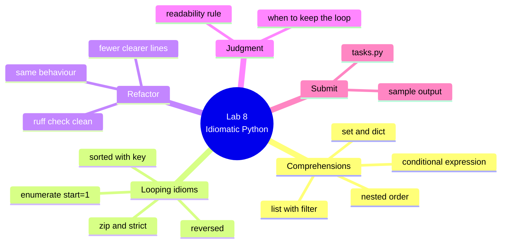

# Lab 8 — Make the Task App Idiomatic

**Python Mastery — Part 1: Foundations · Week 8 · Student Lab Guide**

> **Audience:** You are a student in Week 8 of Python Mastery, Part 1. You've built a task app that
> holds data in lists and tuples (Week 6) and re-modelled it as a dictionary keyed by id (Week 7).
> No new tools are needed this week.
> **Goal:** Take code you already wrote and make it read like Python. You'll rewrite collection-building
> loops as **comprehensions**, number your task list with **`enumerate`**, and add two sorts using
> **`sorted(key=...)`** — all without changing what your app does. You do this on your own, after the
> live session, using the recording plus this guide.
> **Time:** about 60–90 minutes.

---

## Table of contents

<!-- export-png: session-08-lab-mindmap.png -->



<details>
<summary>ASCII fallback</summary>

```
Lab 8 — Idiomatic Python
├── Comprehensions .... list + filter · conditional expression · set & dict · nested order
├── Looping idioms .... enumerate(start=1) · zip(strict=True) · reversed · sorted(key=...)
├── Refactor .......... same behaviour · fewer, clearer lines · ruff check clean
├── Judgment .......... the readability rule · when to keep the loop
└── Submit ............ tasks.py · sample output
```

</details>

---

## 1. What you'll build and why

In the live session you watched two demos. In **Demo 15** the trainer took ordinary `for` loops over
the task model and collapsed them into single-line comprehensions — list, set, and dict — showing how
a trailing `if` filters items out while an `if/else` at the front transforms every item instead. In
**Demo 16** the trainer numbered the task list with `enumerate`, paired lists with `zip`, and sorted
tasks by a key function, including a two-key tuple sort that put unfinished tasks first.

This lab is you doing the same thing to your own code. And it's a different kind of lab from the ones
before it: **you are not building a new feature this week**. You're taking the task app you already
have and rewriting parts of it to read better, while keeping its behaviour exactly the same. That's
called a *refactor*, and it is one of the most valuable things a working developer does. The point
isn't to make your code shorter for its own sake — it's to make the code say what you *meant*, so that
the version of you who opens this file in six months understands it instantly. You'll also practise
the judgment half of the skill: deciding when a comprehension genuinely helps and when an honest loop
is the better answer. If a step doesn't work the first time, that's completely normal — pause the
recording, re-read the step, and try again.

---

## 2. Prerequisites

Before you start, make sure you have:

- The toolchain from Week 1 working: **Python 3.14**, **uv**, **Ruff**, and **VS Code**.
- The **session recording** open in another window so you can follow along.
- Your **Lab 7 task app** (the dict-keyed model). If you don't have it, or it isn't quite where you'd
  like it, don't worry — section 4.1 gives you the exact starting data, so you are never blocked.

**Versions this lab targets (pinned):**

| Tool | Version this lab uses | Role |
|---|---|---|
| **Python** | **3.14.6** (any 3.14.x) | The language; everything here needs 3.10+ at most |
| **uv** | latest (Astral) | Runs your scripts in a managed environment |
| **Ruff** | latest (Astral) | Formats and lints your code |
| **VS Code** | latest | Your code editor |

Quick check that Python answers:

```bash
# macOS / Linux
python3.14 --version
# Windows
py -3.14 --version
```

You should see `Python 3.14.6` (or another `3.14.x`).

---

## 3. Warm up in the REPL (mirrors Demo 15)

Before touching your app, spend ten minutes feeling how comprehensions behave. Create a file called
`tasks_data.py` with the same data the trainer used:

```python
tasks = {
    1: {"title": "Buy milk", "done": False, "tags": ["shopping", "home"]},
    2: {"title": "Write report", "done": True, "tags": ["work"]},
    3: {"title": "Call plumber", "done": False, "tags": ["home", "urgent"]},
    4: {"title": "Archive photos", "done": True, "tags": ["home"]},
}
```

Now open the REPL with that data already loaded:

```bash
# macOS / Linux
python3.14 -i tasks_data.py
# Windows
py -3.14 -i tasks_data.py
```

> **REPL tip:** when you type a `for` or an `if`, the prompt changes from `>>>` to `...` for the
> indented lines. Finish the block by pressing **Enter on an empty `...` line**.

Try each of these, and predict the output before you press Enter:

```pycon
>>> [t["title"] for t in tasks.values() if not t["done"]]
['Buy milk', 'Call plumber']

>>> [f"{t['title']} [x]" if t["done"] else f"{t['title']} [ ]" for t in tasks.values()]
['Buy milk [ ]', 'Write report [x]', 'Call plumber [ ]', 'Archive photos [x]']

>>> {tid: t["title"] for tid, t in tasks.items()}
{1: 'Buy milk', 2: 'Write report', 3: 'Call plumber', 4: 'Archive photos'}

>>> sorted({tag for t in tasks.values() for tag in t["tags"]})
['home', 'shopping', 'urgent', 'work']
```

Look carefully at the first two. The first one asked about four tasks and gave back **two** titles —
the trailing `if` **filtered**, dropping the finished tasks. The second gave back **four** labels —
the `if/else` at the front **transformed** every task and dropped nothing. Same keyword, different
job, decided purely by **where it sits**.

Now try the loop-variable check:

```pycon
>>> [n * n for n in range(5)]
[0, 1, 4, 9, 16]
>>> n
NameError: name 'n' is not defined
```

The comprehension's variable `n` never escaped. That isolation is deliberate — a comprehension can't
accidentally overwrite a variable you were already using. (An ordinary `for` loop, by contrast, *does*
leave its variable behind.)

**Checkpoint:** you've seen all three comprehension flavours produce the outputs above, and you've
seen the filter-versus-transform difference in item counts. Type `exit()` to leave the REPL.

> **About that `sorted(...)` around the set.** A set has **no order**. If you run the bare
> `{tag for t in tasks.values() for tag in t["tags"]}` several times you'll see the four tags come out
> in a *different order each run*. That is not a bug — it's what a set is. Whenever you want to show a
> set to a human, wrap it in `sorted(...)` and you'll get the same stable, alphabetical list every time.

---

## 4. Refactor your task app (`tasks.py`)

This mirrors **Demo 15**: find the loops that are really just building a collection, and let a
comprehension say it.

### 4.1 Start from your Lab 7 code

Open your `tasks.py` from Lab 7 and work on your own data — everything below fits it exactly, because
it's the same shape you built last week: a dict keyed by id, where each task has a `title`, a `done`
flag, and a list of `tags`.

If you'd rather start clean, or your Lab 7 file isn't where you'd like it, use exactly this instead.
It's that same shape with five sample rows, and it's the data every expected output in this guide was
produced from — so if you want your output to match this guide line for line, start here:

```python
tasks = {
    1: {"title": "Buy milk", "done": False, "tags": ["shopping", "home"]},
    2: {"title": "Write report", "done": True, "tags": ["work"]},
    3: {"title": "Call plumber", "done": False, "tags": ["home", "urgent"]},
    4: {"title": "Archive photos", "done": True, "tags": ["home"]},
    5: {"title": "Book flights", "done": False, "tags": ["travel", "urgent"]},
}
```

### 4.2 Find the loops worth replacing

Read through your file looking for this exact shape — it's the tell:

```python
result = []              # 1. create an empty collection
for item in things:      # 2. loop
    if some_condition:   # 3. maybe filter
        result.append(f(item))   # 4. append
```

Every time you find that shape, it's a comprehension waiting to happen. Loops that **print**, loops
that **ask for input**, or loops that do several unrelated things are *not* on this list — leave those
alone. We'll come back to that judgment in section 6.

### 4.3 Write the refactored functions

Rewrite the collection-building parts as comprehensions. Type this in — don't paste blindly:

```python
def open_titles(tasks):
    """Titles of every task that is not done."""
    return [t["title"] for t in tasks.values() if not t["done"]]


def titles_by_id(tasks):
    """A {id: title} lookup."""
    return {tid: t["title"] for tid, t in tasks.items()}


def all_tags(tasks):
    """Every distinct tag used across all tasks."""
    return {tag for t in tasks.values() for tag in t["tags"]}
```

Notice `all_tags` returns a **set**, so it deduplicates on its own — `home` is on three tasks and will
appear exactly once, and you wrote no dedupe code at all.

**Checkpoint:** each of these three is a single `return` line. If any of yours needed a temporary list
and an `append`, you haven't finished converting it.

---

## 5. Number and sort the list (mirrors Demo 16)

Now the looping idioms. Add these to the same file:

```python
def sorted_by_title(tasks):
    """Task dicts sorted alphabetically by title, case-insensitively."""
    return sorted(tasks.values(), key=lambda t: t["title"].lower())


def sorted_by_done(tasks):
    """Task dicts sorted with open tasks first, then alphabetically by title."""
    return sorted(tasks.values(), key=lambda t: (t["done"], t["title"].lower()))


def render(rows):
    """Number a list of task dicts for display, starting at 1."""
    return [
        f"{n}. [{'x' if t['done'] else ' '}] {t['title']}"
        for n, t in enumerate(rows, start=1)
    ]
```

Three things to notice, because each is a beat from the demo:

`sorted_by_title` uses `key=lambda t: t["title"].lower()`. Without `.lower()`, every capitalised title
would sort *before* every lowercase one, because capital letters have lower character codes than
lowercase ones — that's the `Cherry`-before-`apple` surprise from Demo 16. The key is a lens you
compare through; it doesn't change your data.

`sorted_by_done` returns a **tuple** key. Python sorts on the first element and only uses the second to
break ties, so that one line means "open tasks first, then alphabetical within each group". It works
because `False` sorts before `True` — booleans really are integers, so `False` is `0`.

`render` uses `enumerate(rows, start=1)`. Note `rows` here is already a **list** of task dicts (it came
out of `sorted`), not the dict itself — see the troubleshooting section for what happens if you
`enumerate` a dict directly.

### 5.1 Wire up `main` and run it

```python
def main():
    print("Open tasks:", open_titles(tasks))
    print("All tags:", sorted(all_tags(tasks)))
    print()

    print("Sorted by title")
    for line in render(sorted_by_title(tasks)):
        print("  " + line)
    print()

    print("Sorted by done (open first)")
    for line in render(sorted_by_done(tasks)):
        print("  " + line)


if __name__ == "__main__":
    main()
```

Run it:

```bash
python3.14 tasks.py     # or: py -3.14 tasks.py   /   uv run tasks.py
```

Expected output — exactly this, if you started from the sample data in section 4.1. If you're using
your own Lab 7 tasks the titles will differ, but the *shape* must be the same: an open-task list, a
sorted tag list with no duplicates, and two numbered lists in two different orders.

```
Open tasks: ['Buy milk', 'Call plumber', 'Book flights']
All tags: ['home', 'shopping', 'travel', 'urgent', 'work']

Sorted by title
  1. [x] Archive photos
  2. [ ] Book flights
  3. [ ] Buy milk
  4. [ ] Call plumber
  5. [x] Write report

Sorted by done (open first)
  1. [ ] Book flights
  2. [ ] Buy milk
  3. [ ] Call plumber
  4. [x] Archive photos
  5. [x] Write report
```

Compare the two lists carefully — that's the payoff. `Archive photos` is **first** by title but
**fourth** by done-ness, because it's finished. If your two lists come out identical, your
`sorted_by_done` key probably isn't a tuple.

Notice also that `main` still uses ordinary `for` loops to print. That's correct and deliberate:
printing is a side effect, not collection-building, so a loop is the right tool. Don't "fix" it.

**Checkpoint:** your output matches the block above, and the two sorted lists differ.

### 5.2 Tidy with Ruff

Same habit as every week:

```bash
uvx ruff format
uvx ruff check
```

**Checkpoint:** `uvx ruff check` reports `All checks passed!`.

---

## 6. Know when to stop

This is graded as much as the code is, so read it properly. A comprehension has exactly **one** job:
**building a collection**. If that's what you're doing, use it. If it isn't, don't.

The test to apply is: **if you can't read it out loud in one breath, write the loop.** A comprehension
that takes thirty seconds to decode has failed at the only thing it was for, which is clarity.

```python
# Fine — one idea, reads like a sentence
[t["title"] for t in tasks.values() if not t["done"]]
```

```python
# Stop. This should be a loop.
[f(x, y) for x in xs if p(x) for y in g(x) if q(x, y)]
```

And one specific thing to avoid, because it's a common beginner habit: **never write a comprehension
just to call `print`**. This builds a whole list of `None` values and throws it away, and it hides a
side effect inside something that looks like a value:

```python
[print(t["title"]) for t in tasks.values()]   # DON'T — builds [None, None, ...]
```

```python
for t in tasks.values():                       # DO
    print(t["title"])
```

**Checkpoint:** every loop still left in your file is there for a reason you could defend out loud —
it prints, it reads input, or it does several things. "Because it reads better" is a complete and
correct answer.

---

## 7. Expected outcome / self-check

You're done with the core lab when **all** of these are true:

- [ ] `open_titles`, `titles_by_id`, and `all_tags` are each a **single-line comprehension** returning
      a list, a dict, and a set respectively.
- [ ] `all_tags` returns each tag **once**, with no dedupe code written by you.
- [ ] Your displayed list is numbered from **1** using `enumerate(..., start=1)`.
- [ ] `sorted_by_title` and `sorted_by_done` both use `sorted(key=...)`, and their outputs **differ**.
- [ ] `sorted_by_done` uses a **tuple key** so tasks are alphabetical within each group.
- [ ] Behaviour is **unchanged** from your Lab 7 app — same data in, same information out.
- [ ] Loops that print are **still loops**.
- [ ] `uvx ruff check` reports `All checks passed!`.

---

## 8. Where to look in the recording

If a step is unclear, scrub to the matching demo in the session recording:

| You're stuck on… | Watch | In the recording |
|---|---|---|
| Turning a `for`+`append` loop into a comprehension | **Demo 15 (D15)** | The "loop → comprehension" segment |
| Filter (`if` at the end) vs transform (`if/else` at the front) | **Demo 15 (D15)** | The conditional-expression step |
| Dict and set comprehensions; why the set is `sorted()` | **Demo 15 (D15)** | The "dict & set comprehensions" segment |
| Nested `for`s and the `NameError` when they're reversed | **Demo 15 (D15)** | The nested-comprehension step |
| `enumerate(..., start=1)` and `.values()` | **Demo 16 (D16)** | The "enumerate & zip" segment |
| `zip` dropping items, and `strict=True` | **Demo 16 (D16)** | The `zip` steps |
| `key=`, `str.lower`, and the tuple key | **Demo 16 (D16)** | The "sorting by a key" segment |
| `sorted()` vs `.sort()` returning `None` | **Demo 16 (D16)** | The final step of D16 |

---

## 9. Stretch goals (optional)

If you finished early and want to push further. All four are verified to work on Python 3.14.6:

1. **Group tasks by tag** using a dict comprehension with a nested list comprehension inside it. This
   is right at the edge of the readability rule — write it, then decide honestly whether you'd keep it:

   ```python
   all_tags = {tag for t in tasks.values() for tag in t["tags"]}
   by_tag = {
       tag: [t["title"] for t in tasks.values() if tag in t["tags"]]
       for tag in sorted(all_tags)
   }
   ```

2. **Count what's done with a generator expression** — no list is built at all:

   ```python
   done_count = sum(1 for t in tasks.values() if t["done"])
   print(f"{done_count}/{len(tasks)} done = {done_count / len(tasks):.0%}")
   ```

   That prints `2/5 done = 40%`. This is the Week 15 preview from the session, doing real work.

3. **Pair titles with due dates using `zip(strict=True)`.** Give yourself a list of five dates, zip it
   against your titles, and print each pair. Then deliberately delete one date and watch
   `strict=True` raise `ValueError` instead of silently dropping a task.

4. **Sort by tag count, most-tagged first**, breaking ties alphabetically:

   ```python
   by_tagcount = sorted(
       tasks.values(), key=lambda t: (-len(t["tags"]), t["title"].lower())
   )
   ```

   The minus sign reverses just that one part of the key — a neat trick you can't get from
   `reverse=True`, which would flip the title order too.

---

## 10. Reference — constructs used in this lab

| Construct | What it does |
|---|---|
| `[f(x) for x in xs]` | List comprehension — builds a **list** |
| `[x for x in xs if cond]` | Trailing `if` **filters** — failing items are dropped (no `else` allowed) |
| `[a if cond else b for x in xs]` | Conditional expression **transforms** — every item produces a value (`else` required) |
| `{x for x in xs}` | Set comprehension — builds a **set**; duplicates collapse; **no order** |
| `{k: v for k, v in pairs}` | Dict comprehension — builds a **dict** |
| `[y for x in xs for y in x]` | Nested — reads **left to right, outer to inner** |
| `(f(x) for x in xs)` | Generator expression — **lazy**, builds nothing; full story in Week 15 |
| `enumerate(iterable, start=0)` | Yields `(index, item)` pairs; pass `start=1` for humans |
| `zip(a, b)` | Pairs items; **stops at the shortest**, silently |
| `zip(a, b, strict=True)` | Raises `ValueError` if lengths differ (Python 3.10+) |
| `reversed(seq)` | A lazy reverse **view**; wrap in `list(...)` to see it; original untouched |
| `sorted(iterable, key=None, reverse=False)` | Returns a **new** sorted list; original untouched |
| `key=lambda t: t["title"]` | Sort by one field |
| `key=str.lower` | Sort case-insensitively without changing the data |
| `key=lambda t: (a, b)` | **Tuple key** — sort by `a`, break ties with `b` |
| `key=lambda t: -len(...)` | Negate a numeric key to reverse just that part |
| `.sort()` | Sorts **in place** and returns `None` |
| stable sort | Equal keys keep their original relative order — guaranteed |

---

## 11. Troubleshooting & limitations

**`TypeError: 'int' object is not subscriptable` when you `enumerate` your tasks.** You wrote
`enumerate(tasks, start=1)` instead of `enumerate(tasks.values(), start=1)`. Iterating a **dict**
gives you its **keys** — so your `t` was the integer id, and integers don't have a `["title"]`. Add
`.values()` (or use `.items()` if you want both the id and the task).

**`TypeError: '<' not supported between instances of 'dict' and 'dict'`.** You called `sorted()` on
your tasks without a `key=`. Python genuinely cannot decide whether one dictionary is "less than"
another — which is exactly why the key exists. Tell it what to compare: `key=lambda t: t["title"]`.

**Your set prints in a different order every run.** That's correct behaviour, not a bug. Sets have no
order at all. Wrap the set in `sorted(...)` whenever you display it, and you'll get a stable
alphabetical list every time.

**Your two sorted lists come out identical.** Your `sorted_by_done` key is probably returning just
`t["done"]` instead of the tuple `(t["done"], t["title"].lower())`. Without the second element there's
nothing to break ties with, so the tasks stay in whatever order they were already in.

**`NameError` from a nested comprehension.** Your `for` clauses are in the wrong order. They read
left to right, exactly like nested loops: the **outer** collection first, the **inner** one second.
`[tag for t in tasks.values() for tag in t["tags"]]` is right; swapping the two `for`s asks for `t`'s
tags before `t` exists.

**Your list is `None` after you sorted it.** You wrote `tasks = tasks.sort()`. `.sort()` reorders the
list in place and returns `None`, so you just threw your list away and kept the nothing. Either call
`tasks.sort()` on its own line and keep using `tasks`, or use `tasks = sorted(tasks)`.

**`SyntaxError` in a comprehension with a trailing `if ... else`.** A filter can't have an `else`.
`[x for x in xs if x > 0 else 0]` is not valid Python. If you want an `else`, you want a transform,
and it goes at the **front**: `[x if x > 0 else 0 for x in xs]`.

**Ruff reformats your comprehension onto several lines.** That's fine and expected — Ruff wraps long
lines. It's still one expression. Don't fight it; if Ruff has to wrap it heavily, treat that as a hint
that the readability rule from section 6 might apply.

**Limitations of this lab.** Your tags and task data are still hard-coded in the file, and the app
still forgets everything the moment it exits — persistence arrives in Week 12, when we save tasks to a
JSON file. Generator expressions are previewed here but only properly explained in Week 15. And your
app is still a single file; in Week 9 it becomes a real package you run with `python -m taskapp`.

---

## 12. Submission / sign-off

Submit the following to the course channel on Microsoft Teams (this is your Week 8 checkpoint, which
confirms your comprehension refactor preserved behaviour and your keyed sorts are correct, before
Week 9 splits the app into modules):

1. Your refactored **`tasks.py`**.
2. A **sample run** showing the full output — the open tasks, the tag list, and **both** sorted lists,
   so it's visible that the two orders differ.
3. A short note — two or three sentences is plenty — naming **one loop you deliberately did not
   convert**, and why. This is the judgment half of the lab and it counts.
4. A line confirming `uvx ruff check` reports `All checks passed!`.

Once your trainer confirms these, you're signed off for Week 8. Keep your `tasks.py` — next week we
split it into modules and turn it into a package you run with `python -m taskapp`.

---

## 13. Sources

All steps, syntax, and outputs were executed and verified against **Python 3.14.6** (the current
stable release) on **2026-07-16**:

- [Python 3.14 Tutorial — Data Structures (list, set & dict comprehensions; nested comprehensions; looping techniques)](https://docs.python.org/3.14/tutorial/datastructures.html)
- [Python 3.14 Tutorial — Looping Techniques (`enumerate`, `zip`, `reversed`, `sorted`)](https://docs.python.org/3.14/tutorial/datastructures.html#looping-techniques)
- [Python 3.14 — Built-in Functions (`enumerate`, `zip`, `reversed`, `sorted`)](https://docs.python.org/3.14/library/functions.html)
- [PEP 618 — Add Optional Length-Checking To `zip` (`strict=`, added in Python 3.10)](https://peps.python.org/pep-0618/)
- [Python HOWTO — Sorting Techniques (`key` functions, tuple keys, sort stability)](https://docs.python.org/3.14/howto/sorting.html)
- [Python 3.14 — Expressions: displays for lists, sets and dictionaries; conditional expressions](https://docs.python.org/3.14/reference/expressions.html#displays-for-lists-sets-and-dictionaries)
- [PEP 709 — Inlined comprehensions (Python 3.12; comprehension scope isolation preserved)](https://peps.python.org/pep-0709/)
- [Ruff — The formatter & linter (`uvx ruff`)](https://docs.astral.sh/ruff/)
