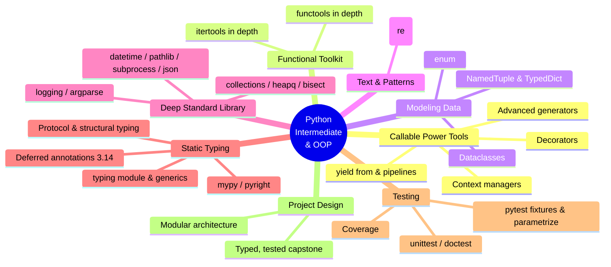
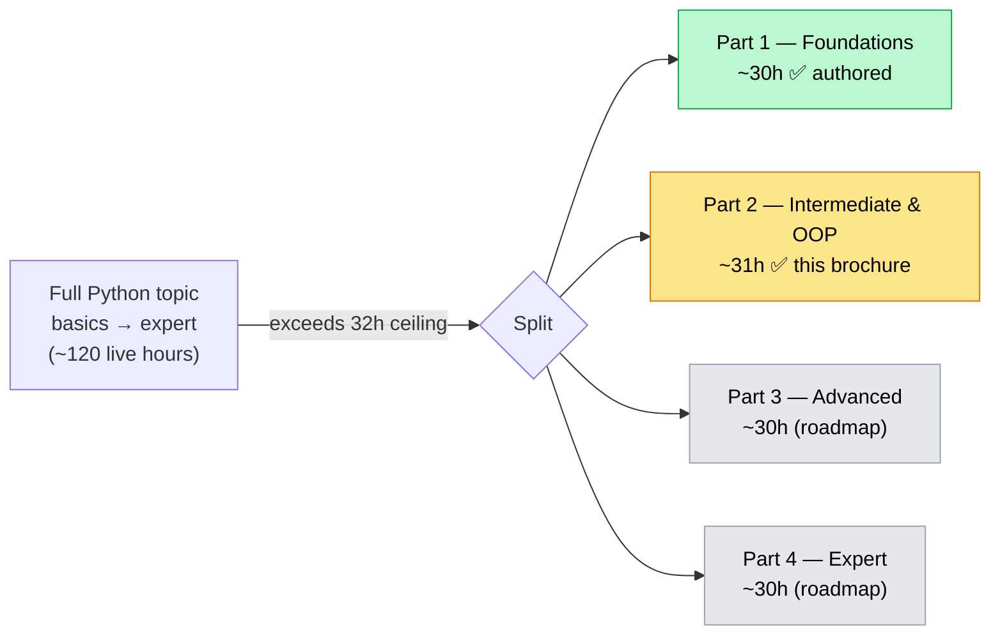

# Python Mastery — Part 2: Intermediate & OOP

## From Idiomatic Core Python to Production-Grade, Type-Checked, Tested Code

**The Python Mastery Series · Program 02 of 4 | Rathinam Trainers & Consultants Private Limited**

> This is **Part 2 of a 4-part Python Mastery program** that covers Python end-to-end, from
> "never written a line" through expert-level CPython internals and C extensions. The full
> arc, the split, and how every documented Python topic is covered across the four parts is
> laid out in [`training_roadmap.md`](../../training_roadmap.md). This brochure is the
> complete, standalone scope for **Part 2 — Intermediate & OOP**, grounded in the official
> Python 3.14 documentation. It assumes **Part 1 — Foundations** (or equivalent core-Python
> experience).

---

## Course at a Glance

| | |
|---|---|
| **Program** | Python Mastery — Part 2: Intermediate & OOP |
| **Shape** | **16 sessions × 2 hours live = 32 live hours**, one session per week (16 weeks) |
| **Delivery** | Live online on Microsoft Teams, **recorded**; trainer-led teach + demo + Q&A |
| **Hands-on** | Done by students **after** each session, from the recording + lab guides |
| **Python version** | **Python 3.14** (3.14.6, current stable — verified 2026-06-11) |
| **Audience** | Graduates of Part 1, and developers already fluent in core Python who want depth |
| **Prerequisites** | **Part 1 — Foundations** (or equivalent): confident with functions, data structures, exceptions, basic OOP, modules, and `uv`/Ruff |
| **Outcome** | Write decorators and context managers; model data with dataclasses/enums; master `re`, `functools`/`itertools`, and the deep standard library; **statically type-check** code with `mypy`/`pyright`; **test** it with `pytest`; structure a real multi-module project |
| **Takeaways** | Certificate of completion · a **typed, tested, packaged library** capstone · all lab code + recordings |

---

## Visual Table of Contents

<!-- export-png: brochure-mindmap.png -->



<details>
<summary>ASCII fallback</summary>

```
Python Intermediate & OOP
├── Callable Power Tools ... decorators · context managers · advanced generators · yield from & pipelines
├── Functional Toolkit ..... functools in depth · itertools in depth
├── Modeling Data .......... dataclasses · enum · NamedTuple & TypedDict
├── Text & Patterns ........ regular expressions (re)
├── Deep Standard Library .. collections/heapq/bisect · datetime/pathlib/subprocess/json · logging/argparse
├── Static Typing .......... typing & generics · Protocol & structural typing · mypy/pyright · deferred annotations (3.14)
├── Testing ................ pytest fixtures & parametrize · unittest/doctest · coverage
└── Project Design ......... modular architecture · typed, tested, packaged capstone
```

</details>

---

## 1. Who This Course Is For

| Profile | Why this course |
|---------|-----------------|
| **Part 1 graduates** | The natural next step: turn working Python into *professional* Python — typed, tested, well-structured |
| **Self-taught / working developers** | You write Python daily but never formalized decorators, typing, or `pytest` — this fills the gaps systematically |
| **QA / automation engineers** | Master `pytest`, fixtures, parametrization, and coverage — the core of modern Python test engineering |
| **Developers heading to backend / data / AI tracks** | Static typing, dataclasses, and project structure are the prerequisites every advanced Python track assumes |

**Assumed prior knowledge (the Part 1 contract):** confident with functions (incl. `*args`/`**kwargs`, scope, lambdas, intro type hints), all core data structures and comprehensions, exceptions, files & `pathlib` basics, modules/packages, `venv`/`uv`/Ruff, and **basic OOP** (classes, `__init__`, inheritance, `__str__`/`__repr__`, intro iterators/generators). If you have equivalent experience without Part 1, you are ready.

---

## 2. What You'll Be Able to Do

On finishing Part 2, you will be able to:

- **Author and apply decorators** — function and class decorators, decorators with arguments, `functools.wraps`, stacking, and real-world uses (caching, timing, registration, access control).
- **Write context managers** both ways — the `__enter__`/`__exit__` protocol and `contextlib.@contextmanager`; use `ExitStack`, `suppress`, `closing`, and `contextlib` helpers.
- **Build advanced generators** — generator pipelines, `yield from` delegation, generator-based coroutines, and lazy data processing that stays memory-flat.
- **Wield the functional toolkit** — `functools` (`cache`/`lru_cache`, `partial` + the new `Placeholder`, `reduce`, `singledispatch`, `cached_property`, `total_ordering`) and `itertools` (the full combinatoric, infinite, and grouping toolkit).
- **Model data precisely** — `@dataclass` (fields, defaults, `frozen`, `slots`, ordering, `__post_init__`), `enum` (`Enum`/`IntEnum`/`Flag`/`StrEnum`/`auto`), `namedtuple`/`typing.NamedTuple`, and `TypedDict`.
- **Master regular expressions** — the full `re` syntax, groups, lookarounds, flags, `compile`/`match`/`search`/`finditer`/`sub`, named groups, and when *not* to use regex.
- **Use the deep standard library** — `collections` (`deque`, `Counter`, `defaultdict`, `OrderedDict`, `ChainMap`), `heapq`, `bisect`, `datetime` (incl. 3.14 `date.strptime`), `pathlib` (incl. 3.14 `copy`/`move`/`Path.info`), `subprocess`, `json`, `logging`, and `argparse` (incl. 3.14 `suggest_on_error`/`color`).
- **Statically type your code** — the full `typing` surface: generics via **PEP 695** (`def f[T]`, `class Box[T]`, `type` aliases), `Protocol` and structural subtyping, `Optional`/`Union`/`|`, `Callable`, `Literal`, `Final`, `overload`, `TypeVar`/`ParamSpec`, and Python 3.14's **deferred annotations** (PEP 649/749) with `annotationlib`.
- **Run a type checker** — configure and interpret `mypy` and `pyright`, read and fix type errors, and add typing to existing code incrementally.
- **Test like a professional** — `pytest` (assertions, fixtures, scopes, `conftest.py`, parametrization, markers, `tmp_path`/`monkeypatch`), `unittest`, `doctest`, and measuring **coverage** with `pytest-cov`.
- **Structure a real project** — `src` layout, package boundaries, configuration in `pyproject.toml`, and deliver a **typed, tested, multi-module library** as the capstone.

---

## 3. Module & Topic Coverage Map

This is the spine of the brochure. Every aspect below is drawn from the official Python 3.14
documentation and the roadmap's Part-2 partition; the **Source** column traces each module
back to where it comes from. (Full source list in
[`../../000_topic_source/SOURCES.md`](../../000_topic_source/SOURCES.md).)

| Module | Aspects covered | Source |
|--------|-----------------|--------|
| **M1 — Decorators** | First-class functions & closures recap; function decorators; decorators *with* arguments; `functools.wraps`; stacking; class decorators; practical patterns (timing, caching, registration, retry, access control) | Lib `functools`; Reference (functions, compound statements) |
| **M2 — Context Managers** | The `with` statement & the context-manager protocol (`__enter__`/`__exit__`); writing class-based managers; `contextlib.@contextmanager`; `ExitStack`, `suppress`, `closing`, `redirect_stdout`, `nullcontext`; reentrant/async-context first look | Lib `contextlib`; Reference (with statement) |
| **M3 — Advanced Iterators & Generators** | Iterator protocol in depth; generator functions & expressions; `send`/`throw`/`close`; **`yield from`** delegation; **generator pipelines** & lazy streaming; generators as coroutines (pre-`async`) | Tutorial 9; Reference (yield expressions); HOWTO (functional) |
| **M4 — `functools` in Depth** | `cache` & `lru_cache`; `cached_property`; `partial` & `partialmethod` + **`Placeholder` (3.14)**; `reduce` (+ **`initial=` keyword, 3.14**); `singledispatch`/`singledispatchmethod`; `total_ordering`; `wraps`/`update_wrapper` | Lib `functools`; What's New 3.14 |
| **M5 — `itertools` in Depth** | Infinite iterators (`count`, `cycle`, `repeat`); terminating iterators (`accumulate`, `chain`, `groupby`, `islice`, `pairwise`, `starmap`, `tee`, `zip_longest`); combinatorics (`product`, `permutations`, `combinations`); composing the recipes | Lib `itertools` |
| **M6 — Modeling Data: Dataclasses, Enums & Typed Records** | `@dataclass` (fields, `default`/`default_factory`, `frozen`, `slots`, `order`, `kw_only`, `__post_init__`, `field()`); `enum` (`Enum`, `IntEnum`, `IntFlag`, `Flag`, `StrEnum`, `auto`, members & aliases); `namedtuple` & `typing.NamedTuple`; `TypedDict` (total/non-total, `Required`/`NotRequired`) | Lib `dataclasses`, `enum`, `collections`, `typing` |
| **M7 — Regular Expressions (`re`)** | Pattern syntax (anchors, classes, quantifiers, groups, alternation); named/numbered groups & backreferences; lookahead/lookbehind; flags (`IGNORECASE`, `MULTILINE`, `DOTALL`, `VERBOSE`); `compile`, `match`/`search`/`fullmatch`, `findall`/`finditer`, `sub`/`subn`/`split`; greedy vs lazy; when regex is the wrong tool | Lib `re`; HOWTO (regex) |
| **M8 — Specialized Containers: `collections`, `heapq`, `bisect`** | `collections` — `deque`, `Counter`, `defaultdict`, `OrderedDict`, `ChainMap`, `UserDict`/`UserList`/`UserString`; `heapq` priority queues & heap operations; `bisect` sorted-list insertion & search | Lib `collections`, `heapq`, `bisect` |
| **M9 — System & Data Stdlib: `datetime`, `pathlib`, `subprocess`, `json`** | `datetime`/`date`/`time`/`timedelta`/`tzinfo`, parsing/formatting (+ **`date.strptime`/`time.strptime`, 3.14**); `pathlib` deep (incl. **`copy`/`move`/`copy_into`/`move_into`/`Path.info`, 3.14**); `subprocess` (`run`, args, capture, pipes, errors); `json` deep (encode/decode, custom (de)serialization, **CLI/color, 3.14**) | Lib `datetime`, `pathlib`, `subprocess`, `json`; What's New 3.14 |
| **M10 — Operational Stdlib: `logging` & `argparse`** | `logging` — loggers/handlers/formatters/levels, config, `QueueListener` (+ **context-manager support, 3.14**), best practices vs `print`; `argparse` — parsers, arguments, subcommands, types/validation (+ **`suggest_on_error`/`color`, 3.14**) | Lib `logging`, `argparse`; What's New 3.14 |
| **M11 — Static Typing I: the `typing` Core** | Why type hints; annotating variables/functions/classes; `Optional`/`Union`/`X | Y`; `list[T]`/`dict[K,V]` builtins; `Any`, `Callable`, `Literal`, `Final`, `ClassVar`; `overload`; `NewType`; **deferred annotations (PEP 649/749) & `annotationlib`** (3.14 default) | Lib `typing`, `annotationlib`; What's New 3.14 |
| **M12 — Static Typing II: Generics, Protocols & Checkers** | **PEP 695** type-parameter syntax (`def f[T]`, `class Box[T]`, `type` aliases); `TypeVar`/`ParamSpec`/`TypeVarTuple`; bounds & constraints; **`Protocol`** & structural subtyping; `@runtime_checkable`; running **`mypy`** & **`pyright`**, reading errors, incremental typing; ecosystem note (`ty`, `pyrefly`) | Lib `typing`; PEP 695; mypy/pyright docs |
| **M13 — Testing with `pytest`** | Test discovery & layout (`src` + `tests/`); `assert` introspection; **fixtures** (scopes, `conftest.py`, factory & parametrized fixtures); **`@pytest.mark.parametrize`**; markers & `--strict-markers`; built-in fixtures (`tmp_path`, `monkeypatch`, `capsys`); config in `pyproject.toml` | pytest docs |
| **M14 — Stdlib Testing & Coverage: `unittest`, `doctest`, coverage** | `unittest` — `TestCase`, assertions, setUp/tearDown, mocking with `unittest.mock`; `doctest` — executable docstrings; measuring **coverage** with `pytest-cov`/`coverage.py`; coverage as a tool, not a target | Lib `unittest`, `doctest`; pytest-cov/coverage.py |
| **M15 — Modular Project Design at Scale** | Package & module boundaries; `src` layout; `__init__.py` re-exports & public API; configuration & metadata in `pyproject.toml`; dependency direction & avoiding cycles; combining typing + tests + structure into a maintainable codebase | Tutorial 6; Packaging Guide; Reference (import system) |
| **M16 — Consolidation & Capstone** | Bring it together: design, build, **type-check**, and **test** a small multi-module library (e.g., a typed config/ETL/CLI toolkit) with dataclasses, `re`, the deep stdlib, decorators/context managers, `mypy`/`pyright` clean, and a green `pytest` suite with coverage; Q&A | recap; all modules |

> **Full-coverage note.** Part 2 owns exactly the aspects the roadmap's partition assigns to
> Part 2 — decorators, context managers, advanced generators, `functools`/`itertools`,
> dataclasses/enums/typed records, full `re`, the deep standard library, the **complete static
> typing system**, **unit testing**, and **modular design**. The **full data model & dunder
> protocols, descriptors, metaclasses, ABCs, concurrency, `asyncio`, and packaging/distribution
> to PyPI** are **explicitly carried by Part 3**; CPython internals, the JIT, profiling, and C
> extensions by **Part 4**. Nothing in the documentation is dropped — it is covered across the
> four parts ([`../../training_roadmap.md`](../../training_roadmap.md)).

---

## 4. Fit-Check / Capacity Ledger

The course shape for each part of this program is the family standard: **16 sessions × 2 hours
= 32 live hours**. Usable teaching time is less than 32h once weekly recap, Q&A, and a
consolidation/capstone session are subtracted — the practical fill is **~28–31h**. The table
below budgets **live teach + demo** time per module (hands-on happens after sessions, so it is
not counted here).

| Module | Estimated live teach + demo (h) |
|--------|:---:|
| M1 — Decorators | 2.0 |
| M2 — Context Managers | 1.5 |
| M3 — Advanced Iterators & Generators | 2.0 |
| M4 — `functools` in Depth | 1.5 |
| M5 — `itertools` in Depth | 1.5 |
| M6 — Dataclasses, Enums & Typed Records | 2.5 |
| M7 — Regular Expressions (`re`) | 2.5 |
| M8 — `collections`, `heapq`, `bisect` | 2.0 |
| M9 — `datetime`, `pathlib`, `subprocess`, `json` | 2.0 |
| M10 — `logging` & `argparse` | 1.5 |
| M11 — Static Typing I: the `typing` Core | 2.5 |
| M12 — Static Typing II: Generics, Protocols & Checkers | 2.5 |
| M13 — Testing with `pytest` | 2.5 |
| M14 — `unittest`, `doctest` & Coverage | 1.5 |
| M15 — Modular Project Design at Scale | 1.5 |
| M16 — Consolidation & Capstone | 1.5 |
| **Recap / Q&A / buffer (distributed)** | **~1.0** |
| **TOTAL** | **~31.0 h** |

**Decision: Part 2 fits in one 16×2h (32h) course.** The ~31h budget sits inside the 32h
ceiling. Part 2 is the **densest part of the program** — it carries three heavyweight strands
at once (the complete static typing system, professional testing, and the deep standard
library), so the buffer is deliberately tighter than Part 1's. The trainer should protect the
typing (M11–M12) and testing (M13–M14) blocks first; the deep-stdlib modules (M8–M10) are
demo-rich and can flex a few minutes into post-session labs if a cohort runs long. No aspect is
cut — the partition is sized to fit.



<details>
<summary>ASCII fallback</summary>

```
Full Python topic (basics -> expert, ~120 live hours)
        |  exceeds 32h ceiling -> SPLIT into 4 parts
        +--> Part 1  Foundations            ~30h   (authored)
        +--> Part 2  Intermediate & OOP     ~31h   [THIS BROCHURE]
        +--> Part 3  Advanced                ~30h   (see roadmap)
        +--> Part 4  Expert                  ~30h   (see roadmap)
```

</details>

---

## 5. High-Level 16-Session Outline

A light module-to-weeks mapping showing the scope flows and fits. (The detailed session plan
is produced separately by the session planner — this is only the shape.)

| Week | Session focus | Modules |
|:---:|---------------|---------|
| 1 | Closures recap → decorators (with args, `wraps`, stacking, class decorators) | M1 |
| 2 | Context managers: protocol + `contextlib` (`@contextmanager`, `ExitStack`, `suppress`) | M2 |
| 3 | Advanced iterators/generators: `send`/`throw`, `yield from`, generator pipelines | M3 |
| 4 | `functools` in depth (cache, `partial`+`Placeholder`, `singledispatch`, `reduce`) | M4 |
| 5 | `itertools` in depth (infinite, terminating, combinatoric, recipes) | M5 |
| 6 | Dataclasses, enums, `NamedTuple`, `TypedDict` | M6 |
| 7 | Regular expressions: full `re` syntax, groups, lookarounds, flags, the API | M7 |
| 8 | `collections`, `heapq`, `bisect` | M8 |
| 9 | `datetime`, `pathlib` (3.14 copy/move/info), `subprocess`, `json` | M9 |
| 10 | `logging` & `argparse` (3.14 suggest_on_error/color) | M10 |
| 11 | Static typing I: the `typing` core + deferred annotations (PEP 649/749) | M11 |
| 12 | Static typing II: PEP 695 generics, `Protocol`, running `mypy`/`pyright` | M12 |
| 13 | Testing with `pytest`: fixtures, `conftest.py`, parametrization, markers | M13 |
| 14 | `unittest`, `doctest`, mocking, and coverage with `pytest-cov` | M14 |
| 15 | Modular project design at scale: `src` layout, `pyproject.toml`, public API | M15 |
| 16 | Consolidation + capstone (typed, tested, multi-module library) + Q&A | M16 |

---

## 6. Prerequisites, Tools & Environment

- **Prerequisites:** **Part 1 — Foundations**, or equivalent confident core-Python experience (functions, data structures, comprehensions, exceptions, modules, basic OOP, `uv`/Ruff).
- **Machine:** Any laptop (Windows, macOS, or Linux) able to run Python 3.14.
- **Tools (current, web-verified 2026-06):**
  - **Python 3.14.x** (CPython, standard build).
  - **uv** (Astral) — project, virtual-environment, and dependency management (from Part 1).
  - **Ruff** (Astral) — linting & formatting (from Part 1).
  - **pytest 8.x** + **pytest-cov** (and `coverage.py`) — the testing stack.
  - **mypy 2.x** and/or **pyright** — static type checkers (we use both; the brochure also notes the newer `ty` and `pyrefly` checkers so learners can place them).
  - An editor — **VS Code** (with Python/Pylance, which is pyright-based) recommended.
- **Cost:** All required tools are free and open-source. No paid services are required for Part 2.

---

## 7. Assessment & Certification

- **Weekly labs** — hands-on exercises completed after each session from the recording + lab guides (e.g., write a caching decorator; a context manager; a regex extractor; a fully typed module that passes `mypy`; a `pytest` suite with parametrized fixtures).
- **Capstone deliverable** — a small **multi-module library** (e.g., a typed config loader, a log/ETL toolkit, or a CLI utility) that uses dataclasses, the deep standard library, decorators/context managers, **passes `mypy`/`pyright` cleanly**, and ships a **green `pytest` suite with measured coverage**.
- **Certificate of completion** awarded on finishing the labs and capstone.
- **Takeaways:** all lab code, the capstone scaffold, and session recordings.

---

## 8. Limitations / What's Out of Scope (carried by later parts)

Part 2 stops at *professional, typed, tested, well-structured intermediate Python*. The
following are **named and carried by later parts** (see
[`../../training_roadmap.md`](../../training_roadmap.md)) — not dropped:

- **Part 3 — Advanced:** the full Python **data model & dunder protocols** in depth (numeric, container, comparison, callable, hashing), **descriptors**, **metaclasses** (`__init_subclass__`, `__set_name__`), **abstract base classes** (`abc`, `collections.abc`), the **memory model**, reference counting, GC, `weakref`, `__slots__`, **concurrency** (threading, multiprocessing, `concurrent.futures`, `InterpreterPoolExecutor`, free-threaded/no-GIL PEP 779), **`asyncio`** and async iterators/context managers, the import/execution model in depth, and **packaging & distribution to PyPI**.
- **Part 4 — Expert:** CPython internals & bytecode (`dis`), the **experimental JIT**, **profiling & optimization** (`cProfile`, `timeit`, `tracemalloc`, Py-Spy, PyPy), **C extensions** (Python/C API, `ctypes`, `cffi`, Cython, pybind11), embedding, advanced async patterns (structured concurrency, `anyio`/`trio`), design patterns, and production tooling/CI/supply-chain.

> **Note on the async-context first look in M2.** Part 2 mentions `async with`/`async for`
> only to complete the context-manager and iterator picture; the **full `asyncio` model** is
> taught in **Part 3**.

Out of scope for the **whole program** (adjacent ecosystems, taught in their own tracks): web
frameworks (Django/FastAPI), data science (NumPy/pandas/Polars), and AI/ML libraries. These
build *on* Python and are separate Rathinam tracks.

---

## 9. Sources

All grounded against the **official Python 3.14 documentation**, verified **2026-06-11**:

- [The Python Standard Library (3.14)](https://docs.python.org/3/library/index.html) — `functools`, `itertools`, `contextlib`, `dataclasses`, `enum`, `collections`, `heapq`, `bisect`, `re`, `datetime`, `pathlib`, `subprocess`, `json`, `logging`, `argparse`, `typing`, `unittest`, `doctest`
- [What's New in Python 3.14](https://docs.python.org/3/whatsnew/3.14.html) — `functools.Placeholder` & `reduce(initial=)`, `pathlib` copy/move/`Path.info`, `argparse` `suggest_on_error`/`color`, `json` CLI/color, `datetime` `date.strptime`/`time.strptime`, `logging` `QueueListener` context manager, deferred annotations
- [`annotationlib` — introspecting annotations (3.14)](https://docs.python.org/3/library/annotationlib.html)
- [PEP 649 — Deferred Evaluation of Annotations](https://peps.python.org/pep-0649/) · [PEP 749 — Implementing PEP 649](https://peps.python.org/pep-0749/)
- [PEP 695 — Type Parameter Syntax (generics)](https://peps.python.org/pep-0695/)
- [PEP 758 — `except`/`except*` without parentheses](https://peps.python.org/pep-0758/)
- [Regular Expression HOWTO (3.14)](https://docs.python.org/3/howto/regex.html) · [Functional Programming HOWTO](https://docs.python.org/3/howto/functional.html)
- [pytest documentation](https://docs.pytest.org/en/stable/) · [pytest-cov](https://pytest-cov.readthedocs.io/) · [coverage.py](https://coverage.readthedocs.io/)
- [mypy documentation](https://mypy.readthedocs.io/) · [pyright](https://microsoft.github.io/pyright/)
- [Status of Python versions](https://devguide.python.org/versions/) · [uv (Astral)](https://docs.astral.sh/uv/) · [Ruff (Astral)](https://docs.astral.sh/ruff/)

---

*Rathinam Trainers & Consultants Private Limited — we train engineers, not just tool users.
For batch schedules and corporate enquiries: www.rathinamtrainers.com · rajan@rathinamtrainers.com.*
</content>
</invoke>
