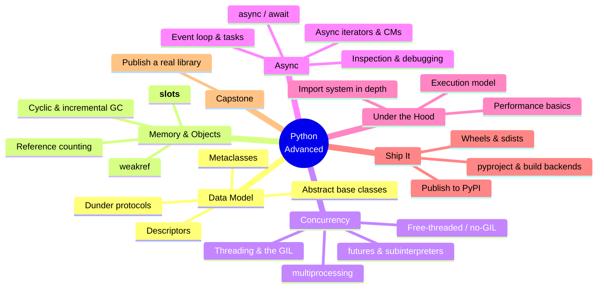
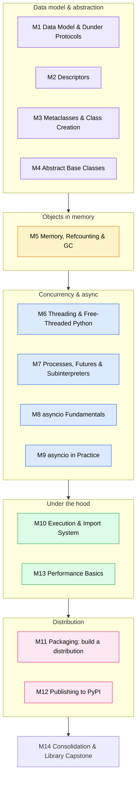
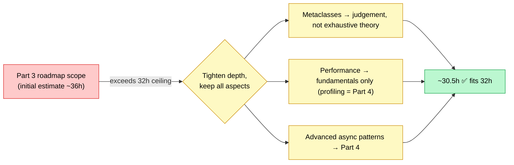

# Python Mastery — Part 3: Advanced

## The Data Model, Concurrency, Async & Packaging — How Python Really Works

**The Python Mastery Series · Program 03 of 4 | Rathinam Trainers & Consultants Private Limited**

> This is **Part 3 of a 4-part Python Mastery program** that covers Python end-to-end, from
> "never written a line" through expert-level CPython internals and C extensions. The full
> arc, the split, and how every documented Python topic is covered across the four parts is
> laid out in [`training_roadmap.md`](../../training_roadmap.md). This brochure is the complete,
> standalone scope for **Part 3 — Advanced**, grounded in the official Python 3.14 documentation.
> It assumes **Parts 1 (Foundations) and 2 (Intermediate & OOP)**.

---

## Course at a Glance

| | |
|---|---|
| **Program** | Python Mastery — Part 3: Advanced |
| **Shape** | **16 sessions × 2 hours live = 32 live hours**, one session per week (16 weeks) |
| **Delivery** | Live online on Microsoft Teams, **recorded**; trainer-led teach + demo + Q&A |
| **Hands-on** | Done by students **after** each session, from the recording + lab guides |
| **Python version** | **Python 3.14** (3.14.6, current stable — verified 2026-06-11) |
| **Audience** | Strong intermediate Python developers who already write clean, typed, tested code |
| **Prerequisites** | **Parts 1 & 2** of this program (or equivalent: confident OOP, decorators, generators, typing, `pytest`) |
| **Outcome** | Build advanced abstractions with the data model, run concurrent & async workloads, and package and publish distributable libraries |
| **Takeaways** | Certificate of completion · a published **PyPI library capstone** · all lab code + recordings |

---

## Visual Table of Contents

<!-- export-png: brochure-mindmap.png -->



<details>
<summary>ASCII fallback</summary>

```
Python Advanced
├── Data Model ......... dunder protocols · descriptors · metaclasses · abstract base classes
├── Memory & Objects ... reference counting · cyclic & incremental GC · weakref · __slots__
├── Concurrency ........ threading & the GIL · free-threaded/no-GIL · multiprocessing · futures & subinterpreters
├── Async .............. async/await · event loop & tasks · async iterators & context managers · inspection
├── Under the Hood ..... execution model · import system in depth · performance basics
├── Ship It ............ pyproject & build backends · wheels & sdists · publish to PyPI
└── Capstone ........... package and publish a real library
```

</details>

---

## 1. Who This Course Is For

| Profile | Why this course |
|---------|-----------------|
| **Library & framework authors** | Learn the data-model protocols, descriptors, and metaclasses that power expressive APIs — and how to package and ship them to PyPI |
| **Backend & systems engineers** | Master concurrency, the free-threaded build, multiprocessing, and `asyncio` to build performant, parallel services |
| **Senior application developers** | Move from *using* objects to *designing* them: customize behavior at the protocol level and reason about memory and the import machinery |
| **Graduates of Parts 1–2** | The natural next step after core Python + OOP, typing, and testing — go deep on how Python actually works |

**Assumed prior knowledge.** You already write idiomatic, typed, tested Python: comfortable
classes and inheritance, decorators and context managers, generators, `functools`/`itertools`,
the `typing` system, and `pytest`. If you completed **Parts 1 & 2** you are ready. This course
does **not** re-teach OOP or generators — it builds on them.

---

## 2. What You'll Be Able to Do

On finishing Part 3, you will be able to:

- **Implement the full data model** — numeric, container, comparison, callable, and hashing
  dunder protocols — so your objects behave like built-ins.
- **Write descriptors** to encapsulate managed attributes, and explain how `property`, methods,
  and `classmethod`/`staticmethod` are descriptors underneath.
- **Use metaclasses, `__init_subclass__`, and `__set_name__`** to customize class creation —
  and know when *not* to reach for a metaclass.
- **Define and consume abstract base classes** with `abc` and the `collections.abc` hierarchy,
  including virtual subclasses and structural protocols.
- **Reason about Python's memory model** — reference counting, the **incremental cyclic GC**
  (two-generation, 3.14), `weakref`, and `__slots__` — and diagnose reference cycles and leaks.
- **Run concurrent workloads correctly** — `threading` and the GIL, the **officially supported
  free-threaded (no-GIL) build (PEP 779)**, `multiprocessing`, and `concurrent.futures`
  including the new **`InterpreterPoolExecutor`** (subinterpreters, PEP 734).
- **Build async programs** with `async`/`await`, the event loop, tasks, task groups, async
  iterators and async context managers — and **inspect running async apps** with
  `python -m asyncio ps/pstree`.
- **Explain the execution and import system in depth** — the execution model, finders, loaders,
  module specs, `sys.meta_path` hooks, and namespace packages.
- **Package and publish a real library** — author `pyproject.toml`, choose a build backend,
  build **wheels and sdists**, version it, and **publish to PyPI** (including trusted publishing).
- **Make informed performance choices** — algorithmic complexity, data-structure selection, and
  caching (`functools.lru_cache`/`cache`).

---

## 3. Module & Topic Coverage Map

This is the spine of the brochure. Every aspect below is the slice of the official Python 3.14
documentation **assigned to Part 3** by the program
[`training_roadmap.md`](../../training_roadmap.md) — nothing from Parts 1, 2, or 4 is pulled in,
and every Part-3 aspect appears here. The **Source** column traces each module back to where it
comes from. (Full source list in [`000_topic_source/SOURCES.md`](../../000_topic_source/SOURCES.md).)



<details>
<summary>ASCII fallback</summary>

```
Data model & abstraction:  M1 Dunder protocols · M2 Descriptors · M3 Metaclasses · M4 ABCs
            |
Objects in memory:         M5 Memory, refcounting & GC
            |
Concurrency & async:       M6 Threading/free-threaded · M7 Processes/futures/subinterpreters
                           M8 asyncio fundamentals · M9 asyncio in practice
            |
Under the hood:            M10 Execution & import system · M13 Performance basics
            |
Distribution:              M11 Packaging · M12 Publishing to PyPI
            |
            +--> M14 Consolidation & library capstone
```

</details>

| Module | Aspects covered | Source |
|--------|-----------------|--------|
| **M1 — Data Model & Dunder Protocols** | Objects, value & type; the full special-method protocols: numeric (`__add__`, `__radd__`, `__iadd__`, …), comparison & rich ordering (`__eq__`, `__lt__`, `functools.total_ordering`), hashing (`__hash__`/`__eq__` contract), container (`__len__`, `__getitem__`, `__setitem__`, `__contains__`, `__iter__`), callable (`__call__`), attribute access (`__getattr__`/`__getattribute__`/`__setattr__`), `__repr__`/`__str__`/`__format__` | Language Reference §3 (Data model) |
| **M2 — Descriptors** | The descriptor protocol (`__get__`/`__set__`/`__delete__`); data vs non-data descriptors; how `property`, functions/methods, `classmethod`, `staticmethod`, and `super` are descriptors; building reusable managed attributes; `__set_name__` for self-naming descriptors | Language Reference §3 (Descriptors); HOWTO: Descriptors |
| **M3 — Metaclasses & Class Creation** | How `class` statements execute; `type` as the default metaclass; the class-creation steps (`__prepare__`, namespace, `__new__`/`__init__` of the metaclass); `__init_subclass__`; `__set_name__` ordering; when a metaclass is warranted vs simpler hooks | Language Reference §3 (Customizing class creation) |
| **M4 — Abstract Base Classes** | The `abc` module: `ABC`, `@abstractmethod`, `ABCMeta`, `register()` (virtual subclasses), `__subclasshook__`; the `collections.abc` hierarchy (`Iterable`, `Sequence`, `Mapping`, `Hashable`, …); ABCs vs `Protocol` (structural) | Lib `abc`, `collections.abc` |
| **M5 — Memory, Refcounting & GC** | The memory model & object lifetime; **reference counting** and `__del__` timing; the **cyclic garbage collector** — now **incremental with two generations (young/old)** in 3.14, reduced pause times, **first-class free-threading support**; the `gc` module; `weakref` & `weakref.finalize`; `__slots__` (memory savings & trade-offs); detecting reference cycles & leaks | Lib `gc`, `weakref`; What's New 3.14 (incremental GC); Data model (`__slots__`, `__del__`) |
| **M6 — Threading & Free-Threaded Python** | `threading` (threads, locks, conditions, events, `queue`); the **GIL** explained; I/O-bound vs CPU-bound; the **officially supported free-threaded / no-GIL build (PEP 779)** — what it changes, when to use it, single-thread overhead (~5–10% in 3.14), thread-safety implications | Lib `threading`; What's New 3.14 / PEP 779 |
| **M7 — Processes, Futures & Subinterpreters** | `multiprocessing` (processes, pools, IPC, shared memory; **`forkserver`** now default start method on non-macOS Unix); `concurrent.futures` (`Executor`, `Future`, `ThreadPoolExecutor`, `ProcessPoolExecutor`); the new **`InterpreterPoolExecutor`** — subinterpreters (PEP 734) for true multi-core parallelism in one process | Lib `multiprocessing`, `concurrent.futures`; What's New 3.14 / PEP 734 |
| **M8 — asyncio Fundamentals** | `async`/`await` & coroutines; the event loop; `Task`s & scheduling; `await`, `asyncio.run`, `gather`, `TaskGroup` (structured) & `timeout`; cancellation; `Future` vs `Task`; common async pitfalls | Lib `asyncio` (coroutines, tasks, event loop) |
| **M9 — asyncio in Practice** | Async iterators (`__aiter__`/`__anext__`, `async for`); async context managers (`__aenter__`/`__aexit__`, `async with`); async generators; queues, synchronization primitives, streams; **inspecting running async apps** with `python -m asyncio ps` / `pstree`; colorized async tracebacks | Lib `asyncio`; Data model (async protocols); What's New 3.14 (asyncio introspection) |
| **M10 — Execution & Import System** | The execution model (code blocks, naming & binding, the eval loop at a conceptual level); the **import system in depth** — packages, `sys.modules`, finders & loaders, **module specs**, `sys.meta_path` & path hooks, namespace packages, `importlib` & `importlib.metadata`, relative imports, `__main__`/`-m` | Language Reference §4 (Execution model), §5 (Import system); Lib `importlib` |
| **M11 — Packaging: build a distribution** | Project layout; authoring **`pyproject.toml`** (`[build-system]`, `[project]` metadata, dependencies, entry points, optional-dependencies); **build backends** (Hatchling, setuptools, Flit, PDM); building **wheels & sdists** with `python -m build`; what's *in* a wheel; **versioning** (semantic versioning, dynamic version) | Packaging Guide (writing pyproject.toml, build) |
| **M12 — Publishing to PyPI** | The package release flow; uploading with **Twine**; TestPyPI vs PyPI; **trusted publishing** (OIDC from CI, no long-lived tokens); release hygiene, READMEs & classifiers, post-release fixes (you can't overwrite a version) | Packaging Guide; PyPI docs (trusted publishers) |
| **M13 — Performance Basics** | Algorithmic complexity (Big-O intuition); choosing the right data structure (list vs deque vs set vs dict; `bisect`/`heapq`); **caching** with `functools.cache` / `lru_cache`; cheap-vs-expensive operations; "measure before optimizing" mindset (deep profiling & the JIT are **Part 4**) | Lib `functools`, `collections`; data-structure complexity notes |
| **M14 — Consolidation & Library Capstone** | Tie it together: design a small library that uses the data model + an ABC, add concurrency or async where it fits, package it with `pyproject.toml`, build the artifacts, and publish to **TestPyPI**; review, Q&A | Recap; Packaging Guide |

> **Coverage note.** Every aspect the roadmap assigns to **Part 3** appears above:
> data model & dunder protocols (M1), descriptors (M2), metaclasses / `__init_subclass__` /
> `__set_name__` (M3), ABCs (M4), memory model / refcounting / GC / `weakref` / `__slots__` (M5),
> concurrency incl. free-threaded & `InterpreterPoolExecutor` (M6–M7), `asyncio` (M8–M9),
> the execution & import system in depth (M10), packaging & distribution to PyPI (M11–M12),
> and performance basics (M13). CPython internals/bytecode, the **JIT**, deep **profiling**,
> **C extensions**, embedding, and advanced async patterns are **Part 4** and are deliberately
> *not* taught here.

---

## 4. Fit-Check / Capacity Ledger

The course shape is the family standard: **16 sessions × 2 hours = 32 live hours**. Usable
teaching time is less than 32h once weekly recap, Q&A, and a consolidation/capstone session are
subtracted — the practical fill is **~28–30h**. The table budgets **live teach + demo** time per
module (hands-on happens after sessions, so it is not counted here).

| Module | Estimated live teach + demo (h) |
|--------|:---:|
| M1 — Data Model & Dunder Protocols | 3.0 |
| M2 — Descriptors | 2.0 |
| M3 — Metaclasses & Class Creation | 2.0 |
| M4 — Abstract Base Classes | 1.5 |
| M5 — Memory, Refcounting & GC | 2.5 |
| M6 — Threading & Free-Threaded Python | 2.5 |
| M7 — Processes, Futures & Subinterpreters | 2.5 |
| M8 — asyncio Fundamentals | 2.5 |
| M9 — asyncio in Practice | 2.0 |
| M10 — Execution & Import System | 2.0 |
| M11 — Packaging: build a distribution | 2.5 |
| M12 — Publishing to PyPI | 1.5 |
| M13 — Performance Basics | 1.5 |
| M14 — Consolidation & Library Capstone | 1.5 |
| **Recap / Q&A / buffer (distributed)** | **~0.5** |
| **TOTAL** | **~30.5 h** |

**Decision: Part 3 fits in one 16×2h (32h) course.** The ~30.5h budget sits inside the 32h
ceiling with a sensible buffer.

This was **not** automatic — Part 3 is a dense slice. An initial pass budgeted nearer **~36h**
because the data model, both concurrency tracks, and `asyncio` each want generous demo time. To
fit the roadmap-assigned scope coherently into 32h, the following depth calls were made (none
drops a required aspect — they shift depth, and the deeper treatment lives in **Part 4**):

- **Metaclasses (M3)** are taught to *competence and judgement* (when to use `__init_subclass__`
  / `__set_name__` instead), not exhaustive metaprogramming theory.
- **Performance (M13)** stays at *fundamentals* — complexity, data-structure choice, caching.
  Profiling tools (`cProfile`, `timeit`, `tracemalloc`, Py-Spy) and the **JIT** are **Part 4**.
- **asyncio** is split across two sessions (M8 fundamentals, M9 in practice); *advanced* async
  patterns — structured concurrency at depth, backpressure, `anyio`/`trio` — are **Part 4**.



<details>
<summary>ASCII fallback</summary>

```
Part 3 roadmap scope (initial estimate ~36h)
   |  exceeds 32h ceiling -> tighten depth, keep ALL aspects
   +--> Metaclasses -> taught to judgement, not exhaustive theory
   +--> Performance -> fundamentals only (deep profiling = Part 4)
   +--> Advanced async patterns -> Part 4
        => ~30.5h  [FITS the 32h ceiling]
```

</details>

Part 3 is one part of the 4-part split that lets the whole Python documentation surface fit the
32h-per-course ceiling; [`training_roadmap.md`](../../training_roadmap.md) proves the full-program
coverage.

---

## 5. High-Level 16-Session Outline

A light module-to-weeks mapping showing the scope flows and fits. (The detailed session plan is
produced separately by the session planner — this is only the shape.)

| Week | Session focus | Modules |
|:---:|---------------|---------|
| 1 | The data model: objects, value/type, the protocol mindset; `__repr__`/`__str__`/`__format__` | M1 |
| 2 | Numeric, comparison, hashing & container dunders; making objects act like built-ins | M1 |
| 3 | Descriptors: the protocol; data vs non-data; how `property`/methods work | M2 |
| 4 | Class creation: `__init_subclass__`, `__set_name__`, metaclasses & when to use them | M3 |
| 5 | Abstract base classes: `abc`, `collections.abc`, virtual subclasses, ABCs vs `Protocol` | M4 |
| 6 | Memory: refcounting, `__del__`, the incremental cyclic GC, `weakref`, `__slots__` | M5 |
| 7 | Threading & the GIL; the free-threaded (no-GIL) build (PEP 779) | M6 |
| 8 | `multiprocessing`, `concurrent.futures`, `InterpreterPoolExecutor` (subinterpreters) | M7 |
| 9 | `asyncio` fundamentals: `async`/`await`, the event loop, tasks, `TaskGroup` | M8 |
| 10 | `asyncio` in practice: async iterators/context managers, queues, `ps`/`pstree` inspection | M9 |
| 11 | Execution model & the import system in depth: finders, loaders, specs, `meta_path` | M10 |
| 12 | Packaging I: `pyproject.toml`, build backends, wheels & sdists, versioning | M11 |
| 13 | Publishing: Twine, TestPyPI vs PyPI, trusted publishing | M12 |
| 14 | Performance basics: complexity, data-structure choice, caching | M13 |
| 15 | Capstone build: design + package a small library using the data model + an ABC | M14 |
| 16 | Capstone publish to TestPyPI; consolidation + Q&A | M14 |

---

## 6. Prerequisites, Tools & Environment

- **Prerequisites:** **Parts 1 & 2** of this program, or equivalent experience — confident OOP
  and inheritance, decorators, context managers, generators, `functools`/`itertools`, the
  `typing` system, and `pytest`. This course builds on all of these and does not re-teach them.
- **Machine:** Any laptop (Windows, macOS, or Linux) able to install Python 3.14. For the
  free-threaded labs, the **free-threaded 3.14 build** (`python3.14t`) is installed alongside.
- **Tools (current, web-verified 2026-06):**
  - **Python 3.14.x** (CPython, standard build) **+ the free-threaded build** for the no-GIL lab.
  - **uv** (Astral) — project, virtual-environment, and dependency management.
  - **Ruff** (Astral) — linting & formatting.
  - **build** (PyPA) — `python -m build` to produce wheels & sdists.
  - **Twine** (PyPA) — uploading to TestPyPI / PyPI.
  - A free **TestPyPI** account for the capstone publish.
  - An editor — **VS Code** (with Python/Pylance) recommended.
- **Cost:** All tooling is free and open-source; TestPyPI and PyPI are free. No paid services
  are required for Part 3.

---

## 7. Assessment & Certification

- **Weekly labs** — hands-on exercises completed after each session from the recording + lab guides
  (e.g., implement a container type via dunders; write a validating descriptor; build a
  thread-pool vs process-pool benchmark; write an async producer/consumer).
- **Capstone deliverable** — design, package, and **publish a small but real library to TestPyPI**:
  it uses the data model (custom dunders) and an ABC, includes concurrency or async where it fits,
  ships a proper `pyproject.toml`, and builds a wheel + sdist.
- **Certificate of completion** awarded on finishing the labs and the published-library capstone.
- **Takeaways:** all lab code, the capstone library scaffold, and session recordings.

---

## 8. Limitations / What's Out of Scope (carried by other parts)

Part 3 stops at *advanced application & library development* on the standard interpreter. The
following are **named and carried by other parts** (see
[`training_roadmap.md`](../../training_roadmap.md)) — not dropped:

- **Already covered in Parts 1–2:** core language & data structures, OOP basics, decorators,
  context managers, generators, `functools`/`itertools`, dataclasses/enums, full `re`, the
  static **typing** system, and **testing with `pytest`**. Part 3 *uses* these but does not teach them.
- **Part 4 — Expert (next):** **CPython internals & bytecode** (`dis`, the evaluation loop), the
  **experimental JIT**, **profiling & optimization** (`cProfile`, `timeit`, `tracemalloc`,
  Py-Spy, PyPy), **C extensions** (Python/C API, `ctypes`, `cffi`, Cython, pybind11), **embedding**
  the interpreter, **advanced async patterns** (structured concurrency at depth, backpressure,
  `anyio`/`trio`), **design patterns**, and **production-grade tooling/CI/supply-chain**.

Out of scope for the **whole program** (adjacent ecosystems, taught in their own tracks): web
frameworks (Django/FastAPI), data science (NumPy/pandas/Polars), and AI/ML libraries. These build
*on* Python and are separate Rathinam tracks.

---

## 9. Sources

All grounded against the **official Python 3.14 documentation**, verified **2026-06-11**:

- [The Python Language Reference (3.14)](https://docs.python.org/3/reference/index.html) — [Data model](https://docs.python.org/3/reference/datamodel.html), [Execution model](https://docs.python.org/3/reference/executionmodel.html), [Import system](https://docs.python.org/3/reference/import.html)
- [Descriptor HowTo Guide](https://docs.python.org/3/howto/descriptor.html)
- [`abc`](https://docs.python.org/3/library/abc.html) · [`collections.abc`](https://docs.python.org/3/library/collections.abc.html)
- [`gc`](https://docs.python.org/3/library/gc.html) · [`weakref`](https://docs.python.org/3/library/weakref.html)
- [`threading`](https://docs.python.org/3/library/threading.html) · [`multiprocessing`](https://docs.python.org/3/library/multiprocessing.html) · [`concurrent.futures`](https://docs.python.org/3/library/concurrent.futures.html)
- [`asyncio`](https://docs.python.org/3/library/asyncio.html) · [`importlib`](https://docs.python.org/3/library/importlib.html) · [`functools`](https://docs.python.org/3/library/functools.html)
- [What's New in Python 3.14](https://docs.python.org/3/whatsnew/3.14.html) — incremental GC, asyncio introspection, `InterpreterPoolExecutor`, `forkserver` default
- [PEP 779 — Criteria for supported free-threaded CPython](https://peps.python.org/pep-0779/) · [PEP 734 — Multiple Interpreters in the Stdlib](https://peps.python.org/pep-0734/)
- [Python Packaging User Guide](https://packaging.python.org/) — [Writing pyproject.toml](https://packaging.python.org/en/latest/guides/writing-pyproject-toml/), [Packaging projects](https://packaging.python.org/en/latest/tutorials/packaging-projects/)
- [PyPI — Trusted Publishers](https://docs.pypi.org/trusted-publishers/) · [Twine](https://twine.readthedocs.io/)
- [Status of Python versions](https://devguide.python.org/versions/) · [uv](https://docs.astral.sh/uv/) · [Ruff](https://docs.astral.sh/ruff/)

---

*Rathinam Trainers & Consultants Private Limited — we train engineers, not just tool users.
For batch schedules and corporate enquiries: www.rathinamtrainers.com · rajan@rathinamtrainers.com.*
