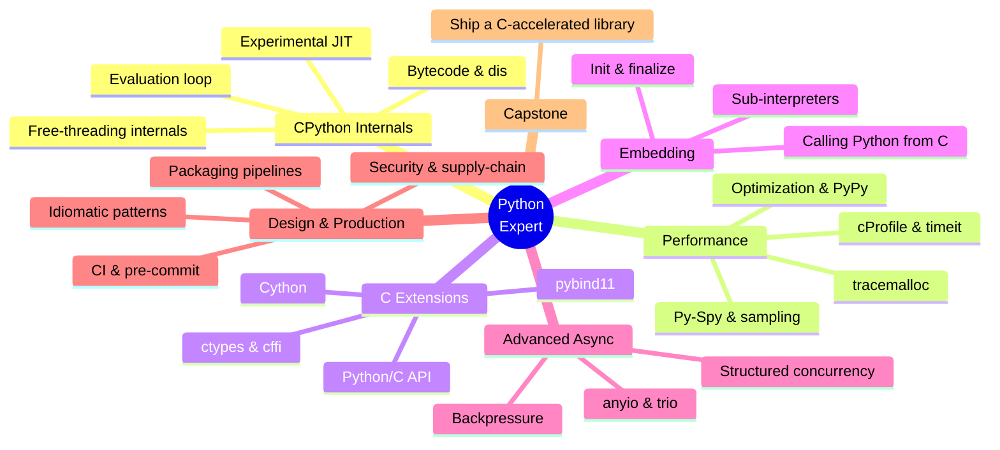
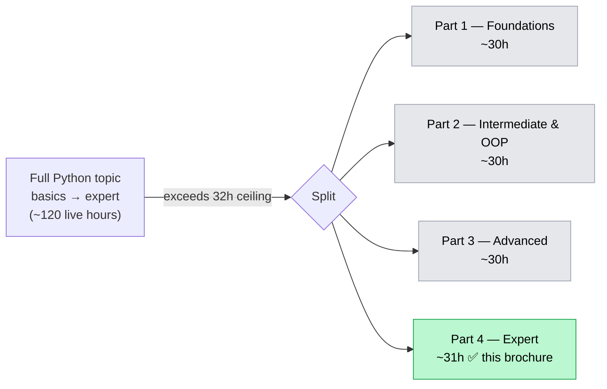

# Python Mastery — Part 4: Expert

## CPython Internals, Performance, C Extensions & Production-Grade Engineering

**The Python Mastery Series · Program 04 of 4 | Rathinam Trainers & Consultants Private Limited**

> This is **Part 4 of a 4-part Python Mastery program** that covers Python end-to-end, from
> "never written a line" through expert-level CPython internals and C extensions. The full arc,
> the split, and how every documented Python topic is covered across the four parts is laid out
> in [`../training_roadmap.md`](../training_roadmap.md). This brochure is the complete,
> standalone scope for **Part 4 — Expert**, the capstone of the series, grounded in the official
> Python 3.14 documentation, the C API reference, and the Python Packaging User Guide.

---

## Course at a Glance

| | |
|---|---|
| **Program** | Python Mastery — Part 4: Expert |
| **Shape** | **16 sessions × 2 hours live = 32 live hours**, one session per week (16 weeks) |
| **Delivery** | Live online on Microsoft Teams, **recorded**; trainer-led teach + demo + Q&A |
| **Hands-on** | Done by students **after** each session, from the recording + lab guides |
| **Python version** | **Python 3.14** (3.14.6, current stable — verified 2026-06-11) |
| **Audience** | Advanced developers building libraries, performance-critical code, or systems-level Python |
| **Prerequisites** | **Parts 1–3 of this series** (or equivalent) — see Section 6 |
| **Outcome** | Read CPython bytecode, profile and optimize hot paths, write & ship C extensions, embed the interpreter, design idiomatic systems, and run production-grade release pipelines |
| **Takeaways** | Certificate of completion · a published, CI-gated, C-accelerated **library capstone** · all lab code + recordings |

---

## Visual Table of Contents

<!-- export-png: brochure-mindmap.png -->



<details>
<summary>ASCII fallback</summary>

```
Python Expert
├── CPython Internals ..... bytecode & dis · evaluation loop · experimental JIT · free-threading internals
├── Performance ........... cProfile & timeit · tracemalloc · Py-Spy & sampling · optimization & PyPy
├── C Extensions .......... Python/C API · ctypes & cffi · Cython · pybind11
├── Embedding ............. init/finalize · calling Python from C · sub-interpreters
├── Advanced Async ........ structured concurrency · backpressure · anyio & trio
├── Design & Production ... idiomatic patterns · packaging pipelines · CI & pre-commit · security/supply-chain
└── Capstone .............. ship a C-accelerated, CI-gated library
```

</details>

---

## 1. Who This Course Is For

| Profile | Why this course |
|---------|-----------------|
| **Library & framework authors** | Ship correct, fast, well-packaged libraries with native acceleration where it earns its place |
| **Performance engineers** | Measure before optimizing — profile, read bytecode, and choose the right tool (C ext, Cython, JIT, PyPy) |
| **Systems / platform developers** | Bridge Python to C/C++/Rust, embed the interpreter in host applications, and exploit free-threading |
| **Senior engineers & tech leads** | Set idiomatic design standards and production-grade release/CI/supply-chain practices for a team |

**Assumed prior knowledge (Parts 1–3 or equivalent):** confident idiomatic core Python; the full
data model and dunder protocols, descriptors, metaclasses, ABCs; the memory model & garbage
collection; concurrency (`threading`, `multiprocessing`, `concurrent.futures`, free-threaded
builds) and `asyncio` (async/await, tasks, event loop); and packaging fundamentals
(`pyproject.toml`, wheels/sdists, publishing to PyPI). This Part goes *beneath* and *beyond* all of
that. **It is not an entry point — it assumes a strong, working Python developer.**

---

## 2. What You'll Be Able to Do

On finishing Part 4, you will be able to:

- **Read CPython bytecode** with `dis`, explain the stack-based evaluation loop, and reason about
  what the compiler emits for a given construct.
- **Enable, inspect, and benchmark the experimental JIT** (PEP 744, copy-and-patch) and decide when
  it — or **PyPy** — is the right acceleration path versus rewriting a hot loop.
- **Profile rigorously**: time with `timeit`, find hot paths with `cProfile`/`profile` and
  `pstats`, trace allocations with `tracemalloc`, and attach a sampling profiler (**Py-Spy**) to a
  live process — then optimize from evidence, not guesswork.
- **Write C extensions** with the **Python/C API** (reference counting, error handling, the GIL and
  free-threading rules, the Limited API / Stable ABI), and call existing C with **`ctypes`** and
  **`cffi`**.
- **Accelerate with higher-level tools** — compile typed Python with **Cython**, and bind C++ with
  **pybind11**, declaring free-threading compatibility where supported.
- **Embed the CPython interpreter** in a C/C++ host: initialize/finalize, run code, exchange data,
  handle errors, and use multiple sub-interpreters.
- **Design idiomatic Python systems** — apply (and recognize the Pythonic form of) classic design
  patterns and write **advanced async**: structured concurrency, cancellation, backpressure, and
  the `anyio`/`trio` model layered over `asyncio`.
- **Run production-grade engineering**: reproducible build/packaging pipelines, CI matrices,
  `pre-commit` gates, and software **supply-chain security** (pinning, hashes, SBOMs, signed
  releases).
- **Deliver the series capstone**: a published library with a native-accelerated core, a full test
  + CI + release pipeline, and a supply-chain-secured distribution.

---

## 3. Module & Topic Coverage Map

This is the spine of the brochure. Every aspect below is the **Part 4 slice of the official
Python 3.14 documentation**, exactly as partitioned in
[`../training_roadmap.md`](../training_roadmap.md) ("Whole-Topic Aspect → Part Partition"). The
**Source** column traces each module back to where it comes from. (Full source list in
[`../000_topic_source/SOURCES.md`](../000_topic_source/SOURCES.md).)

| Module | Aspects covered | Source |
|--------|-----------------|--------|
| **M1 — CPython Execution Model & Bytecode** | Compile → code objects → bytecode; the stack-based evaluation loop (`ceval`); frames; reading bytecode with **`dis`**; `co_*` code-object attributes; specializing adaptive interpreter (PEP 659) mental model | Reference (execution model); Lib `dis`; What's New 3.11–3.14 |
| **M2 — The Experimental JIT & Free-Threading Internals** | Copy-and-patch **JIT** (PEP 744): what it does, enabling/building it, measuring its effect; the GIL vs the **free-threaded** build (PEP 779) under the hood; how JIT + free-threading interact | What's New 3.14; PEP 744; PEP 779 |
| **M3 — Measuring: `timeit` & Microbenchmarks** | `timeit` (CLI & API); benchmarking pitfalls (warmup, GC, variance, JIT warmup); building defensible microbenchmarks; statistics of timing | Lib `timeit` |
| **M4 — Profiling Hot Paths: `cProfile` / `profile` / `pstats`** | Deterministic profiling; `cProfile` vs `profile`; reading & sorting `pstats`; call graphs; profiling a script vs a function; interpreting cumulative vs total time | Lib `profile` (The Python Profilers) |
| **M5 — Memory Profiling: `tracemalloc`** | Allocation tracing; snapshots & diffs; top allocators; finding leaks and growth; combining with `gc` and `weakref` knowledge from Part 3 | Lib `tracemalloc` |
| **M6 — Sampling Profilers & Production Profiling** | **Py-Spy** (attach to live processes, flame graphs, no code change); sampling vs deterministic trade-offs; `python -m asyncio ps PID` task inspection; profiling in production safely | Py-Spy docs; What's New 3.14 (asyncio introspection) |
| **M7 — Optimization Strategy & Alternative Runtimes** | Algorithmic vs micro optimization; data-structure choices revisited at depth; caching/memoization; when to reach for C, Cython, the JIT, or **PyPy**; measuring before/after | Lib (performance); PyPy docs |
| **M8 — The Python/C API: Foundations** | Extending Python with C; the `PyObject` model; **reference counting** (`Py_INCREF`/`DECREF`, ownership/borrowing); exceptions & error handling at the C level; module init | Extending & Embedding; C API Reference |
| **M9 — The Python/C API: GIL, Free-Threading & the Stable ABI** | The GIL in C code and releasing it; writing **free-threading-compatible** C extensions; the **Limited API** & **Stable ABI** (`Py_LIMITED_API`, `abi3`); building & distributing wheels for the C API | C API (stability); Extending & Embedding; py-free-threading guide |
| **M10 — Calling C Without Writing C: `ctypes` & `cffi`** | `ctypes` (loading shared libs, types, callbacks, structs) — now **free-thread-safe in 3.14**; **`cffi`** (ABI vs API mode); when to choose each; trade-offs vs the C API | Lib `ctypes`; cffi docs |
| **M11 — Cython** | Compiling typed Python to C; `cdef`/`cpdef`, typed memoryviews; building with the Cython toolchain; releasing the GIL (`nogil`) & `freethreading_compatible`; packaging Cython modules | Cython docs (3.1+) |
| **M12 — pybind11** | Binding C++ to Python; classes, functions, STL conversions; `gil_not_used` free-threading declaration; build integration; choosing pybind11 vs Cython vs the raw C API | pybind11 docs |
| **M13 — Embedding the Interpreter** | Embedding CPython in a C/C++ host; `Py_Initialize`/`Py_FinalizeEx`; running code & exchanging objects; error handling across the boundary; **sub-interpreters** & `InterpreterPoolExecutor` (PEP 734) from the embedding side | Extending & Embedding (embedding); C API (init) |
| **M14 — Advanced Async Patterns** | Structured concurrency (nurseries / task groups); cancellation & timeouts; **backpressure** with bounded queues & memory streams; **`anyio`** (one API over asyncio/Trio) and **`trio`** concepts; async pipelines & generators at scale | Lib `asyncio`; anyio/trio docs |
| **M15 — Design Patterns in Idiomatic Python** | Classic GoF patterns and their Pythonic forms (strategy via callables, decorator via `@`, singleton via module, factory, adapter, observer); when *not* to use a pattern; protocols & duck typing as pattern substitutes | Reference (data model); idiomatic-Python practice |
| **M16 — Production Tooling, Supply-Chain & Capstone** | Reproducible **packaging pipelines** (build backends, wheels, sdists, cibuildwheel for C ext); **CI** matrices; **`pre-commit`** gates (Ruff, type-check, tests); **supply-chain security** (pinning, hashes, lockfiles, SBOMs, signed/attested releases, PyPI Trusted Publishing); the capstone ship | Packaging Guide; PyPA tooling; recap |

> **Full-coverage note.** Part 4 covers **every Part-4 aspect in the roadmap partition** — the
> expert tail of the Language Reference (execution model), the profiling and `dis` slices of the
> Standard Library, the entire **Extending & Embedding** guide and **Python/C API**, the C-interop
> ecosystem (`ctypes`/`cffi`/Cython/pybind11), advanced async, design patterns, and the
> production/packaging/supply-chain surface. The Tutorial, core OOP, typing, testing, the full data
> model, concurrency/`asyncio` basics, and packaging fundamentals are carried by **Parts 1–3** (see
> the roadmap). Across the four parts, **nothing in the Python 3.14 documentation is dropped.**

---

## 4. Fit-Check / Capacity Ledger

The course shape for each part of this program is the family standard: **16 sessions × 2 hours =
32 live hours**. Usable teaching time is less than 32h once weekly recap, Q&A, and a
consolidation/capstone session are subtracted — the practical fill is **~28–30h**. The table below
budgets **live teach + demo** time per module (hands-on happens after sessions, so it is not
counted here). Expert material is dense and demo-heavy (live builds, profiling runs, C compilation),
so estimates lean toward the higher end honestly.

| Module | Estimated live teach + demo (h) |
|--------|:---:|
| M1 — CPython Execution Model & Bytecode | 2.0 |
| M2 — Experimental JIT & Free-Threading Internals | 2.0 |
| M3 — Measuring: `timeit` & Microbenchmarks | 1.5 |
| M4 — Profiling Hot Paths: `cProfile` / `pstats` | 2.0 |
| M5 — Memory Profiling: `tracemalloc` | 1.5 |
| M6 — Sampling Profilers & Production Profiling | 1.5 |
| M7 — Optimization Strategy & Alternative Runtimes | 2.0 |
| M8 — Python/C API: Foundations | 2.5 |
| M9 — Python/C API: GIL, Free-Threading & Stable ABI | 2.0 |
| M10 — Calling C Without Writing C: `ctypes` & `cffi` | 1.5 |
| M11 — Cython | 2.0 |
| M12 — pybind11 | 1.5 |
| M13 — Embedding the Interpreter | 2.0 |
| M14 — Advanced Async Patterns | 2.5 |
| M15 — Design Patterns in Idiomatic Python | 2.0 |
| M16 — Production Tooling, Supply-Chain & Capstone | 1.5 |
| **Recap / Q&A / buffer (distributed)** | **~0.5** |
| **TOTAL** | **~31.0 h** |

**Decision: Part 4 fits in one 16×2h (32h) course.** The ~31h budget sits inside the 32h ceiling.
It is deliberately the fullest of the four parts — the material is dense and the audience is
expert, so demo time runs long — but it remains within ceiling with the recap/Q&A buffer kept lean
and hands-on pushed to the post-session labs. No Part-4 aspect is cut; the partition is coherent.



<details>
<summary>ASCII fallback</summary>

```
Full Python topic (basics -> expert, ~120 live hours)
        |  exceeds 32h ceiling -> SPLIT into 4 parts
        +--> Part 1  Foundations            ~30h   (see roadmap)
        +--> Part 2  Intermediate & OOP      ~30h   (see roadmap)
        +--> Part 3  Advanced                ~30h   (see roadmap)
        +--> Part 4  Expert                  ~31h   [THIS BROCHURE]
```

</details>

---

## 5. High-Level 16-Session Outline

A light module-to-weeks mapping showing the scope flows and fits. The course arc moves from
**understanding the machine** (internals) → **measuring it** (profiling) → **extending it**
(C/Cython/pybind11) → **embedding & advanced design** → **shipping it like a pro** (production).
(The detailed session plan is produced separately by the session planner — this is only the shape.)

| Week | Session focus | Modules |
|:---:|---------------|---------|
| 1 | CPython execution model, code objects & bytecode with `dis` | M1 |
| 2 | The experimental JIT and free-threading internals | M2 |
| 3 | Measuring with `timeit`; building honest microbenchmarks | M3 |
| 4 | Profiling hot paths: `cProfile` / `profile` / `pstats` | M4 |
| 5 | Memory profiling with `tracemalloc` | M5 |
| 6 | Sampling profilers (Py-Spy) & production profiling | M6 |
| 7 | Optimization strategy; C vs Cython vs JIT vs PyPy | M7 |
| 8 | Python/C API foundations: objects, refcounts, errors | M8 |
| 9 | C API: GIL, free-threading & the Limited API / Stable ABI | M9 |
| 10 | Calling C without writing C: `ctypes` & `cffi` | M10 |
| 11 | Cython: typed Python compiled to C | M11 |
| 12 | pybind11: binding C++ to Python | M12 |
| 13 | Embedding the interpreter; sub-interpreters | M13 |
| 14 | Advanced async: structured concurrency, backpressure, anyio/trio | M14 |
| 15 | Design patterns in idiomatic Python | M15 |
| 16 | Production tooling, supply-chain security + capstone ship + Q&A | M16 |

---

## 6. Prerequisites, Tools & Environment

- **Prerequisites:** **Parts 1–3 of the Python Mastery series**, or equivalent experience: strong
  idiomatic core Python, the full data model, descriptors/metaclasses/ABCs, the memory & GC model,
  concurrency and `asyncio`, and packaging fundamentals (`pyproject.toml`, wheels, PyPI).
- **Machine:** A laptop able to install Python 3.14 **and a working C/C++ toolchain** —
  - **Windows:** MSVC Build Tools · **macOS:** Xcode Command Line Tools · **Linux:** `gcc`/`clang` + headers.
  - A **free-threaded** 3.14 build available for the free-threading and JIT demos.
- **Tools (current, web-verified 2026-06):**
  - **Python 3.14.x** (CPython), including a **free-threaded** build; the **experimental JIT** (PEP 744) enabled for demos.
  - **uv** (Astral) — projects, venvs, locking; **Ruff** — lint/format (carried from earlier parts).
  - **C interop:** `ctypes` & `tracemalloc`/`timeit`/`cProfile`/`dis` (stdlib, built in); **cffi**; **Cython 3.1+** (free-threading-aware); **pybind11**.
  - **Profiling:** **Py-Spy** (sampling, attach to live processes).
  - **Alternative runtime:** **PyPy** (for the optimization comparison).
  - **Packaging/CI:** a PEP 517 build backend, **cibuildwheel** (for C-extension wheels), **pre-commit**, and a CI provider (e.g. GitHub Actions) with PyPI **Trusted Publishing**.
- **Cost:** All tooling is free and open-source. A free CI tier and a (free) PyPI/TestPyPI account
  cover the packaging and publishing labs. No paid services are required.

> **Current-tooling notes (verified 2026-06-11):** `ctypes` gained **free-threading support in
> Python 3.14**; **Cython 3.1+** and **pybind11** declare free-threading compatibility, while
> **CFFI** does not yet ship free-threading support — the course teaches each tool's current
> free-threading status so learners choose correctly. The JIT is opt-in/experimental but has
> stabilized across the 3.14.x line.

---

## 7. Assessment & Certification

- **Weekly labs** — hands-on exercises after each session from the recording + lab guides
  (e.g. disassemble and explain a function, profile and speed up a slow script, write and build a C
  extension, bind a C++ class with pybind11, embed the interpreter, ship a wheel through CI).
- **Capstone deliverable** — a **published library** with a **native-accelerated core** (a hot path
  rewritten via C API / Cython / pybind11, justified by profiling evidence), a full **test + CI**
  pipeline, `pre-commit` gates, and a **supply-chain-secured** release (pinned/hashed deps, signed
  & attested wheels via Trusted Publishing).
- **Certificate of completion** awarded on finishing the labs and capstone. As the final Part, it
  also completes the **full Python Mastery series**.
- **Takeaways:** all lab code, the capstone library scaffold (build + CI + release templates), and
  session recordings.

---

## 8. Limitations / What's Out of Scope

Part 4 is the **expert capstone** of the series; the rest of the documentation is carried by the
earlier parts (see [`../training_roadmap.md`](../training_roadmap.md)) — not dropped:

- **Parts 1–3 (assumed, not re-taught here):** core language & syntax, OOP, the full **typing**
  system, **testing** with `pytest`, the data model & dunder protocols, descriptors, metaclasses,
  ABCs, the memory model & GC, **concurrency** (threads/processes/futures/free-threaded) and
  **`asyncio`** fundamentals, and packaging **fundamentals**. Part 4 builds *on top of* these.

Deliberately out of scope for Part 4 itself (and the whole program):

- **CPython core contribution** — patching `ceval.c`, the compiler, or the JIT's stencil generator.
  Part 4 teaches you to *read and reason about* internals and to *use* the JIT, not to develop
  CPython itself.
- **Adjacent ecosystems**, taught in their own Rathinam tracks: web frameworks (Django/FastAPI),
  data science (NumPy/pandas/Polars), and AI/ML libraries. These build *on* Python and are separate
  tracks — though Part 4's C-extension and packaging skills are exactly what underpins them.
- **Rust-based extensions (PyO3/maturin)** are mentioned for orientation but not taught in depth;
  the C/C++ interop path (C API, Cython, pybind11) is the spine here.

---

## 9. Sources

All grounded against the **official Python 3.14 documentation** and the named third-party project
docs, verified **2026-06-11**:

- [The Python Language Reference (3.14)](https://docs.python.org/3/reference/index.html)
- [The Python Standard Library (3.14)](https://docs.python.org/3/library/index.html)
- [`dis` — Disassembler for Python bytecode](https://docs.python.org/3/library/dis.html)
- [The Python Profilers (`profile` / `cProfile` / `pstats`)](https://docs.python.org/3/library/profile.html)
- [`timeit`](https://docs.python.org/3/library/timeit.html) · [`tracemalloc`](https://docs.python.org/3/library/tracemalloc.html)
- [Extending and Embedding the Python Interpreter](https://docs.python.org/3/extending/index.html)
- [Python/C API Reference Manual](https://docs.python.org/3/c-api/index.html) · [C API Stability (Limited API / Stable ABI)](https://docs.python.org/3/c-api/stable.html)
- [`ctypes`](https://docs.python.org/3/library/ctypes.html) · [`asyncio`](https://docs.python.org/3/library/asyncio.html)
- [What's New in Python 3.14](https://docs.python.org/3/whatsnew/3.14.html)
- [PEP 744 — JIT Compilation](https://peps.python.org/pep-0744/) · [PEP 779 — Free-threaded CPython (supported)](https://peps.python.org/pep-0779/) · [PEP 734 — Multiple Interpreters in the Stdlib](https://peps.python.org/pep-0734/)
- [Python Free-Threading Guide (extension support)](https://py-free-threading.github.io/) · [Cython docs](https://cython.readthedocs.io/) · [pybind11 docs](https://pybind11.readthedocs.io/) · [cffi docs](https://cffi.readthedocs.io/)
- [Py-Spy](https://github.com/benfred/py-spy) · [PyPy](https://www.pypy.org/)
- [Python Packaging User Guide](https://packaging.python.org/) · [cibuildwheel](https://cibuildwheel.pypa.io/) · [pre-commit](https://pre-commit.com/) · [PyPI Trusted Publishing](https://docs.pypi.org/trusted-publishers/)

---

*Rathinam Trainers & Consultants Private Limited — we train engineers, not just tool users.
For batch schedules and corporate enquiries: www.rathinamtrainers.com · rajan@rathinamtrainers.com.*
