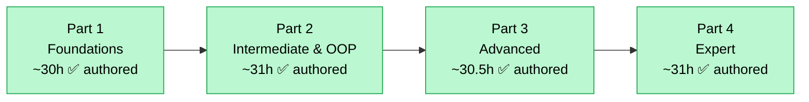

# Python Mastery — Training Roadmap (4-Part Program)

> The topic **"Python — basics to expert level"** is far larger than a single 16×2h (32 live
> hour) course. Its full official-documentation surface budgets to **~120 live hours**, so it
> is split into **four sequential 16×2h parts**, each a complete, deliverable course with a
> coherent foundations→advanced arc. **Across the four parts, every aspect of the Python 3.14
> documentation is covered.** This roadmap proves that with an aspect→part partition.
>
> **All four parts are now authored.** Each part lives in its own part folder
> (`part-1-foundations/`, `part-2-intermediate/`, `part-3-advanced/`, `part-4-expert/`),
> following the same `010_brochure/` convention. **Last verified against
> Python 3.14: 2026-06-11.**

---

## Program Map



<details>
<summary>ASCII fallback</summary>

```
[Part 1 Foundations ~30h ✅] -> [Part 2 Intermediate & OOP ~30h]
   -> [Part 3 Advanced ~30h] -> [Part 4 Expert ~30h]
```

</details>

Each part assumes the previous one. Total program: **64 sessions · 128 live hours · ~16 months
at one session/week** (or run back-to-back as four 16-week cohorts).

---

## Whole-Topic Aspect → Part Partition

This table is the coverage proof: every documented aspect maps to exactly one part.

| Aspect (from official docs) | Part |
|-----------------------------|:----:|
| Install, REPL, running programs, interpreter model | 1 |
| `uv` / `venv` / Ruff basics | 1 |
| Numbers, variables, expressions, floating-point | 1 |
| Strings, f-strings, t-strings (intro), bytes/encoding basics | 1 |
| Control flow, `match`/`case` | 1 |
| Functions, arguments, scope, lambdas, type-hint intro | 1 |
| Lists, tuples, sets, dicts | 1 |
| Comprehensions & looping idioms | 1 |
| Modules, packages, imports (intro) | 1 |
| Virtual environments & dependencies (intro) | 1 |
| Exceptions, chaining, custom exceptions, 3.14 `except` syntax | 1 |
| Files & I/O, `pathlib`, JSON/CSV (intro) | 1 |
| Standard library tour (`os`, `sys`, `datetime`, `random`, `math`...) | 1 |
| Classes, instances, inheritance (intro), `__str__`/`__repr__` | 1 |
| Iterators & generators (intro) | 1 |
| **Decorators** (authoring & use) | 2 |
| **Context managers** (authoring, `contextlib`, `@contextmanager`) | 2 |
| Advanced iterators/generators, `yield from`, generator pipelines | 2 |
| **`functools`** & **`itertools`** in depth | 2 |
| **Dataclasses**, `enum`, `namedtuple`/`NamedTuple`, `TypedDict` | 2 |
| Full **`re`** (regular expressions) | 2 |
| Deep standard library (`collections`, `heapq`, `bisect`, `datetime`, `logging`, `argparse`, `pathlib`, `subprocess`, `json`) | 2 |
| **Static typing** — `typing` module, generics, `Protocol`, `mypy`/`pyright`, deferred annotations (PEP 649/749) | 2 |
| **Unit testing** — `pytest`, fixtures, parametrization, `unittest`, `doctest`, coverage | 2 |
| Modular project design & code organization at scale | 2 |
| **Python data model** — full dunder protocols (numeric, container, comparison, callable, hashing) | 3 |
| **Descriptors** & the descriptor protocol | 3 |
| **Metaclasses**, `__init_subclass__`, `__set_name__` | 3 |
| **Abstract base classes** (`abc`), `collections.abc` | 3 |
| **Memory model**, reference counting, garbage collection, `weakref`, `__slots__` | 3 |
| **Concurrency** — `threading`, `multiprocessing`, `concurrent.futures`, `InterpreterPoolExecutor`, **free-threaded/no-GIL (PEP 779)** | 3 |
| **`asyncio`** — async/await, tasks, event loop, async iterators/context managers | 3 |
| Execution & import system in depth (Language Reference) | 3 |
| **Packaging & distribution** — `pyproject.toml`, build backends, wheels/sdists, publishing to PyPI, versioning | 3 |
| Performance basics — complexity, data-structure choice, caching | 3 |
| **CPython internals** — bytecode, `dis`, the evaluation loop, the **experimental JIT** | 4 |
| **Profiling & optimization** — `cProfile`, `timeit`, `tracemalloc`, Py-Spy, PyPy | 4 |
| **C extensions** — Python/C API, `ctypes`, `cffi`, Cython, pybind11 | 4 |
| **Embedding** the interpreter | 4 |
| Advanced **async patterns** — structured concurrency, backpressure, `anyio`/`trio` concepts | 4 |
| **Design patterns** in idiomatic Python | 4 |
| Production-grade tooling — packaging pipelines, CI, pre-commit, security/supply-chain | 4 |

---

## Part Details

### Part 1 — Foundations  ✅ (authored this run)
- **Scope:** absolute basics → confident idiomatic core Python; the Tutorial end-to-end plus foundational Reference/Library slices.
- **Audience:** complete beginners + developers new to Python. **Prereqs:** none.
- **Budget:** ~30 live h ≤ 32h ceiling. **Brochure:** `part-1-foundations/010_brochure/brochure.md`.

### Part 2 — Intermediate & OOP  ✅ authored
- **Scope:** decorators, context managers, advanced generators, `functools`/`itertools`, dataclasses/enums, full `re`, deep standard library, the **complete static typing system**, **testing with `pytest`**, modular design.
- **Audience:** graduates of Part 1 (or equivalent core-Python experience). **Prereqs:** Part 1.
- **Budget:** ~31 live h ≤ 32h (densest part). **Brochure:** `part-2-intermediate/010_brochure/brochure.md`.

### Part 3 — Advanced  ✅ authored
- **Scope:** the full data model & dunder protocols, descriptors, metaclasses, ABCs, memory model & GC, **concurrency** (threads/processes/futures/free-threaded), **`asyncio`**, the import/execution model in depth, **packaging & distribution to PyPI**, performance fundamentals.
- **Audience:** strong intermediate Python developers. **Prereqs:** Parts 1–2.
- **Budget:** ~30.5 live h ≤ 32h. **Brochure:** `part-3-advanced/010_brochure/brochure.md`.

### Part 4 — Expert  ✅ authored
- **Scope:** CPython internals & bytecode, the experimental **JIT**, **profiling & optimization**, **C extensions** (C API, `ctypes`, `cffi`, Cython, pybind11), embedding, advanced async patterns, design patterns, production tooling/CI/supply-chain.
- **Audience:** advanced developers building libraries, performance-critical, or systems-level Python. **Prereqs:** Parts 1–3.
- **Budget:** ~31 live h ≤ 32h. **Brochure:** `part-4-expert/010_brochure/brochure.md`.

---

## Capacity Summary

| Part | Live hours (budget) | Ceiling | Fits? |
|------|:---:|:---:|:---:|
| Part 1 — Foundations | ~30 | 32 | ✅ |
| Part 2 — Intermediate & OOP | ~31 | 32 | ✅ |
| Part 3 — Advanced | ~30.5 | 32 | ✅ |
| Part 4 — Expert | ~31 | 32 | ✅ |
| **Program total** | **~122.5** | **128 (4×32)** | ✅ |

---

## Out of Scope for the Whole Program

Adjacent ecosystems that build *on* Python are taught in their own Rathinam tracks, not here:
web frameworks (Django/FastAPI), data science (NumPy/pandas/Polars), and AI/ML libraries.

## Sources

Grounded against the **official Python 3.14 documentation**, verified **2026-06-11** — full
list in [`000_topic_source/SOURCES.md`](000_topic_source/SOURCES.md). Key roots:
[Tutorial](https://docs.python.org/3/tutorial/index.html) ·
[Language Reference](https://docs.python.org/3/reference/index.html) ·
[Standard Library](https://docs.python.org/3/library/index.html) ·
[What's New in 3.14](https://docs.python.org/3/whatsnew/3.14.html) ·
[C API](https://docs.python.org/3/c-api/index.html) ·
[Packaging Guide](https://packaging.python.org/).
